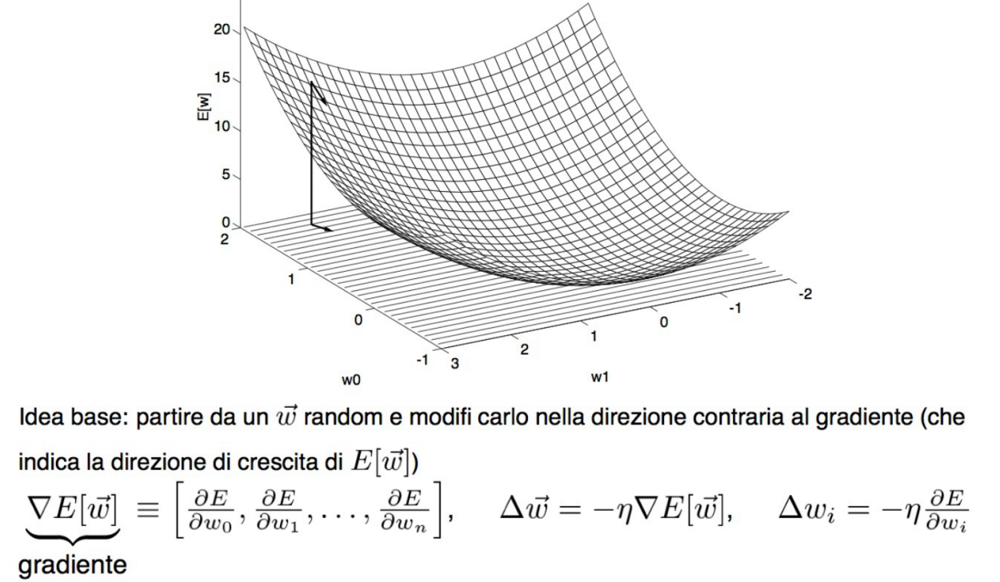
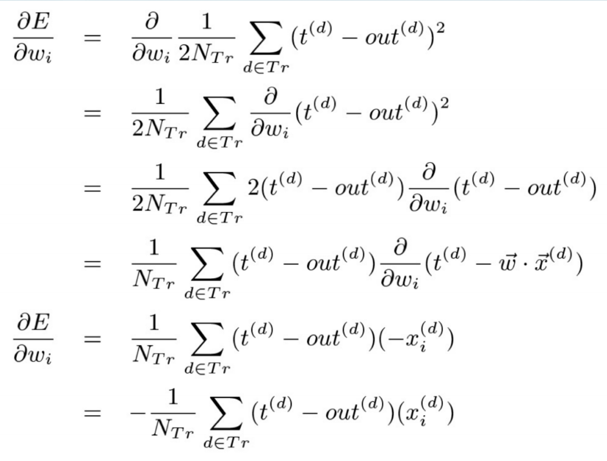
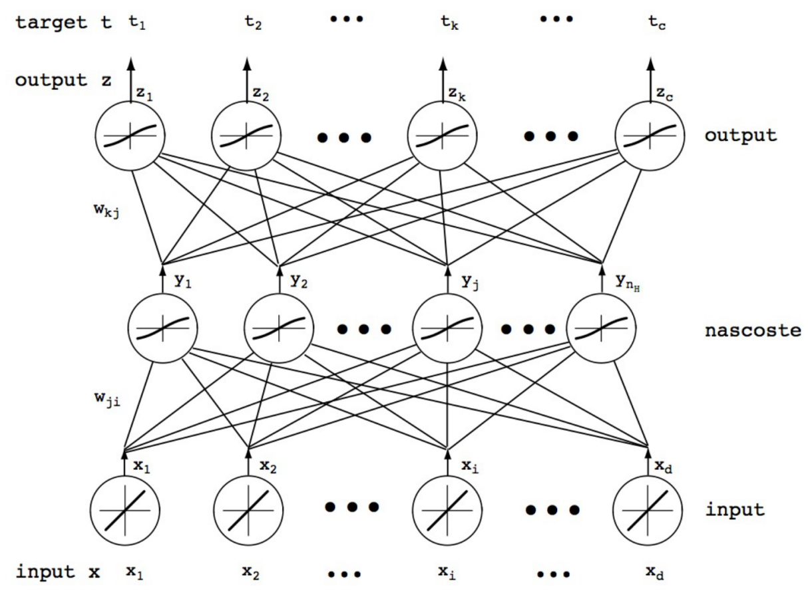
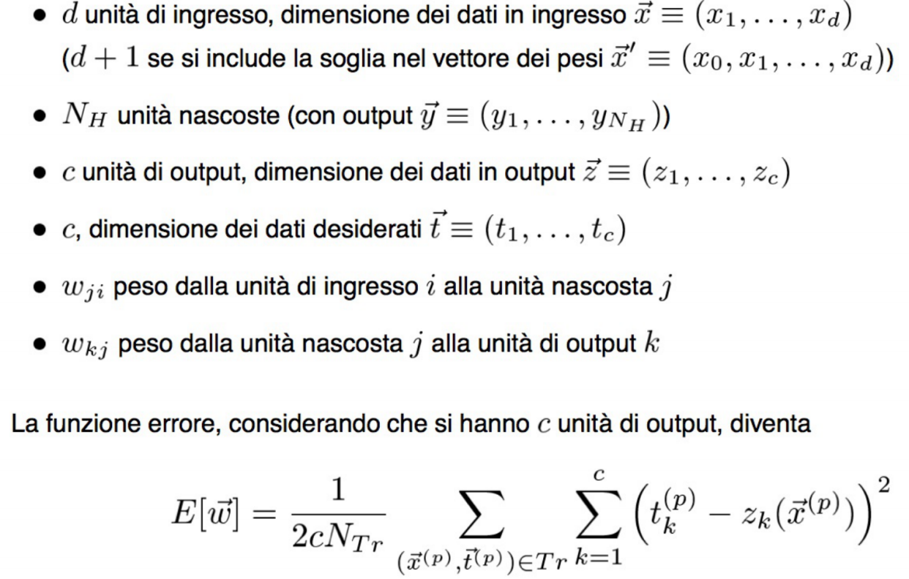
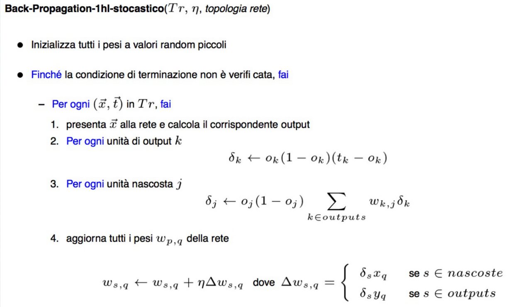

#Lezione 10

Perceptron va bene ma non riesce ad apprendere la XOR perché non è linearmente separabile.

## Reti di Perceptron

L'idea è quindi quella di combinare più Perceptron tra loro, in modo che riescano ad apprendere una qualsiasi funzione boolena.

Il problema ora diventa come effettuare l'apprendimento con una rete di Perceptron, dal momento che non è più triviale come assegnare dei pesi alle unità nascoste. 
Una possibile soluzione è quella di rendere il singolo neurone derivabile e sfruttare la tecnica di Discesa del Gradiente per apprendere i pesi "giusti".

###Discesa di gradiente

**Richiami di analisi**: il segno della derivata di una funzione determina se la funzione è crescente o decrescente. Inoltre se la derviata vale 0, la funzione in quel punto ha un minimo o un massimo locale.

Si può quindi seguire il segno della derivata prima di una funzione per  raggiungere un massimo o minimo locale.

La funzione obbiettivo da minimizzare è la **funzione errore**, la quale rappresenta lo scarto quadratico medio del valore target predetto dal neurone (*funzione out*).

Dal momento che si tratta di una funzione derivabile è possibile utilizzare la discessa di gradiente per raggiungere un minimo.

Il valore *-η* è lo step con il quale mi sposto e prende il nome di **learn rate**.

Per calcolare lo spostamento rispetto ad ogni *wi* per minimizzare la funzione obiettivo, vado a calcolare la derivata.
Una volta calcolati tutti i *Δwi* posso andare a sommarli tra loro e successivamente aggiornare il vettore *w*.

La seguente serie di calcoli mostra come è possibile calcolare i *Δwi* per tutti gli esempi presenti nel training set. 
Viene usato *out(d)* per indicare il valore calcolato dalla reter per il *d*-esimo esempio del training set e *t(d)* per indicare il corretto valore della funzione target per lo stesso esempio.

In questo caso viene sempre considerata una rete di perceptron senza hard-treshold e senza sigmoide.

####Algoritmo di apprendimento

*Δwi* rappresenta lo spostamento dal *wi* iniziale.

In pratica prima viene esaminato tutti il training set per aggiornare i vari *Δwi*, una volta finito di esaminare il training set si aggiornano i *wi* e si ripete fino a che non si verifica una  condizione di stop.

Possono essere utilizzate varie condizioni di stop:

- *E(w)* minore di una soglia prefissata
- *Δwi = 0 ∀i*
- Il numero di iterazioni ha superato una soglia prefissata. 

### Discesa di gradiente con sigmoide

In questo caso si può utilizzare lo stesso algoritmo di apprendimento visto in precedenza, cambia però come vengono aggiornati i *Δwi*, dal momento che bisona tenere in considerazione la derivata della funzione sigmoidale.

Nonostate la formula sembri molto minacciosa, i *Δwi* sono uguali a *-η∂E / ∂wi*, cioè il learn rate moltiplicato per la derivata appena calcolata.

##Rete di Perceptron

E rappresenta l'errore quadratico medio di tutte le unità di output.

###Calcolo dei pesi per le unità di output

Calcoliamo i pesi per le unità di output, considerando i livelli nascosti come se fossero degli ingressi.

I *wi* adesso diventano *Δwk,j* perché i pesi vengono calcolati per ogni collegamento da un'unità nascosta *j* all'unità di output *k*.

Nel secondo passo sono state fatte due operazioni, prima viene tolta la sommatoria, perché quando viene fatta la derivata della sommatoria c'è un solo elemento diverso da ed è quello di indice *k^=k*.

###Calcolo dei pesi per le unità nascoste

###Algoritmo di apprendimento

L'algoritmo di apprendimento lavora in due fasi: nella prima fase, detta **feed forward**, viene forinto in input alla rete un esempio del training set, in modo che questa possa provare a calcolare la funzione target per l'esempio. Una volta calcolata si passa alla fase di **backward progragation**, nella quale si aggiornarno i coefficenti delle unità di output e delle unità nascoste in base alla correttezza o meno della predizione. In questo caso l'apprendimento avviene a ritroso, prima vengono aggiornati i coefficenti delle unità di output e poi quelli dei livelli nascosti.

Il passo 2 dell'algoritmo rappresenta il calcolo della differenza tra l'output atteso e quello ottenuto, questo viene poi utilizzato per aggiornare a ritroso i valori dei nodi interni (passo 3).

L'algoritmo prende il nome di **back propagation stocastico** perché il valore dei *Δwi* viene aggiornato subito dopo aver valutato un esempio *x* e non solamente dopo aver valutato tutti gli esempi del training set.

Le possibili condizioni di terminazione sono le stesse che si hanno quando c'è un solo neurone.