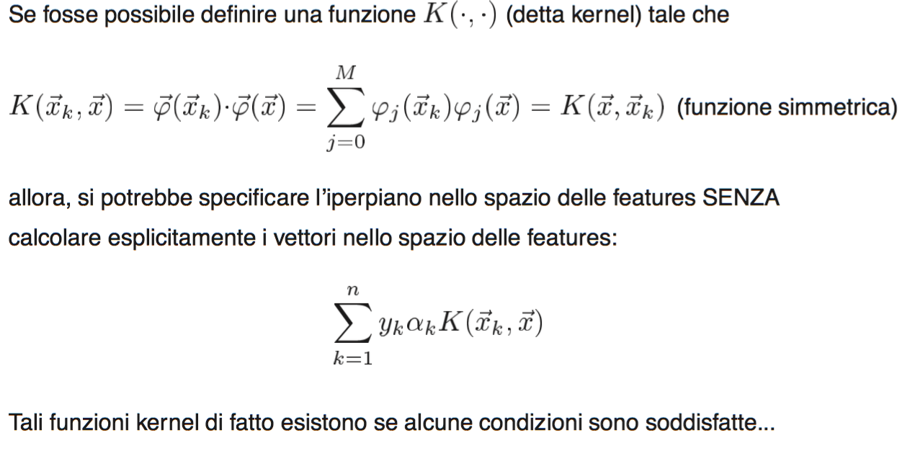
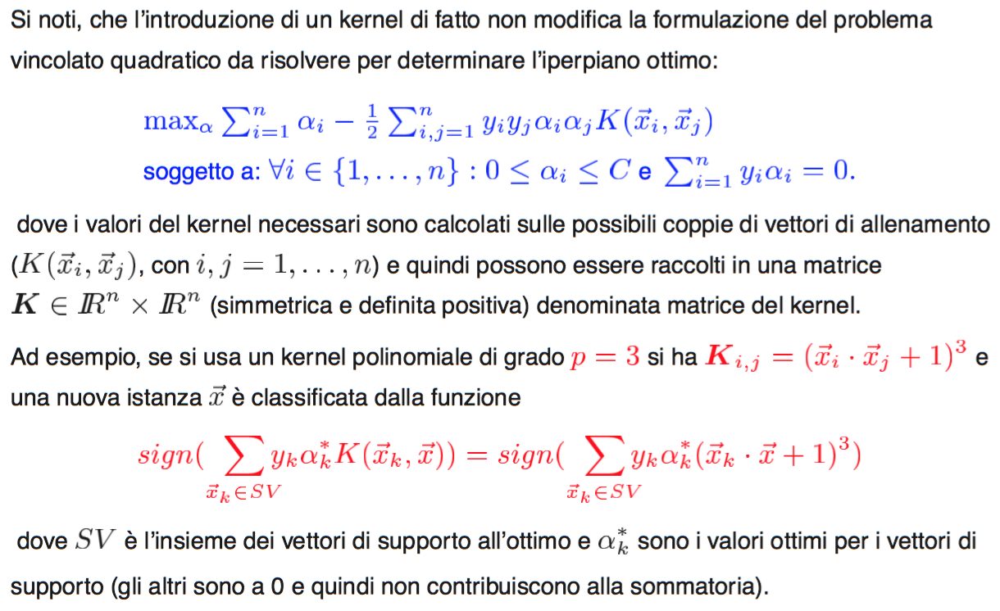
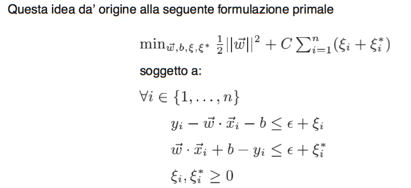

#Lezione 13 - Support Vector Machine

Nelle precedenti puntate:

- Sappiamo che un iperpiano in uno spazio di dimensione m ha VC dimension m+1.
- Si può aggiungere un vincolo di classificazione relativo al margine.
- Per ottenere l'iperpiano con margine ottimo è necessario considerare le ipotesi che minimizza la norma di *w*.
- Il tutto si fa prima con un polinomio di Lagrange e il suo duale.

##Dati non separabili linearmente

Tutto quello visto finora funziona se i dati sono linearmente separabili.

Nel caso questi non lo siano è necessario aggiungere una nuova variabile per ogni elemento presente nel training set.

Vengono quindi definite delle psi_i che rappresenta la distanza del elemento i-esimo dal margine entro il quale dovrebbe trovarsi.

L'idea è quindi quella di andare a sommare alla funzione costo, un altro quoziente della sommatoria di tutti i psi_i dei vari esempi presenti nel training set.

Il valore *C* del coefficente che va a moltiplicare la sommatoria degli psi_i può essere scelta con le tecniche di model selection.

In pratica vengono penalizzati (aumentato il costo) gli esempi che non rispettano il margine.

La funzione psi_i si comprota anche come upper buond per la rappresentazione dell'esempoio i-esimo del trainging set.

Sommando le psi_i di tutti gli esempi è maggiore o ugale al numero di errrori analizzzando tutto il trainingset.

Allo stesso modo si può trovare il problema duale (non vengono visti i conti)

Da notare che nel caso separabile i vettori di supporto stanno su uno dei due iperpiani margini.

Nel caso di dati non linearmente separabili o si trovano in un ipermpiano margine oppire uno psi_i negativo.

Da notare che le psi_i sono variabili del problema primale e che quindi non compaiono nel problema duale.

Questa strategia per esempi non linearmente separabili non sempre garantisce buone prestazioni perché un iperpiano pul solo rappresentare dicotomie dello spazio delle istanze.

Per questo motivio, quando gli esempi non sono lineramente separabili su usa una strategia divisa in due passi:

1. Si mappano i dati di ingresso (input sapce) in uno spazio a dimnesione molto superirore (feature space). Quindi a partire dalle feature degli elementi dell'input space vengono creati nuovi esempi nel feature space che utilizza combinazioni non lineari delle feature del primo spazio.
2. Si calcola poi l'iperpiano ottimo per il nuovo spazio usando la formulazione precedente (che prende il nome di variabili slack).

Perché dovrei farlo?

1. Perché il teorema sulla separabilità di Cover afferma che uno spazio delle ipotesi più grande è più probabile che questo sia linearmente separabile. (Un problema di classificazione complesso, formulato attrvareso una trasfomrazione non linear dei dati in uno spazio ad alata dimensionalità, ha maggiore probabilità di essere linearmente separabile che in uno spazio a bassa dimnsionalità).
2. Perché l'iperpiano ottimo minimizza la VC-Dimension e quindi la capacità di generalizzazione migliora.

In un modo simile a come accade con il perceptron.

##Funzioni Kernel

La cosa bella è che si può "inventare" una funzione K che ci permette di calcolare agevolmente il prododdo scalare.

##Regressione

Quando si considera il problema di approssimazione di funzioni a valori reali (regressione) si utilizza l'ϵ-tubo: output che differiscono dai valori di target per più di ϵ in valore assolunto vengono penalizzati linearmente, altrimenti non vengono considerati errori.
In partica aggiungo un intervallo di tolleranza al iperpiano che partiziona lo spazio.

che trasformata in duale diventa

