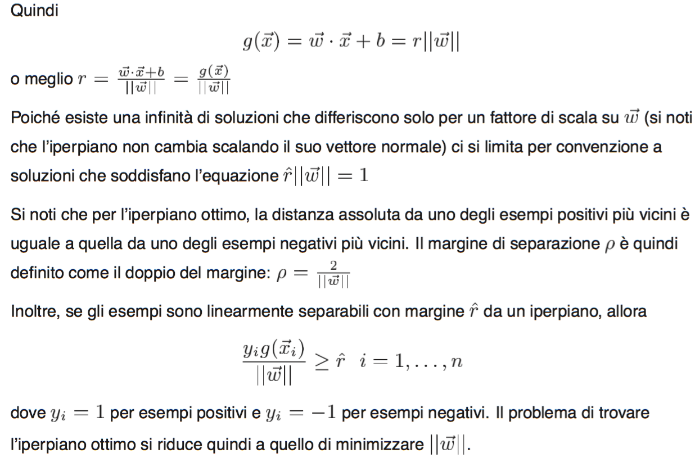
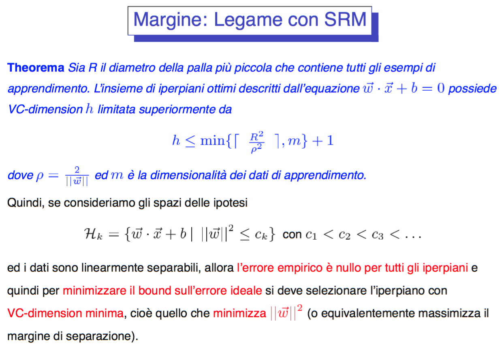

#Lezione 12 - Support Vector Machine

Richiamo: l'errore **ideale**, cioè quello commesso su esempi che non sono stati valutati durante l'apprendimento, può essere visto come composto da due termini, un errore empirico sui dati e la VC-Confidence.

L'algoritmo di minimizzazione dei rischi cerca lo spazio delle impotesi che va a minimizzare la VC-Confidence.

##SVM - Idea di base

Sappiamo che la VC dimension di un iperpiano nello spazio *m* è *m+1*.

Considerando il caso in cui gli esempi sono linearmente separabili si può definire il margine *r* come la distanza minima tra l'iperpiano e l'esempio più vicino.

L'iperpiano che ha un margine maggiore viene detto ottimo e massimizza la minima distanza con gli esempi.

###Margine

Vincoli e funzione di costo sono convessi perché i vincoli sono lineare e il costo è una parabola.

Quindi i vettori di supporto sono gli esempi di training che si trovano in uno dei due iperpiani margine.
