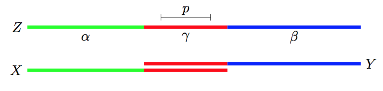
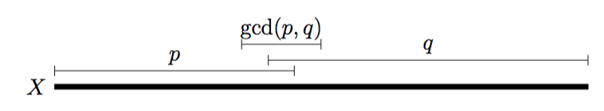

# Algoritmi su stringhe

# Il problema del matching esatto

Si ha un pattern *P* di lunghezza *m* e un testo *T* in cui cercare il pattern di lunghezza *n >= m*.

Un esempio di problema è la ricerca del pattern *P = aba* in *T=bbabaxababay*. In questo caso ci sono 3 occorrenze del pattern, che si sovrappongono tra loro.

Risolvere questo problema in modo efficiente è di importanza chiave dal momento che tutti i motori di ricerca si basano sul pattern matching esatto o approssimato.
Un altro campo in cui è utile il pattern matching è nella bioinformatica, infatti, il DNA umano può essere visto come una stringa di 4 miliardi di caratteri.

## Notazione utilizzata

Una stringa è composta da un insieme *Sigma* di simboli distingubili e che prendono il nome di **caratteri dell'alfabeto**.

L'alfabeto, ovvero l'insime di simboli, può essere finito oppure infinito ed è dotato di un ordine totale tra i vari simboli.

Una successione finita dei caratteri dell'alfabeto prende il nome di **stringa** e i caratteri che la compongono vengono indicizzati a partire da 1.

```
X = x1 ... xn
```

`|X|` indica la lunghezza di una stringa e nel caso questa sia 0, la stringa è vuota e viene rappresentata con *epsilon*.

Due stringhe possono essere concatenate tra loro:

```
X \cdot Y = x1...xny1...ym
```

e *epsilon* è l'elmento neutro per la concatenazione, dal momento che la concatenazione della stringa vuota ad un'altra stringa è uguale alla stringa di partenza.

La concatenazione multipla della stessa stringa viene indicata con l'esponenziale:

```
X^k = X \cdot \ldots \cdot X
```

Una **sottostringa** di una stringa *X* è una stringa *Y*, tale che `X = Z \cdot Y \cdot W` per qualche *Z,W*.

Ogni terna *(Z,Y,W)* prende il nome di **occorrenza** di *Y* in *X* e si diche che la stringa *Y* **occorre** in *X* nella posizione `i = |Z| + 1`.
In particolare si ha:

```
X = Z \cdot Y \cdot W = X[1,i-1]X[i,j]X[j+1,n]
```

Se la stringa *Z = epsilon*, *Y* prende il nome di **prefisso**, mentre se *W=epsilon*, *Y* prende il nome di **suffisso**.

Se la stringa *Y* è sia prefisso che suffisso di *X*, allora *Y* è un **bordo** della stringa *X* e si ha che

```
Y = X[1,m] = X[n-m+1,n]
```

Prefissi, suffissi, bordi e sottostringhe vengono detti **propri** se sono `\neq \epsilon` e `\neq X`, altrimenti vengono detti **degeneri**.

### Periodo

Se *Y* è un bordo di *X* allora esistono *Z* e *W* tali che `X = Z \cdot Y = Y \cdot W` con `|Z| = |W| = p = n -m`.
*p* prende il nome di **periodo** della stringa *X*.

Un periodo si dice **proprio** se *0 < p < n*

#### Lemma - Origine del periodo

Il nome periodo deriva dal fatto che se *X = x1x2...xn* ha come bordo *Y* di lunghezza *m*. Allora *xi = xi+p* per ogni *i* tale che `1 \leq i \leq n-p`. Viceversa se *xi = xi+1*, per ogni *i* tale che `1 \leq i \leq n-p` allora *Y = X[1,n-p]* è un bordo di *X*.

##### Dimostrazione

Per definzione di bordo, *Y* è un bordo di *Z* se e solo se

```
Y =X[1,m]=X[n−m+1,n]
```

```
Ma X[1, m] = X[n − m + 1, n] se e solo se sono uguali i corrispondenti caratteri xi e xi+n−m peri=1,...,mequestoe`comedirexi =xi+p perogniitaleche1≤i≤n−p con p = n − m.
Per il Lemma 1.1 bordi e periodi sono legati dalla relazione:
La stringa X di lunghezza n ha un bordo Y di lunghezza m se e solo se
p = n − m e` un periodo della stringa X.
Un prefisso, suffisso, bordo o sottostringa di una stringa X si dice proprio se esso non e` ne la stringa nulla ne l’intera stringa X. Un periodo p di una stringa X di lunghezza n si dice proprio se 0 < p < n. Notiamo che p = 0 e p ≥ n sono periodi (degeneri) di ogni stringa X di lunghezza n.
Una stringa X di lunghezza n si dice periodica se ha un periodo p tale che 0 < 2p ≤ n (equivalentemente: un bordo di lunghezza m tale che m < n ≤ 2m).
Ci sara` anche utile il seguente lemma.
```

Una stringa *X* viene detta **periodica** se `0 \leq 2p \leq n` ovvero se c'è un bordo di lunghezza `m < n \leq 2m`.

#### Lemma - Concatenazione di stringhe periodiche

Siano *X* e *Y* due stringhe con periodo *p* tali che `X = \alpha \gamma` e `Y = \gamma\beta` con `|\gamma|\geq p`.

La stringa `Z = \alpha\gamma\beta` ha anch'essa periodo *p*.



##### Dimostrazione

```
Dimostrazione. Siano zi e zi+p due caratteri di Z a distanza p. Siccome |γ| ≥ p tali due caratteri o stanno entrambi in X = αγ oppure entrambi in Y = γβ e quindi sono uguali.
```
Da questo segue il lemma di periodicità che afferma che due periodi distinti *p* e *q* non possono coesistere troppo a lungo in una stessa stringa senza che la stringa abbia anche periodo *MCD(p, q)*.

#### Lemma - Lemma di periodicità

Sia *X* una stringa di lunghezza *n* con due periodi *p* e *q* entrambi non nulli.

Se `n \geq p + q - MCD(p,q)` allora la stringa *X* ha anche periodo *MCD(p,q)*.



##### Dimostrazione

Supponendo che `p \leq q`, la dimostrazione viene fatta per induzione su *p+q*.

###### (p+q = 1) 
Se *p=0* oppure *p=q=0* allora *MCD(p,q) = q* e dunque *X* ha periodo *MCD(p,q)* perché ha periodo *q*.

###### (p+q > 1)

Se *p=0* o *p=q* vale ancora il caso base.

Se *1 leq p < q*, si ha che la stringa *X* ha bordi *alpha* e *beta* di lunghezza *n-p* e *n-q*.


La stringa *beta* essendo bordo di *X* è anche bordo *alfa* dal momento che *alfa* è un bordo di *X*.

La stringa *Y = alpha* ha quindi periodo `r = |\alpha|- |\beta| = q -p`.

E si ha che *p+r < p + q* e *MCD(p,r) = MCD(p,q)*, inoltre

```
|Y| = n - p \geq q - MCD(p,q) = p+r+MCD(p,q)
```

**vedi dispensa pagina 5 e 6**