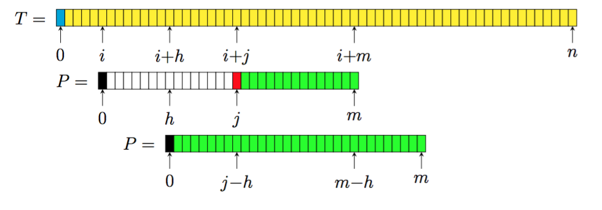

### Esercizio - Tandem massimale

TODO: copia testo dalle dispense

#### Soluzione

Si concatenano *A* e *T* in modo da formare *S = A$T*.

E si calcolano i vari *π_i* in modo da trovarele occorrenze del pattern.

Se *π_j* è un coccorenza di *A*, si va a controllare *π_j+len(A)* e così via, finché non ci sono più occorrenze in fila.

Può essere che i pattern si sovrappongano al più per qualche carattere, quindi quando viene trovato l'ultimo elemento dell'array, è necessario controllare anche i vari *π_j* precedenti, per verificare che non ci sia un altro tandem array.

Non è necessario controllare i *π_j* intermedi ad un tandem array, perché dal momento che la stringa *A* non è periodica, non può esserci un'occorrenza di *A* a cavallo tra altre due occorrenze di *A*.

# Algoritmi base per il pattern matching

## Algortimo di Knuth Morris e Pratt


Perché ci sia un'occorrenza del pattern a partire da *i+h* è necessario che *P[1, j-h-1]* siano uguali a *P[1+h, j-1]*, inoltre, *P[j-h]* deve essere diverso di *P[j]*, perché è già stato fatto un confronto tra *P[j]* e *T[i+j-1]*, e sono stati trovati diversi.

Questo vuol dire che il prefisso *P[1, j-h-1]* deve essere anche un suffisso, in particolare si ha che *π_{1+h} = j - h -1*, ovvero *j = π_{1+h} +h +1*.

Lo spostamento *d[j]* (quando trovo un mismatch in posizione *j*), sarà uguale a

```
min(\{j\} \cup \{h | 1 <= h < j, j = 1 + h + \pi_{1+h}^p\})
```

Nel caso venga trovato un match del pattern, si ha un mismatch sul carattere *j=m+1* perché è la sentinella, in questo caso lo spostamento equivale al periodo minimo della stringa *P*:

```
d[m+1] = min(\{m+1\} \cup \{h | 1 \leq h \leq m, m+1 = 1 + h + \pi_{1+h}^S\})
```

Se *h = m*, ovvero la stringa non è periodica, si ha che viene preso in considerazione il periodo degenere, che è pari alla lunghezza della stringa, quindi anche nel caso di un match completo si ottiene lo spostamento corretto.

Per calcolare *d[j]* si può utilizzare

```
for j = 1 to m+1
    // Diamo ad ogni d[j] il valore j che è il massimo dei valori tra cui minimizzare
    d[j] = j
for h = m downto 1
    // Aggiorniamo d[j] quando troviamo un h minore che soddisfa la condizione j = 1 + h + \pi_{1+h}
    d[1 + h + pref[1+h]] = h
```

Il tutto viene fatto in *O(m)*, perché viene scorso 2 volte il pattern.

L'algoritmo risulta quindi essere:

```
Knth-Morris-Pratt(P,T)
    pref \gets Funzione-Prefisso(P)
    for j = 1 to m+1
        d[j] \gets j
    for h = m downto 1
        d[1 + h + pref[1+h]] \gets h
    i,j \gets 1
    while i \leq n - m +1
        while P[j] == T[i+j-1]
            j \gets j + 1
        if j > m
            // Segnala occorrenza in posizione i
        i \gets i + d[j] \Comment{Spostamento nella stringa T}
        j \gets \max(1, j - d[j]) \{Spostamento interno al pattern}
    
```

### Complessità dell'algoritmo

La complessità della funzione presfisso e dei due cicli `for` risulta essere *O(m)*.

Durante la ricerca, l'operazione che viene effettuata più volte è il test del ciclo `while` interno.
Se il confronto ha esito negativo, il pattern viene rieallienato e le posizioni possibili in cui è possibile allineare il pattern sono *n -m +1*, quindi possono essere fatti al massimo *n -m +1* confronti con esito negativo.

Quando il confronto ha esito positivo, *i + j-1* non diminuisce mai e aumenta di uno se viene trovato un match. Dal momento che all'inizio *i+j-1 = 1* e alla fine vale *i+j-1<=n+1*, perché deve essere un carattere della stringa *T* o al più la sentinella.
Segue che al massimo il numero di match è *<= n + 1 - 1*.

Considerando sia i match che i mismatch, si hanno al massimo *2n-m +1* confronti e considerando l'*O(m)* iniziale, si ha come complessità totale dell'algortimo *O(m+n)*.

## Algoritmo di Boyer e Moore

Quando viene allineanto il patterno con il testo i confronti dei caratteri vengono effettuati a partire dalla fine del pattern, andando a ritroso.

Lo svantaggio di questo algoritmo è che nel caso peggiore, vengono fatti *5n* confronti, tuttavia nel caso ottimo l'algoritmo riesce a confrontare un numero di caratteri *<= n*.

Dal momento che l'approccio utilizzato va a ritroso, la sentinella viene aggiunta all'inzio, sia del pattern che del testo, nella posizione 0.



Con la sentinella *P[0]* allineata con il carattere *T[i]* e partendo dal fondo si è trovato un primo mismatch in posizione *j*, vi è una occorrenza del pattern quando la sentienella è allineata con *T[i+h]* per uno spostamento *h* compreso tra 1 e *j-1*

Siccome l'algoritmo confronta i caratteri da destra a sinistra sappiamo che ad un certo punto

```
P [j + 1, m] = T [i + j + 1, i + m] e che P[j] = T[i + j]
```

vedi dispense


Si ha quindi che lo spostamento *d[j]* sarà uguale a

```
d[j] = min(\{h | 1 \leq h < j, j ) m , \pi_{1+h}^{P_{rev}}\} \cup \{h | j \leq h \leq m, h = m - \pi_{1+h}^{P_{rev}}\})
```

Tale minimo è sempre definito perché *h = m* soddisfa sempre la seconda condizione.