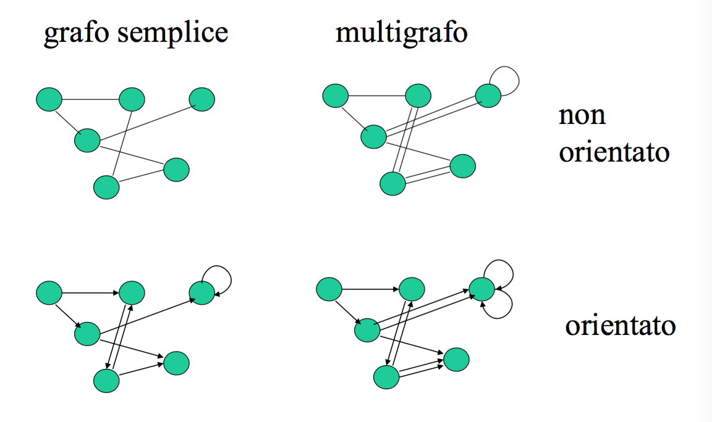
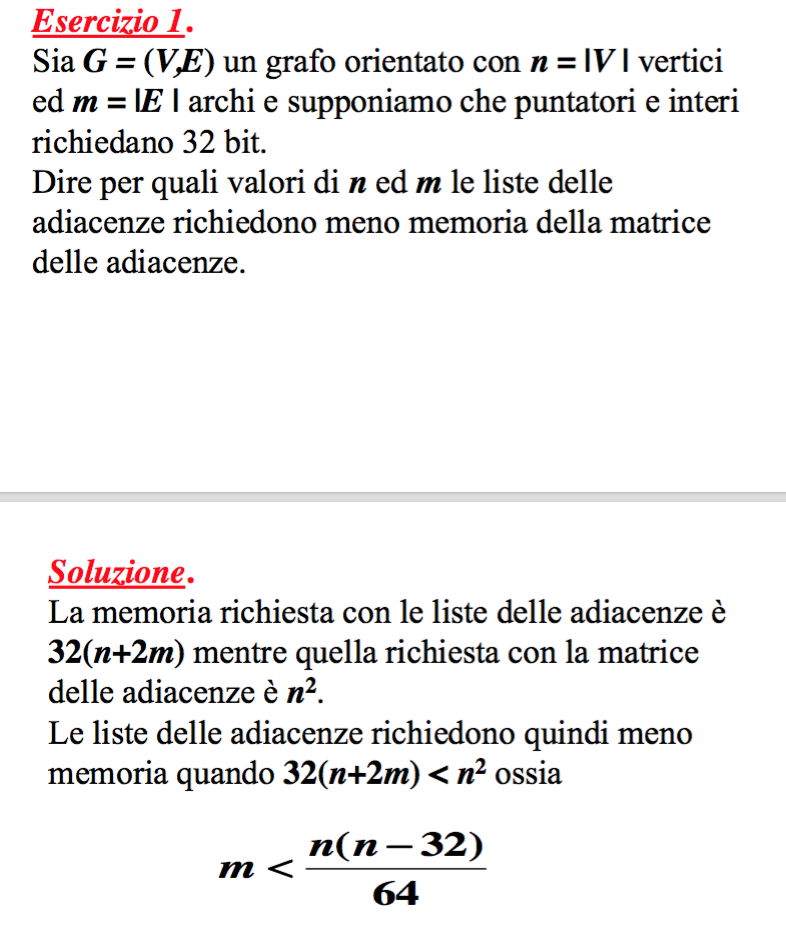

# Lezione 2 - Introduzione e Algoritmi sui grafi

C'è la possibilità di fare un pre-orale nella settimana dei compitini.

Libro: Cormen, Introduzione agli algoritmi e strutture dati [BIB](http://catalogo.unipd.it/F/FCKK1DACESL2TDH5CF15FLDL2BUM936U1XG9U15MFDCKI764BV-10675?func=full-set-set&set_number=011139&set_entry=000001&format=999):

- Introduzione agli algoritmi sui grafi
    - Strutture dati per i grafi
    - Operazioni elementari sui grafi
- Algoritmi su stringhe (capitolo 22)
- Algoritmi paralleli (capitolo 27)
- Algoritmi di geometria computazionale

## Terminologia dei grafi

Un grafo *G* è costituito da un insieme di vertici *V* e di archi *E*. Ad ogni arco vengono associati due vertici in *V*.

Se c'è un ordine tra i due estremi degli archi, il grafo prende il nome di **orientato** o **diretto**. In questo caso, il primo vertice pernde il nome di **coda** e l'ultimo **testa**.

Un **cappio** è un grafo i cui due estremi coincidono.

Un grafo non orientato si dice **semplice** se non ha cappi e non ci sono due archi con gli stessi estremi.
Mentre se il grafo è orientato, perché sia semplice non devono esserci archi con gli stessi estremi, iniziali e finali.
Un grafo non semplice prende il nome di **multrigrafo**.



Se un grafo è semplice, un arco può essere espresso con:

```
e = uv ϵ E, con u,v \in V
```

e si dice che l'arco *e* è incidente in *u* e *v*.
Da notare che se il grafo è orientato `e = uv \neq vu` e la terminologia diventa "l'arco *e* esce da *u* entra in *v*".

Il **grado** di un vertice *v* viene indicato con `δ(v)` e rappresenta il numero di archi incidenti in quel vertice.
Se il grafo è ordinato, il suo **grado uscente** `δ^+(v)` è il numero di archi uscenti e il suo **grado entrante** è `δ^-(v)`.

Se due vertici sono collegati da un arco, questi vengono detti **adiacenti**.

Un **cammino** di lunghezza *k* da un vertice *u* ad un vertice *v* in un grafo *G=(V,E)*, è una sequenza di *k+1* vertici *x<sub>0</sub>...x<sub>k</sub>*, tali che *x<sub>0</sub> = u*, *x<sub>k</sub> = v* e *x<sub>i-1</sub>x<sub>i</sub> ϵ E ∀i = 1...k*.

Se il cammino ha lunghezza 0, questo viene detto **nullo**, mentre se il vertice di partenza coincide con quello di arrivo, il cammino prende il nome di **chiuso**.

Un cammino viene detto **semplice** quanto tutti i vertici che lo compongnono sono distinti, ad eccezione del primo, che può coincidere con l'ultimo.
Un cammino semplice e il primo vertice coincide con l'ultimo, questo prende il nome di **ciclo**. L'esempio più semplice di ciclo è dato da un cappio.

Un grafo **acicliclo** è un grafo che non contiene cicli.

Quando esiste almeno un cammino dal vertice *u* al vertice *v*, si dice che *v* è **accessibile** (o **raggiungibile**) da *u*. Questa definizione è simmetrica solamente nel caso di un grafo non orientato.

Un grafo non orientato si dice **connesso** se esiste almeno un cammino tra ogni coppia di vertici.

Le **componenti connesse** di un grafo sono le classi di equivalenza dei suoi vertici rispetto alla relazione di accessibilità, ovvero un sottoinsieme di vertici che sono tutti tra loro accessibili.

Nel caso di un grafo orientato, si dice che è **fortemente connesso** se esiste almeno un cammino tra ogni vertice del grafo.
In modo analogo è possibile definire le **componenti fortemente conneese**

Sia la **connessione** che la **connessione forte** hanno le proprietà:

- **riflessiva**: se c'è una connessioe tra *u* e *v*, c'è anche tra *v* e *u*
- **transitiva**: se c'è una connessione tra *u* e *v* e tra *v* e *z*, allora c'è anche tra *u* e *z*.


Un sottografo del grafo *G=(V,E)* è un grafo *G' = (V', E')* tale che:

```
V' ⊆ V
E' ⊆ { uv : uv ϵ E e u,v 𝝐 V' }
```

ovvero un grafo che ha alcuni vertici e alcuni archi del grafo iniziale. Da notare che se tolgo un vertice, devo togliere anche tutti gli archi incidenti in quel vertice.


Se il sottografo viene ottenuto rimuovendo solo dei vertici, questo prende il nome di **indotto**, perché la rimozione degli archi viene forzata dalla rimozione dei vertici.


## Rappresentazione dei grafi

Per rapprensetare i grafi in un calcolatore è possibile utilizzare la matrice delle adiacenze o la lista delle adiacenze.


### Lista delle adiacenze

Per ogni vertice del grafo viene tenuta in memoria una lista dei vertici adiacenti al vertice:

```
Adj[u] ∀u \in V
Adj[u] = {v | uv \in E}
```

Questa rappresentazione richiede memoria per:

- `n = |V|` puntantori alla cima delle liste
- `m = |E|` elementi per le liste (in totale) se il grafo orientato, se è non orientato è `2m`.

### Matrice delle adiacenze

Viene utilizzata una matrice booleana quadrata che tante righe e tante colonne, quanti sono i vertici del grafo.

Ogni elemento della matrice vale 1 se i due vertici sono adiacenti, 0 altrimenti:

```
a_{u,v} = 1 se uv \in E
```

Se il grafo è non orientato, la matrice delle adiacenze è simmetrica.


Il consumo di memoria è `n^2`.

Se il grafo è **sparso**, ovvero il grado dei vertici è minore del logaritmo del numero dei vertici, la matrice delle adiacenze risulta peggiore della rappresentazione con liste in termini di memoria occupata.



## Calcolo del grafo trasposto

Dato un grafo orientato *G=(V,E)* si vuole ottenere *G^T = (V,E^T)* in modo che gli archi siano rovesciati, ovvero *E^T = {uv | vu \in E}*.

Utilizzando la rappresentazione con la matrice delle adiacenze, è necessario attraversare metà della matrice e mettere a 1 la cella *i,j* se *j,i* è a 1. La complessità risulta quindi essere *O(n^2)*.

Con la lista delle adiacenze l'algoritmo risulta essere

```
https://en.wikibooks.org/wiki/LaTeX/Algorithms#Typesetting_using_the_algorithmicx_package

Trasponi(Adj, AdjT, n)
    for v = 1 to n
        AdjT[v] = nil
    for u = 1 to n
        x = Adj[u]
        while x != nil
            v = x.v
            y = nodo(u, AdjT[v])
            AjdT[v] = y
```

Ovvero viene attraversata la lista delle adiacenze del grafo originale, e per ogni elemento delle liste, lo aggiunge "*al contrario*" nella nuova lista delle adiacenze.

La complessità risulta quindi essere *O(m+n)*, questo perché il secondo `for` esamina tutti i possibili archi, quindi anziché avere complessità *n* (numero di vertici) ha complessità *m* (numero di archi). 

## (Esericizio) Ricerca del pozzo universale

Un vertice è un **pozzo universale** se può essere raggiunto da tutti gli altri vertici del grafo, dal quale però non è possibile raggiungere  altri vertici.

Trovare un algoritmo che riesce a risolvere il problema in *O(n)*.