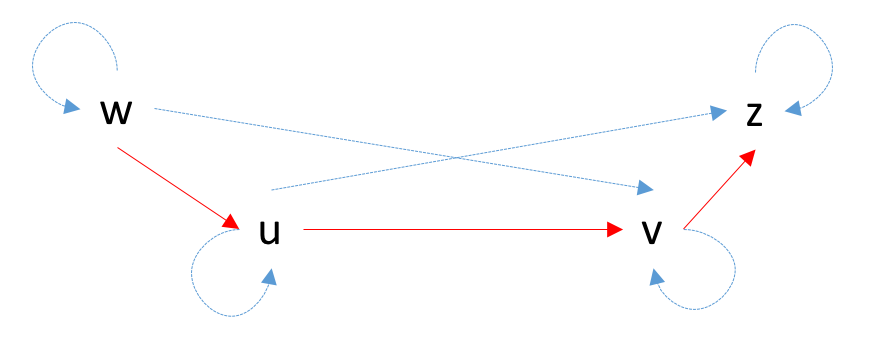
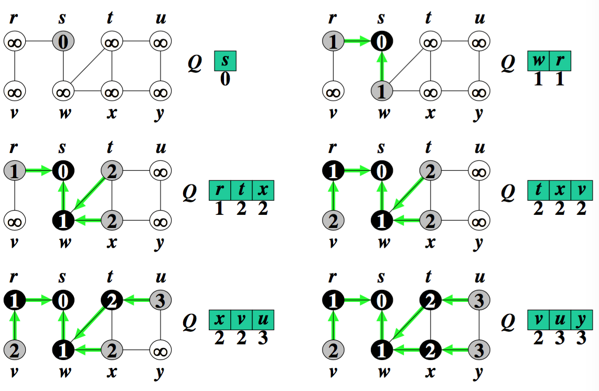

# Lezione 3 - Algoritmi sui grafi

## Chiusura transitiva e riflessiva

La chiusura riflessiva e transitiva di un grafo *G = (V,E)* è il grafo _G\* = (V,E\*)_ che si ottiene da *G* aggiungendo tutti gli archi *uv* tali che in *G* ci sia un cammino da *u* a *v*.

Ovvero se nel grafo originale c'è un arco *uv*, la chiusura transitiva contiene gli archi che collegano *u* a tutti i nodi che possono essere raggiunti da *v* e gli archi che collegano i nodi entranti in *u* a *v*. 



L'algortimo naive riesce a trovare una soluzione in *O(n^3)*

```
CTR(M,M*,n)
    for u = 1 to n //Costruzione di M*
        for v = 1 to n 
            M*[u,v] = 0
    for u = 1 to n  // Chiusura riflessiva
        M*[u,u] = 1
    
    for u = 1 to n 
        for v = 1 to n
            if M[u,v] == 1 and M*[u,v] == 0
                // Aggiungi tutti gli archi wz con z
                // raggiungibile da w con un cammino
                // passante per uv
                CT (M*,u,v,n)
CT (M*,u,v,n) 
    M*[u,v] = 1 
    for z = 1 to n
        if M*[v,z] == 1 and M*[u,z] == 0 
            CT (M*,u,z,n)
    for w = 1 to n
        if M*[w,u] == 1 and M*[w,v] == 0
            CT (M*,w,v,n)
```

Per `CRM` l'inizializzazione della matrice `M*` ha complessità *O(n+n^2)*, mentre l'ultimo `for` ha complessità *O(n^2)* (senza considerare la complessità di `CT`.
`CT` ha complessità *O(n . m\* )*, *n* deriva dal ciclo `for` e _m\*_ deriva dal numero di chiamata ricorsive che sono limitate dal numero di archi nel grafo riflessivo, ovvero *m\**.

La complità totale è quindi *O(n^3 m\*)*.

## Visita in ampiezza

Dato un grafo *G=(V,E)* e fissato un vertice del grafo *s*, la visita in ampiezza partendo dalla **sorgente** *s* visita sistematicamente il grafo per scoprire tutti i vertici che sono raggiungibili da *s*.

In questo modo è possibile misurare la **distanza** dei vertici dalla sorgente e costruire l'**albero della visita in ampiezza**, i cui rami sono i cammini di lunghezza minima che partono dalla sorgente e raggiunto tutti i veritici del grafo che possono essere raggiunti.

Tutti i cammini che compaiono nell'albero della visita in ampiezza sono tutti **cammini minimi**.

La vista in ampiezza parte quindi da *s* e visita tutti i vertici a distanza 1, per poi passare a quelli a distanza 2 e così via, ovvero la frontiera dell'albero viene espansa in ampiezza.

Durante l'esplorazione un nodo può essere colorato in tre modi:

- **bianco**: vertice del grafo non ancora raggiunto
- **grigio**: vertice raggiunto e che si trova sulla frontiera, ovvero non sono stati ancora raggiunti tutti i suoi figli
- **nero**: vertice raggiunto e che non si trova più nella frontiera.

Ad alto livello, l'algoritmo parte dal vertice *s*, utilizzandolo come radice dell'albero.
Quando viene scoperto un vertice bianco *v* a causa di un arco *uv* che lo connette al verice *u* scoperto precedentemente (all'inizio *u=s*), questo viene aggiunto all'albero e collegato al nodo *u*, che diventa il **padre** di *v*.

L'implementazione dell'algoritmo utilizza una coda FIFO **Q** che mantiene in memoria la frontiera.



```
BFS(G,s)
    for \forall v \in G.V
        v.color = bianco
        v.d = \infinity //Distanza massima possibile
        v.\pi = nil // Padre del nodo
    s.color = grigio
    s.d = 0
    PUSH(Q,s)
    while not Empty(Q)
        u = POP(Q)
        for \forall v \in Adj[u]
            if v.color == bianco
                v.color = grigio
                v.d = u.d +1
                v.\pi = u
                PUSH(Q,v)
        u.color = nero
``` 

### Complessità

Il ciclo `for` di inizializzazione ha complessità *O(n)*.

Il ciclo `while` viene ripetuto al massimo *n* volte e il `for` interno percorre la lista delle adiacenze di tutti i nodi, al massimo una volta sola, quindi le esecuzioni totali dei cicli `for`, ottengo *m* iterazioni.
In tutto il ciclo `while` ha complessità *O(n+m)*, la quale domina la complessità dell'inizializzazione.

La complessità dell'algoritmo è anche ottima, non è possibile ottenere una visita completa del grafo effettuando meno di *O(n+m)* operazioni.

*Da notare che O(n\*m) sarebbe sbagliata come complessità, perché m tiene in considerazione il fatto che il ciclo `for` viene ripetuto n volte.*

### Correttezza

Indicando con *δ(u,v)* la distanza tra il vertice *v* e *u*, ovvero la lunghezza del cammino minimo che li congiunge. Per convezione, se i due vertici non sono raggiungibili, la distanza è infinita.

La distanza così definita ha la propeità *δ(x,v) \leq δ(x,u) + 1* per ogni *x ϵ V* e *uv ϵ E*.
Questo perché aggiungendo l'arco *uv* al cammino *x->u*, si ottiene un cammino di lunghezza *δ(x,u)+1*, pertanto, per definzione *δ(x,v)* è minore o uguale della lunghezza del nuovo cammino.

Un'altra proprietà è quella del **limite inferiore**, ovvero per ogni vertice *u* e per tutta l'esecuzione di **BFS** vale la disuguaglianza *u.d >= δ(s,u)*.

Questo è trivialmente vero per *s.d* e per *u.d* quando *u* non è raggiungibile da *s* (per costruzione).

L'unica istruzione dell'algoritmo che modifica la distanza è `v.d = u.d +1`, che viene eseguita solo se esiste l'arco *uv*.
Supponendo induttivamente che la proprietà sia vera prima di eseguire l'assegnamento, si ha che:

```
v.d = u.d + 1
    ≥ δ(s,u) + 1 // per l'ipotesi induttiva
    ≥ δ(s,v)     // per la proprietà delle distanze
```

Un'altra proprietà utile alla dimostrazione di correttezza è che, se la coda *Q* non è vuota, allora è ordinata per distanza crescente.
Formalmente 

```
v1, v2, ..., vr \in Q, \forall v_i.d \leq v_{i+1} + 1 e v_r \leq v_1.d +1
```

Questa proprietà è vera per la coda con un solo elemento, la quale è sempre ordinata.

Induttivamente, le operazioni che modificano la coda sono i push e i pop.

Quando viene eseguito un pop, viene tolto il primo elemento e la proprietà rimane vera perché `v_r.d \leq v_1.d +1 \leq v2.d +1`.

Nel caso di un push con la coda che contiene già degli elementi ordinati, questa operazione viene eseguita dopo aver tolto dalla coda il vertice *u* e viene aggiunto il nodo *v* con *v.d = u.d + 1*.

Dopo aver rimosso *u*, il primo elemento dello coda ha *v_1.d <= u.d + 1* e l'ultimo elemento *v_r* ha distanza *v_r.d <= u.d + 1*.
Dal momento che viene aggiunto in coda *v* con *v.d = u.d + 1*, si ha che *v_r.d <= v.d*, pertanto la proprietà rimane soddisfatta.