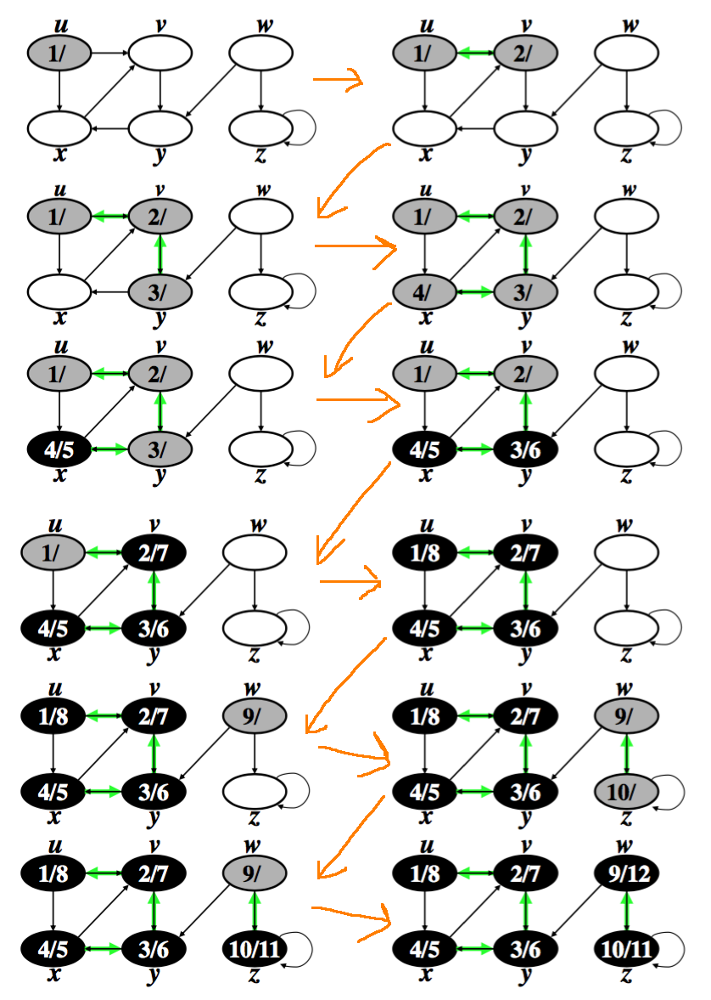
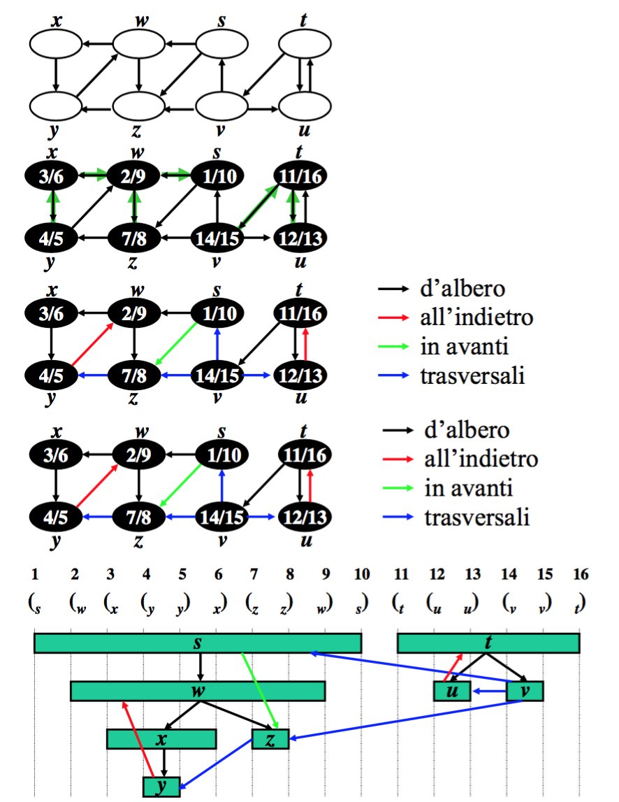

#Lezione 6 - Algoritmi sui grafi 2

# Visita in ampiezza - Correttezza

Riassumendo quanto visto finora:

- **Proprietà del limite superiore**: *u.d >= delta(s,u)*
- **Proprietà della coda**: *v1, ..., vn, vi.d <= vi+1.d, vn.d <= v1.d+1*

L'algoritmo BFS visita tuti e soli i vertici raggiungibili da *s* e quando termina *v.d = delta(s,v)* per ogni vertice *v* del grafo.

Inoltre, *∀v != s* e raggiungibile da *s* si ha che *v.pi = u != nil* con *uv in E* e uno dei cammini minimi da *s* a *v* è costituito da un cammino minimo da *s* a *u* seguito dall'arco *uv*.

Supponiamo per assurdo che *v.d != delta(s,v)* con *v.d > delta(s,v)*, *v* raggiungibile da *s* e *v!=s*.

Se *v* è raggiungibile, esiste un cammino minimo che li collega. Sia *u* il penultimo vertice del cammino, ovvero quello che precede *v*.
Questo vertice ad un certo momento dell'algoritmo verrà inserito nella coda, per poi essere tolto.
Quando *u* viene tolto dalla coda, *u.d = delta(s,u)* e vengono visitati i nodi raggiungibilid da *u* e tra questi c'è il nodo *v*.
In questo momento il nodo *v* non può essere bianco, perché altrimenti gli sarebbe assegnata distanza *v.d = u.d+1*, che contrattice l'ipotesi.
*v* non può neanche essere nero, perché dovrebbe essere già stato tolto dalla coda e quindi *v.d <= u.d < u.d+1*.
Infine, *v.d* non può essere grigio perché in quel caso dovrebbe essere stato aggiunto alla coda visitando un vertice *w* tolto dalla coda prima di *u* e quindi *v.d = w.d+1 <= u.d+1*.

Quindi *v.d = delta(s,v)* è la distanza corretta per ogni vertice *v* e quando viene eseguita l'assegnazione *v.d = u.d+1* esiste l'arco *uv* e viene posto *v.pi = u*.

Rimane da dimostrare che così facendo si ottiene un albero e che contenga solamente i cammini minimi.

Sia il **grafo dei predecessori** *Gpi = (Vpi, Epi)*, con *Vpi = {s} U {v in V : v.pi != nil}* e *Epi = {(v.pi)v : v.pi != nil}*.
Questo grafo è connesso dal momento che viene costrutito utilizzando solamente i vertici raggiungibili a partire da *s*. Inoltre, sempre per come viene costruito il grafo, ogni vertice ha solamente un padre (*escluso s*), pertanto il grafo è anche un albero.

Preso un nodo *v in Vpi*, l'unico cammino che lo raggiunge è *x0, x1, ... xk*, con *x0 = s* e *xk = v*.
La dimostrazione del fatto che il cammino è minimo viene fatta per induzione.
Se *k=0*, allora si ha *v = s* e *v.d = 0 = delta(s,s)*, mentre se *k>0*, *xk-1 = v.pi* è il vertice precedente, e per ipotesi induttiva, il cammino che lo raggiunge è minimo ed ha lunghezza *k-1 = delta(s,k-1)*, pertanto *delta(s,v) = v.d = xk-1.d+1 = delta(s,xk-1)+1 0 = k*.

# Visita in profondità

Nella vistità in profondità vengono esplorati sempre gli archi uscenti dall'ultimo vertice aggiunto. Se viene scomperto un nuovo vertice ci si sposta su quel vertice. Se tutti gli alrchi uscenti sono già scoperti, si torna indietro e si riprende l'esplorazione degli archi uscenti dal vertice dal quale è stato scoperto l'ultimo nodo.
Il procedimento continua fino a che non vengono visitati tutti i vertici del grafo.

Con questa visita viene costruita una foresta di alberi, composta da nodi che hanno un puntatore *pi* al padre.

Durante l'esplorazione vengono utilizzati i colori come per la visita in ampiezza e altri due **marcatempi**, *v.d* che contiene un timestamp  relativo a quando è stato scoperto il nodo e *v.f* che contiene un timestamp relativo a quando sono stati esplorati tutti i vertici raggiungibili dal vertice *v*.

```
DFS(G)
    for ogni v in G.V
        v.color = bianco
        v.pi = nil
    EndFor
    time = 0
    for ogni v in G.V
        if v.color == bianco
            DFS-Visit(v)

DFS-Visit(u)
    time = time+1
    u.d = time
    u.color = grigio
    for ogni v in Adj[u]
        if v.color = bianco
            v.pi = u
            DFS-Visit(v) \Comment{Visita in profondità dei vertici raggiungibili dal nodo}
    EndFor
    time = time + 1
    u.f = time
    u.color = nero
```

**NB**: La procedura DFS-Visit viene eseguita solamente sui nodi bianchi, quindi vengono creati tanti alberi quanti sono i sotto-grafi sconnessi.



## Complessità

La procedura `DFS` viene eseguita *O(n)* volte, allo stesso modo `DFS-Visit` viene chiamata esattamente una volta per ogni vertice e per ognuno di essi scorre la lista delle adiacenze e, dal momento che il ciclo for viene eseguito per ogni nodo, si ha che la complessità totale   della visità in profondità è *O(n+m)*.

## Proprietà di DFS

DFS ha varie proprietà interessanti.

### Proprietà delle parentesi

Se si rappresenta la scoperta di ogni vertice *u* con una partentesi aperta *(u* e la terminazione con una partentesi chiusa *u)*, si ottiene una sequenza ben formata di parentesi.

Ovvero per ogni coppia di vertici *u* e *v*, si può verificare solamente uno di 4 casi:

1. *(u ... u) ... (v ... v)*
2. *(v ... v) ... (u ... u)*
3. *(u ... (v ... v) ... u)*
4. *(v ... (u ... u) ... v)*

#### Dimostrazione

Assumendo che venga scoperto prima *u* di *v*, ovvero *u.d < v.d*, si ha che, se *u.f < v.d*, allora si verifica il caso 1.

Se invece *u.f > v.d*, allora quando *v* viene scoperto, *u* è grigio, ovvero lo si sta ancora esplorando e siccome il vertice *v* è stato scoperto dopo, la sua lista della adiecenze verrà esplorata completamente prima di quella del nodo *u*, si verifica quindi il caso 3.

I casi 2 e 4 sono simmetrici.

### Proprietà dei discendenti

Il vertice *v* è discendente del vertice *u* in un albero della foresta di ricerca se e solo se *(u ... (v ... v) ... u)*.

#### Dimostrazione

*v* diventa un discendente solamente se viene scoperto dopo che è stato scoperto il vertice *u* e pertanto, verrà completata prima la lista delle adiacenze di *v* e poi quella di *u*, pertanto per la proprità delle parentesi si ha che *(u ... (v ... v) ... u)*.

### Proprietà del cammmino bianco

Se c'è un arco *uv* e si sta espandendo il nodo *u*, può essere che il nodo *v* sia già stato visitato perché la ricerca è partita da un altro nodo *w* ed è già stato trovato un cammino tra *w* e *v*.

Quindi, il vertice *v* diventa discendente del vertice *u* in un albero della forsera di visita in profondità se e solo se nell'instante in cui *u* viene scoperto esiste un cammino da *u* a *v* i cui vertici sono tutti bianchi.

#### Dimostrazione

Sia *v* discendente di *u*, ovvero c'è un cammino *u = x0, x1, ..., xk = v* nel ramo dell'albero della foresta di ricerca che connette *u* a *v*.

Siccome *xi+1* viene scoperto visitando la lista delle adiacenze di *xi*, esiste l'arco *xixi+1* e inoltre *xi* viene scoperto prima di *xi+1*.

Quindi *u = x0,x1,...,xk = v* è un cammino tale che quando *u = x0* viene scoperto i vertici *x1,...,xk = v* non sono ancora stati scoperti e dunque sono bianchi.

Supponendo il contrario, ovvero che quando *u* viene scoperto esiste un cammino bianco da *u* a *v*.

Siccome *v* viene scoperto dopo di *u*, per la proprietà delle parentesi si ha che *(u ... u) ... (v ... v)* oppure *(u ... (v ... v) ... u)*.

Se si verifica il secondo caso, allora *v* è discendente di *u* per la proprietà dei discendenti.

Il primo caso invece non può accedere, perché, se per assurdo questo succede viene violata la proprietà delle parentesi.
Sia *w* il penultimo vertice del cammino bianco, ovvero il veritice *xk-1* che è discendente di *u* e connesso a *v*. 
Per la propietà delle parenteisi si ha *(u ... (w ... (v .... v) ... w) ... u)* mentre secondo l'ipotesi dovrebbe essere *(u .... (w .... w) .... u) .... (v .... v)* che è assurdo.

**NB:** l'esistenza di un cammino bianco non implica che lo stesso cammino sarà presente nell'albero dalla foresta.

### Classificazione degli archi

Con la visita in profondità si possono classificare gli archi in 4 categorie:

1. **Archi d'albero**: archi *uv* che connettono un padre ad un figlio in uno degli alberi, ovvero con *v* scoperto visitando le adiacenze di *u*.
2. **Archi all'indientro**: archi che connettono un nodo ad un suo predecessore nell'albero di ricerca, ovvero archi *uv* con *u=v* oppure *v* ascendente di *u* in un albero della foresta di ricerca.
3. **Archi in avanti**: archi che connettono un vertice ad un suo discendente, ovvero archi *uv* con *v* discendente di *u* in un albero della foresta. Sia i cappi, che gli archi d'albero sono archi in avanti.
4. **Archi trasversali**: archi che connettono due vertici che si trovano in due rami distinti di un albero, ovvero archi *uv* in cui *v* ed *u* appartengono a rami o alberi distinti della foresta.

Da notare che lo stesso arco può appartenere a più categorie, in questo  caso gli si assegna la categoria nell'ordine in cui sono state riportate.



La classificazione degli archi può essere fatta durante la visita dell'albero, andando a modificare la procedura DFS-Visit:

```
DFS-Visit(u)
    time = time+1
    u.d = time
    u.color = grigio
    for ogni v in Adj[u]
        if v.color = bianco
            (uv).tipo = albero \Comment{Il nodo viene scoperto da un arco diretto}
            v.pi = u
            DFS-Visit(v) \Comment{Visita in profondità dei vertici raggiungibili dal nodo}
        if v.color = grigio
            (uv).tipo = indietro \Comment{Vuol dire che il nodo è già stato scoperto e non è stato concluso, quindi è un discendente nel cammino corrente}
        if v.color = nero
            if u.d < v.d
                (uv).tipo = avanti \Comment{u è stato scoperto prima di v, quindi per la proprietà delle parentesi è un suo discendente, tuttavia la scoperta è avvenuta con un altro cammino, quindi l'arco uv è un arco in avanti}
            if u.d > v.d
                (uv).tipo = trasversale \Comment{il nodo v è stato scoperto prima di u ed è già stato chiuso, quindi si trova su un altro ramo o albero} 
    EndFor
    time = time + 1
    u.f = time
    u.color = nero
```

### Visita in profondità su grafi orientati

Se il grafo sul quale viene effettuata la visita in profondità è orientato possono essere presenti solamente archi d'albero e archi all'indietro.

.......... **ascolta registrazione**

Si può sfruttare questa proprietà per verificare la presenza di un ciclo in un grafo orientato.
Se durante la visita in profondità viene trovato un arco all'indietro, vuol dire che c'è un ciclo. Questo risulta efficiente perché in una forsesta con *d* alberi su *n* nodi, ci sono *n-d* archi, ottenendo così una complessità *O(n)*.

È ovvio che se viene trovato un arco all'indietro c'è un ciclo nell'albero, ma la dimostrazione del contrario risulta meno ovvia: supponendo che ci sia un ciclo e che il primo vertice del ciclo scoperto sia il vertice *u*. 
Gli altri nodi che compaiono del ciclo saranno quindi bianchi e la visita in profondità andrà a visitare tutti i nodi del ciclo, colorandoli. Quando la visita del ciclo sarà finita, il nodo *u* si avrà ancora un arco che lo collega all'ultimo nodo del ciclo che è stato visitato e questo sarà un arco all'indietro.

**Esercizio 8 -> ascolta registrazione**
**Provare esercizio 9 e 10**