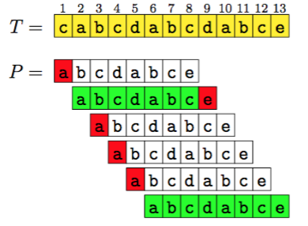

**Sottostringa**: serie di caratteri vicini

**Sottosequenza**: serie di caratteri non necessariamente vicini.

# Pattern matching di base

Effettua il pattern matching esatto, cercando la sotto stringa *P* dentro la stringa *T*.

```
Ingenuo(P,T)
// T ha lunghezza n e P ha lunghezza m <=n
for i to n-m+1
    j = 1
    while j <= m and P[j] == T[i+j-1]
        j = j + 1
    \EndWhile
    if j > m
        Segnala l'occorrenza del pattern
```

## Utilizzo della sentinella

La prima modifica che si può fare all'algoritmo per migliorarne l'efficienza è quello di ridurre il test del `while`, rimuovendo il controllo sulla lunghezza del pattern, riducendo così le opreazioni da 3 a 2.

Questo viene fatto aggiungendo una sentinella alla fine del pattern, ovvero viene aggiunto al pattern un carattere che non compare nell'alfabeto della stringa.

Perché questo funzioni è necessario aggiungere un carattere diverso dalla sentinella anche alla fine di *T* per permettere il match del pattern anche quando questo è un suffiso della stringa.


```
Ingenuo(P,T)
// T ha lunghezza n e P ha lunghezza m <=n
P[m+1] = $
T[n+1] = @
for i to n-m+1
    j = 1
    while P[j] == T[i+j-1]
        j = j + 1
    \EndWhile
    if j > m
        Segnala l'occorrenza del pattern
```

Nel caso non sia possibile modificare il testo si può togliere il `+1` del ciclo `for` e sostituirlo con un `if` che verifica l'uguaglianza dell'ultimo carattere.

D'ora in avanti assumeremo la presenza dei due caratteri sentinella.

## Riduzione del numero di confronti

Se il pattern contiene delle sottostringhe uguali, è possibile ridurre il numero di controlli.

Ad esempio nel caso sotto riportato, l'algoritmo \textsc{Ingenuo} effettua 20 confronti.



Ovvero è possibile evitare il confronto tra l'inzio del pattern e il terzo carattere del testo, perché si sa già che il terzo carattere del testo è uguale al secondo carattere del pattern, il quale è diverso dal primo carattere del pattern.
Lo stesso ragionamento vale anche per i due confronti successivi.

Ma si può fare di più, perché il pattern ha una sottostringa uguale al suo prefisso, ovvero i caratteri 7-8-9 della del testo sono uguali ad una sottostringa del pattern che coincide con il prefisso del pattern e dal momento che questo è già questa ugualiganza è già stata verificata, si possono ridurre utleriormente i confronti.


Per poter applicare queste osservazioni ad un algoritmo è necessario effettuare delle pre-elaborazioni delle stringhe.


## Pre-elaborazione fondamentale

Data una stirnga *S* di lunghezza *n*, la funzione *π_i^s* calcola la lunghezza del prefisso di *S* più lungo che occore nella posizione *i* di *S*.

Quindi *π_i^s* è il massimo *h* tale che 

```
S[1,h] = S[i, i+h-1]
```

Ad esempio:


Da notare che *Y = S[i, i+π_i-1]* è un bordo del prefisso di *S[1, i +π_i -1]* e per la relazione tra prefisso e bordo, vuol dire che quel prefisso ha periodo *p = i - 1*.

```
Peri=1abbiamoY =Sep=0chesonobordoeperiododegeneridiS. Sei≥2alloraoi+πi −1=n,nelqualcasoY =S[i,n],oppure
S[1 + πi] ̸= S[i + πi]
e, in entrambi i casi, la stringa S[1, i + πi − 1] e` il piu` lungo prefisso di S avente periodo p = i − 1.
Le sottostringhe S[i, i + πi − 1] non sono necessariamente disgiunte ma possono sovrapporsi.
Dato un i ≥ 2 consideriamo tutte le sottostringhe S[j,j + πj − 1] con 2 ≤ j ≤ i ed indichiamo con ri il valore massimo dell’estremo destro j + πj − 1 di tali sottostringhe e
con li = j l’estremo sinistro corrispondente. Se ci sono piu` sottostringhe S[j, j + πj − 1] con lo stesso estremo destro ri = j + πj − 1 massimo prendiamo l’estremo sinistro li = j di una qualsiasi di esse.
Detto in altro modo: S[1, ri] e` il piu` lungo prefisso di S che ha un periodo 1 ≤ p < i ed li = p + 1. Nel caso in cui S[1, ri] abbia piu` di un periodo proprio minore di i, scegliamo li = p + 1 dove p e` uno qualsiasi di tali periodi.
```

### Preambolazione fondamentale in tempo lineare

Seguendo l'approccio di definizione il tempo richiesto è *O(n^2)*, ma è possibile scendere a *O(n)*.

Supponiamo che *S* termini con un carattere diverso da tutti gli altri che compaiono nella stringa. Questo non è un problema perché si può sempre aggiungere una sentinella.

L'algoritmo calcola *π_1 = n* e poi calcola i valori *π_i, r_i, l_i* per *i = 2,...,n*.

...

Durante il calcolo di *π_i* possono verificarsi 2 casi:  

1. *i > r*, dove *r* rappresenta il punto in cui termina il precendente prefisso più lungo ... calcola *π_i* direttamente, confrontando i caratteri a partire dalla posizione *i* con i primi caratteri della stringa.
2. *i <= r*, il carattere *S[i]* è contenuto nella sottostirnga *alpha = S[l,r]*. Dal momento che *alpha* compare anche all'inzio di *S*, si ha che il caratter *S[i]* compare anche nella posizione *i' = i - l +1* di *S* e per la stessa ragione *beta = S[i,r] = S[i', π_l]* (*alpha* inizia alla posizione *l*).
3. ...

```
Funzione-Prefisso(S)
    // S stringa di lunghezza n > 1 con sentinella alla fine
    pref[1] = n \Comment{$ \pi_i, \pi_1 = n$}
    h = 0
    while S[1+h] == S[2+h] \Comment{Calcola $\pi_2$}
        h = h +1
    pref[2] = h
    l = 2
    r = 2 + h - 1
    for i = 3 to n
        if r < i \Comment{Caso 1}
            h = 0
            while S[1+h] == S[i+h]
                h = h+1
            pref[i] = h
            l = i
            r = i + h -1
        else \Comment{Caso 2}
            if pref[i-l+1] < r - i +1 \Comment{Caso 2a}
                pref[i] = pref[i - l +1]
            else \Comment{Caso 2b}
                h = r - i +1
                while S[1+h] = S[i +h]
                    h = h +1
                pref[i] = h
                l = i
                r = i +h -i
    return pref
```

La correttezza dell'algoritmo deriva da quanto detto prima

#### Complessità

Se non viene presa in considerazione la complessità dei cicli `while` si ha che la complessità è data da *O(n)*.

I cicli `while` terminano quando viene trovato un mismatch e al massimo venogno trovati *n-1* mismatch (1 dal `while` esterno, n-2 dai `while` dentro il ciclo `for`).

Ad ogni confroto con successo, il carattere destro (*S[i+h]*) viene sposto a destra di 1. Resta da dimostrare che per i confronti successivi il carattere *destro* non si sposta mai a sinistra.

**vedi dispense**

Pertanto vengono eseguiti al più *n-1* confronti con successo.
Si ottiene quindi una complessità per i `while` di *O(2n-2)*.

La complessità totale dell'algoritmo è data da *O(n) + Complessità while = O(n) + O(2n-2) = O(n)*.

### Matching esatto in tempo lineare

Per effettuare il pattern matching in tempo *O(m+n)* del pattern *P* in *T* è possibile utilizzare una versione leggermente modifica della funzione prefisso sulla stringa *S = P$T*.

... vedi dispense

