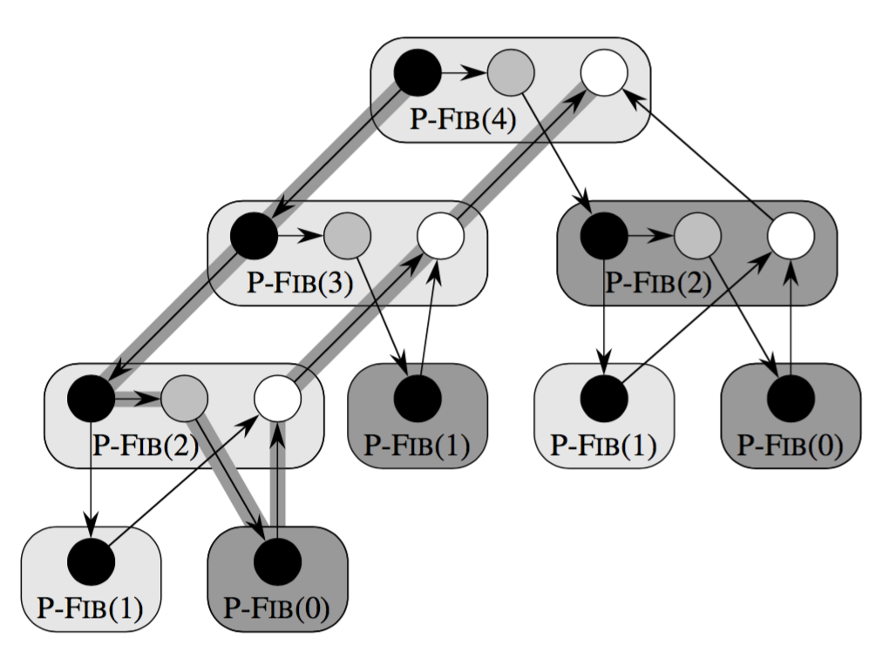

# Algoritmi multithread

Finora abbiami visto solamente algoritmi sequenziali, ma il progresso ha fornito la possibilità di eseguire algoritmi paralleli.

Il problema è che non c'è un modello di calcolo preciso. Tipicamente ci sono più processori con della memoria condivisa, oppure ci sono dei cluster composti da processori, ognuno con la propria memoria che comunica con altri cluster per condividere i dati.

Noi ci limiteremo al caso con più processori con memoria condivisa.

In questo caso il lavoro deve essere distribuito tra i vari processori, utilizzando dei **thread**, dei processi logici che vengono assegnati ai vari processori.

Tipicamente una volta che il thread è stato avviato, questo non viene fermato e rimane in esecuzione su quel processore fino alla fine (**thread statico**).

La gestione dei thread viene effettuata in modo automatico (**threading dinamico**) perché lasciarla allo sviluppatore è troppo pericoloso.
Con questa modalità, il programmatore può specificare quali parti del programma possono essere eseguite in parallelo, la suddivisione del programma in thread viene lasciata alla **piattaforma parallela** i quali vengono poi assegnati ai vari processori.

L'assegnazione viene effettauta con uno scheduler che cerca di bilanciare il lavoro svolto dai vari processori.

# Il primo algoritmo parallelo

Come notazione per lo pseudo codice utilizzeremo:

- **spawn**: posta davanti ad un istruzione indica che questa può essere eseguita in parallelo rispetto al resto del programma. In poche parole segnala che l'istruzione può essere eseguita su un altro thread.
- **sync**: segnala che è necessario aspettare la terminazione di tutti i thread attivati con spawn.
- **parallel**: ... (qualcosa con i cicli for, combinando le due precedenti, probabilmente si tratta dell'esecuzione del corpo del ciclo in modo parallelo).

L'istruzione **spawn** non obbliga il sistema ad eseguire il codice in parallelo, è il sistema che sceglie se conviene o meno.

Se da un programma parallelo togliamo tutte queste istruzioni, otteniamo un classico programma sequenziale.


## Fibonacci ricorsivo

```
\Function{P-Fib}{n}
\If{$n \leq 1$}
    \State \Return $n$
\EndIf
\State $x = \textbf{ spawn } \texttt{P-Fib}(n-1)$
\State $y = \texttt{P-Fib}(n-1)$
\State \textbf{sync}
\State \Return $ x + y$
\EndFunction
```

La complessità per la **versione sequenziale** di questo codice è proporzionale al numero ritornato dalla funzione, il quale cresce esponenzialmente.

## Grafo di computazione

L'esecuzione di un algoritmo multithread può essere rappresententata con un DAG.

Come prima cosa è necessario individure gli **strand** ovvero le porzioni di codice che vengono eseguite in modo sequenziale.

Come notazione per il grafo viene utilizzato:

- **nero** o un pallino pieno per indicare uno strand.
- **grigio** o un pallino con una crocetta per indicare la porzione di codice che c'è tra una spawn e una sync.
- **bianco** o un pallino vuoto per indicare l'istruzione di ritorno per un thread (o funzione).



(sistemare immagine, aggiungere la versione alternativa, spiegare gli archi)

## Metriche per la complessità

Per quanto riguarda la complessità asintotica possiamo considerare l'esecuzione di uno strand costante.

Vengono poi distinte due misure: il **lavoro** ovvero il numero di strand e la **durata** (span) che è la lunghezza del cammino massimo (critico) del DAG, ovvero il numero di strand che deveno per forza essere eseguiti in sequenza.

Nell'esempio di fibonacci, il lavoro è 17 e la durata è 8 unità di tempo.

Ovviamente se l'algoritmo viene eseguito in modo sequenziale, il lavoro coincide con la durata (T_1).
Se invece si hanno a disposizione infiniti processori, la durata è il tempo minimimo richiesto (T_\infty).
Infine, se si hanno a disposizione *p* processori, valgolo la legge del lavoro, ovvero che T_p >= T1/p, e la legge della durata, che secondo la quale Tp >= T_\infity.

Lo **speedup** di un algoritmo misura quanto viene velocizzato l'algoritmo utilizzando *p* processori:

**speedup** = T1/Tp \leq p

Se lo speedup è molto più piccolo di *p* non è conveniente aumentare il numero di processori.

Lo speedup viene detto **lineare** se 

T1/Tp = O(p)

e **perfetto** se 

T1/Tp = p

Un'altra misura è data dal **parallelismo** che è il rapporto tra T1 e T\inifty e misura il lavoro medio che può essere eseguito in parallelo, fornendo un limite superiore per lo speedup.

Il parallelismo fornisce anche un limite allo speedup perfetto, ovvero supponendo di avere un numero di processori molto più grande del parallelismo:

p >> T1/Tininity allora T1/Tp << p

Il **lasco** del parallelismo viene definito come

(T1/Tinifinity)/P

ovvero di quanto il parallelismo è maggiore del numero di processori. 

Se il lasco è minore di 1, si ha che T1/Tp <= T1/Tinfinity < p, quindi si ha che lo speedup non potrà mai essere perfetto.
Se invece il lasco è maggiore di 1, ci si può avvicinare allo speedup perfetto.

## Lo scheduling dei thread

L'ordine ottimo che minimizza la durata dell'algoritmo è dato dall'ordinamento topologico del DAG, il quale non è noto a priori.

Lo scheduler più semplice è quello **goloso**, il quale se ci sono più strand che thread vengono assegnati casualemente ai vari processori.

Se tutti i thread stanno si verifica un passo **completo** ovvero tutti i processori stanno lavorando. Se non ci sono strand a sufficienza per tenere impegnati tutti i processori si ha un passo **incompleto**. Ottenendo quindi una durata pari alla somma dei passi completi e di quelli incompleti.

Questo tipo di scheduler funziona sufficientemente bene dal momento che nel caso peggiore richiede il doppio del tempo rispetto alla schedulazione ottima effettuata conoscendo a priori il DAG, ovvero lo scheduler goloso è **2-competitivo**.

Usando lo scheduler goloso Tp è sempre <= di T1/P + TInfinity.

Sia T\*p il tempo richiesto dallo scheduler ottimo, T\*p >= T1/TInf e Tp >= TInf e quindi Tp <= 2T\*p.

Il numero di passi completi è <= di T1/P, perché se per assurdo non lo fosse, floor(T1/P) ovvero il numero di passi completi risulta essere maggiore o uguale di T1/P+1 = (T1 - (T1 mod p))/p +1 e pertanto il numero di strand risulterà essere p((T1 - (T1 mod p))/p +1) che è maggiore di T1, il che è assurdo.

Dopo aver eseguito un certo numero di passi completi, verrà eseguito un passo incompleto, quando questo succederà il DAG della computazione sarà un grafo G' che avrà un numero di nodi iniziali (senza dipendenze) minore di *p*, perché il passo è incompleto. Per forza di cose, uno di questi nodi appartiene al cammino critico e verrà eseguito, diminuendo di 1 la lunghezza di tale cammino. Dal momento che all'inizio la lunghezza del cammino è T_infinito, possono esserci al massimo T_inifinity passi incompleti.