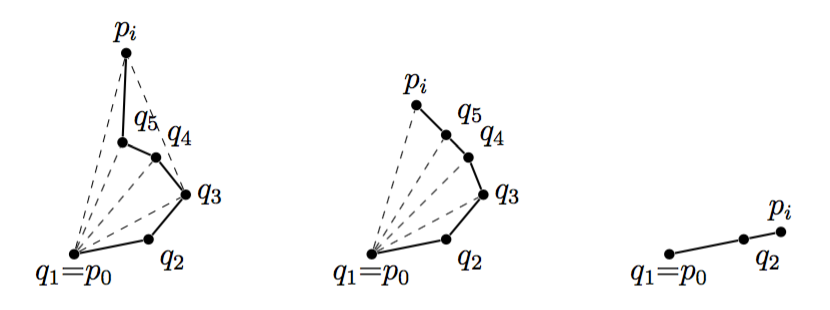
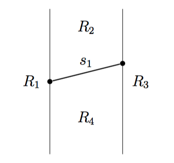
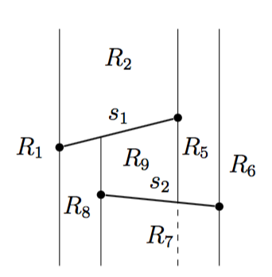

# Rircerca dell'involucro convesso

Si ha un insieme di punti e si vuole trovare il più piccolo involucro convesso che li contiene tutti.

## Algortimo di Graham

Se l'insieme *Q* contiene *n* punti riesce a risolvere il problema in *O(n log n)*.

L'algoritmo inizia cercando il punto *p0* più in basso. Se ci sono più punti con la stessa *y* minima, effettua il tie-breaking prendendo quello più a sinistra.

Dopodiché ordina i restanti *n-1* punti per angolo polare rispetto a *p0* e se due punti hanno lo stesso ancorlo polare li ordina per distanza crescente da *p0*

Una volta stabilito l'ordinamento dei punti *p0 p1 ... pn-1*, l'algoritmo inizia a costruire incrementalmente l'involucro convesso utilizzando una struttura dati *S* che si comporta come una pila.

Su *S* è possibile eseguri:

- `Push(S,p)`: aggiunge il punto *p* in cima alla pila
- `Pop(S)`: elimina il primo elemento della pila
- `Top(S)`: restituisce, senza eliminarlo, il valore del primo elemento della pila
- `Next-To-Top(S)`: restituisce il valore del penultimo elemento della pila.

L'algoritmo inizia inserendo *p0* nella pila, *p0* è sicuramente un punto dell'involucro convesso perché è quello più a in basso a sinistra.
Quindi quando c'è solo *p0* in *S* si ha l'involucro convesso degenere.

Dopodiché per ogni punto restante l'algoritmo prova ad aggiungerlo nel poligono convesso.
Quando viene aggiunto un nuovo punto viene fatto un controllo per rimuovere da *S* i punti che sono interni.

Questo viene fatto considerando i primi due punti della pila, *p* e *q*, e il punto corrente *p_i*.

Da notare che se nella pila c'è un solo elemento, il punto *pi* viene aggiunto senza problemi, perché in quel momento non può essere interno.

Se nel passare dal segmento *qp* al segmento *ppi* c'è una svolta a destra, vuol dire che aggiungendo il punto *pi* al poligono, il punto *p* diventa interno e quindi deve essere tolto.

Una volta tolto *p* è necessario rieffettuare lo stesso controllo, perché può essere che anche *q* diventi un punto interno del poligono.

```
Graham-Scan(Q)
    cerca p0
    ordina p1, ... pn-1 per angolo polare rispetto a p0
    \State \textsc{Push}$(S,p_0)$
    \For{$i = 1 \textbf{ to } n-1$}
        \State $p \gets \textsc{Top}(S)$
        \State $q \gets \textsc{Next-To-Top}(S)$
         \While{$q \neq \textsc{Nil} \textbf{ and } \textsc{Turn-left}(q,p,p_i)$}
            \State \textsc{Pop}$(S)$
            \State $p \gets q$
            \State $q \gets \textsc{Next-To-Top}(S)$
         \EndWhile
         \State Push(S,p_i)
    \EndFor
    \State \Return $S$
```

Per dimostrare la **correttezza** dell'algoritmo è necessario dimostrare che un punto viene tolto dal poligono solo quando non appartiene....

Discorso dell'angolo polare...



La **complessità** dell'algortimo ha un *O(n)* per la ricerca di *p_0*, *O(n log n)* per l'ordinamento dei punti e un restante *O(n)* per l'esecuzione del for.
La complessità totale è quindi dominata da quella della ricerca.

## Algoritmo di Jarvis

L'algoritmo di Jarvis calcola l'involucro convesso in tempo *O(nh)* dove *h* è il numero di vertici.

L'idea alla base dell'algorimto è quella di andare a *recitare dei chiodi piantati su un pezzo di legno con uno spago legato ad un punto del poligono convesso*.

L'algoritmo cerca quindi il punto *p0* in modo analogo all'algoritmo di Graham, dopodiché cerca tra i restanti punti, il punto *q1* che ha l'angolo polare più piccolo rispetto al punto di origine *p0*.
Una volta trovato questo punto la procedura viene ripetuta utilizzando come riferimento *q1* e così via.
Quando viene raggiunto il punto più alto del poligono, la semiretta di riferimento viene girata, in modo da avere sempre angoli minori di 180°. Questo punto viene chiamato *pt* ed è quello più in alto, tie-breaking scegliendo quello più a destra.

L'algoritmo termina quando si ritorna al punto di partenza.

```
\Function{Jarvis}{$Q$}
    \State // Cerca $p_0$ e $p_t$
    \State $H[1] \gets p_0$ \Comment{Array che contiene i punti dell'involucro}
    \State $k \gets 1$
    \While{$H[k]\neq p_t$}
        \State $q \gets \text{ Min-Polar-Right}(H[k],Q)$ \Comment{Angolo rispetto la semi-retta destra}
        \State $k \gets k +1$
        \State $H[k] \gets q$
    \EndWhile
    \State $q \gets \textsc{ Min-Polar-Left}(H[k],Q)$
    \While{$q \neq p_0$}
        \State $k \gets k+1$
        \State $H[k] \gets q$
        \State $q \gets \textsc{Min-Polar-Left}(H[k],Q)$
    \EndWhile
    \State \Return $H$
\EndFunction
```

Se la ricerca del minimo angolo polare richiede tempo *O(n)* si ha che questa viene ripetuta per ogni vertice del poligono e quindi si ha *O(nh)*.

Da notare che si può ottenere un leggero miglioramento andado a rimuovere da *Q* i punti che sono stati aggiunti a *H*.

## Tecnica incrementale per il poligono convesso (es 14)

Vengono ordinati i punti dell'insieme *Q* da sinistra verso destra, per poi iniziare ad aggiungerli uno ad uno al poligono convesso, il quale all'inizio è composto dal punto più a sinistra.

Per memorizzare i punti del poligono vengono utilizzate due pile, una per i punti della parte bassa e una per i punti della parte alta.

...

La complessità è la stessa dell'algoritmo di Graham, perché viene dominata dall'ordinamento dei punti.

## Tecnica divide et impera (es 15)

Vengono ordinati i punti da sinsitra a destra e poi vengono divisi in due sotto-insiemi, per ognuno dei quali viene poi cercato il poligono convesso in modo ricorsivo.

...

# Localizzazione dei punti nel piano

Data una suddivisione in regioni del piano, si vuole trovare una struttura dati che permetta di trovare rapidamente a quale regione del piano appartiene un dato punto. Le regioni possono anche avere area infinita e non necessariamente convesse.

Queste regioni vengono rappresentate da una successione di lati e vertici che formano il poligono in senso antiorario.

Il problema può però essere ritoddo alla ricerca del segmento dominante, ovvero dati *n* segmenti ed un punto *p*, trovare il gemento *si* che si trova immediatamente sopra al punto *p*.

Risolvere questo problema permette di risolvere il problema della localizzazione utilizzando tutti i lati delle regioni e associando ad ogni lato l'informazione relativa a quale regione si trova sotto.

Se una regione è illimitata si può utilizzare un bordo, ma all'inizio ci limiteremo al caso senza regioni illimitate.

## Segmento dominante

Ci sono *s1 ... sn* segmenti e un punto *p*, volgiamo trovare quale semgento si trova immediatamente sopra a *p*, assumendo che non ci siano segmenti verticali o segmenti che si intersecano e che ci sia almeno un segmento sopra il punto *p*.

Queste restrizioni sono presenti solo per semplificare l'algoritmo, ma possono essere rimosse, ad esempio spezzando i segmenti che si intersecano.

Come prima cosa viene definita una regione *R0* che contiene tutto il piano.
Dopodiché utilizziamo *s1* per suddividere *R0* nelle 4 regioni *R1,...R4* come riportato in figura.



Dopodiché viene preso in considerazione il segmento successivo *s2* e lo utilizziamo per dividere ulteriormente il piano in regioni.



Da notare che se due parti sono limitate superiormente dallo stesso segmento, vengono unite in un'unica parte.

Il partizionamento del piano può essere schematizzato in un DAG. Il grafo ottenuto non è un albero, per il fatto che più parti possono essere unite in un unica parte.


Una volta suddiviso il piano utilizzando tutti i segmenti si ottiene un  DAG le cui *"foglie"* raprpesentano le regioni del piano e ogni nodo ha al massimo 4 nodi adiacenti.

Una volta costruito il grafo si parte da *R0* e ci si sposta sulla regione adiacente al nodo relativo a *R0* e che contiene il punto *p*.

Per verificare se un punto si trova all'interno di una data regione, come prima cosa si valuta se la *x* del punto si trova tra *x1* e *x2*, ovvero le rette verticali che delimitano la regione. Se il punto si trova tra le due rette, viene verificato con `AngleLeft` se si trova sopra il segmento *s1* inferiore della regione e sotto il segmento *s2* superiore della regione.

Si ha quindi che il test di appertenenza ad una regione può essere fatto in tempo costante e deve essere ripetuto per ogni regione fino all'arrivo in una foglia.
Nel caso peggiore si ha quindi una complessità *O(n)*.

### Randomizzazione

L'ordine in cui si valutano i segmenti influisce sul partizionamento che si ottiene, il quale a sua volta influisce sulla lunghezza del cammino critico del DAG. 

... Questo cammino prende il nome di **lunghezza della storia di _R_**.

Assiumamo quindi che l'ordine di valutazione dei segmenti *s1,...sn* sia casuale e ci chiediamo quale sia la lungehzza media della storia della regione *R* che cointene il punto *p*.

...

