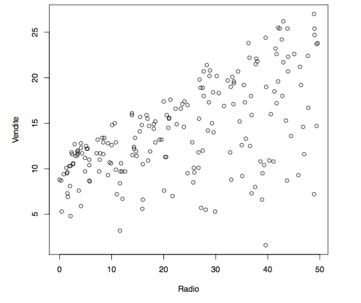
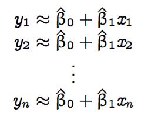
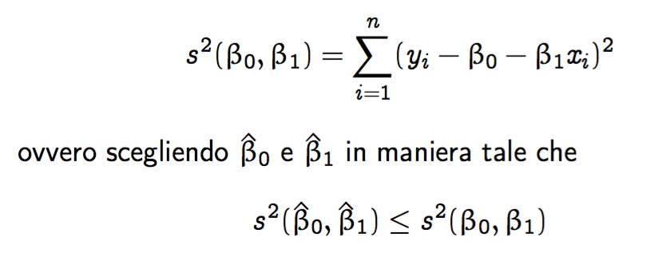
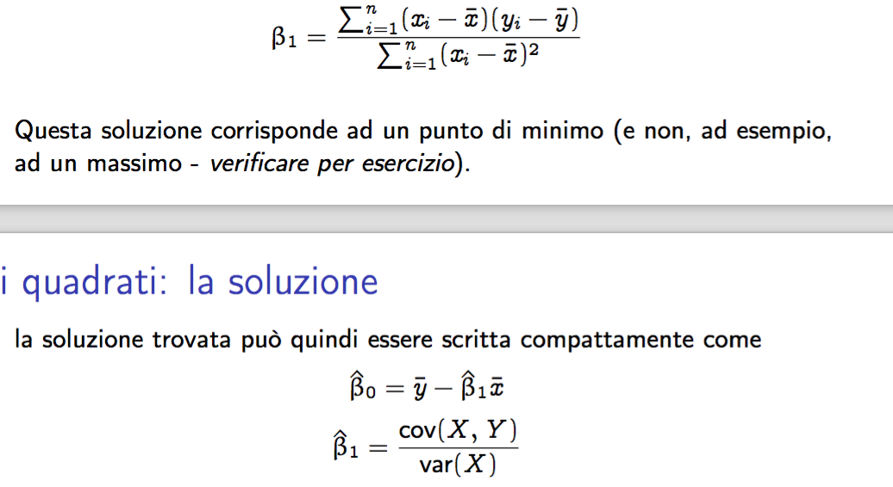
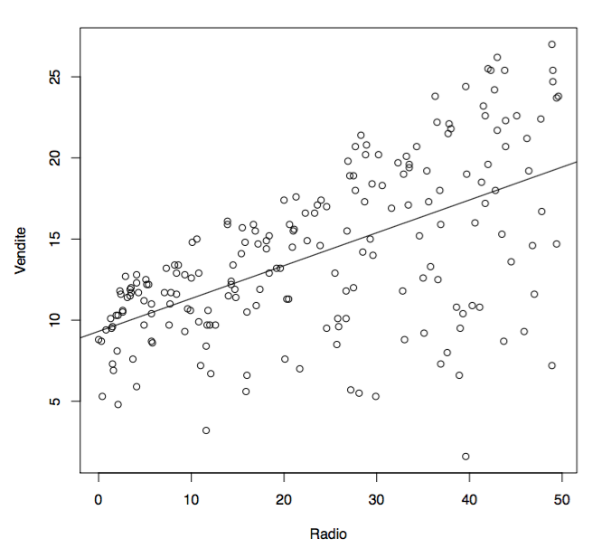
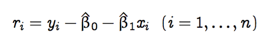

#Lezione 3 - Modello lineare semplice

- **OLTP**: strumenti di interrogazione su specifiche informazioni da rihicedere ai vari database, detti operativi
- **OLAP**: ...
- **KDD**: Knowledge discovery database, si parte da uno o più database operativi per costruirne uno strategico, il data whare house; questa costruzione comporta anche un'operazione di omogeneizzazione di definizione di variabil e operazioni di pulizia dei dati (**data mining analitico**).

# Modelli

**Modello**: (o algoritmo) rappresentazione semplificata del fenomeno di interesse, funzionale ad un obiettivo specifico.

Non esiste un modello vero in quanto si tratta di approssimazioni molto dettagliate, ci sono dei modelli che in determinati contesti risultano migliori di altri. Specialmente in ambiti non sceintifici, il criterio per la bontà di un modello è il **basta che funzioni**, questo perché tipicamente i dati che vengono utilizzati non sono stati raccolti con un criterio sperimentale.

Tipicamente il modello viene visto come una scatola nera, funziona ma non si sa quale sia il vero meccanismo che regola il fenomeno.
Tuttavia, questa black box deve essere comunque manutenuta, non basta avere solamente l'hardware e il software.

## Il modello lineare semplice

Si parte da due variabili e si costruisce un modello che li mette in relazione tra loro.

Il dataset di riferimento rigurada i dati di 200 mercati su cui opera un'azienda, per i quali si conosce la quantità di merce venduta in migliagia e il budget speso per la pubblicità radiofonica in quella zona.

Si vuole ottenere un'equazione che permetta di prevedere le vendite in funzione del budget.

Il primo passo è quello del costruire un grafico di dispersione, dove nelle *x* ci sono le spese e nelle *y* ci sono le unità vendute.



Dal grafico si può osservare un andamento lineare che può essere approssimata con:

```
vendite = beta_0 + beta_1 (radio) + (errore)
```

dove la componente *errore* esprime la parte delle vendite non legate alle pubblicità via radio.

Un modello di questo tipo prende il nome di **modello di regressione lineare semplice**.

La variabile *y* (*vendite*) prende il nome di **variabile risposta/dipendente/output** mentre *x* (*radio*) prende il nome di **variabile esplicativa/indipendente/inout** e i vari coefficiente *beta* prendono il nome di **parametri**.

Il gioco adesso diventa quello di andare a trovare dei valori *b^0* e *b^1* che approssimano la retta nel miglior modo possibile.
La ricerca avviene utilizzando i dati presenti nel dataset:



Raffinando l'idea si ottiene il metodo dei **minimi quadrati**



ovvero si vanno a cercare i parametri che minimizzano l'errore di stima ai minimi quadrati.

Si utilzza il quadrato della distanza, sia per rendere l'errore indipendete dal segno, sia per dare maggior peso ad errori maggiori.

Ci sono un po' di barbatrucchi matematici per trovare il minimo quello che interessa è:



Da notare che nel lato pratico non ci sarà mai un dataset con varianza nulla, perché in quel caso il problema di regressione non ha senso.
Per il dataset delle vendite si ottiene come retta ai minimi quadrati



### Residui

Non è detto che la retta approssimi bene i dati, anche se è quella dei minimi quadrati.

Un indicatore dell'andamento è dato dai **resiudui**, che rappresentano la differenza tra i valori osservati e quelli ottenuti utilizzando la retta.



Per costruzione della retta, la somma di tutti i residui risulta essere 0, quindi, per valutare la retta è necessario utilizzare la **varianza** dei residui. Minore è la varianza, migliore è la retta.

Nel caso peggiore, la varianza dei residui ha come bound superiore la varianza della risposta, ovvero *Var(Y)*.

È quindi possibile definire il **coefficiente di determinazione**:

```
R^2 = 1 - VAR(r1...rn) / VAR(Y)
```

*R^2* varia tra 0 e 1, dove 1 è il valore ottimo e 0 è il valore peggiore.

Da notare che ciò vale solo per la retta.
