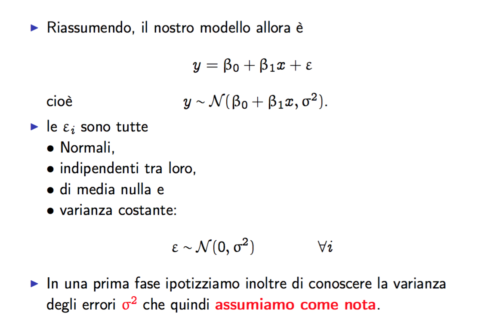
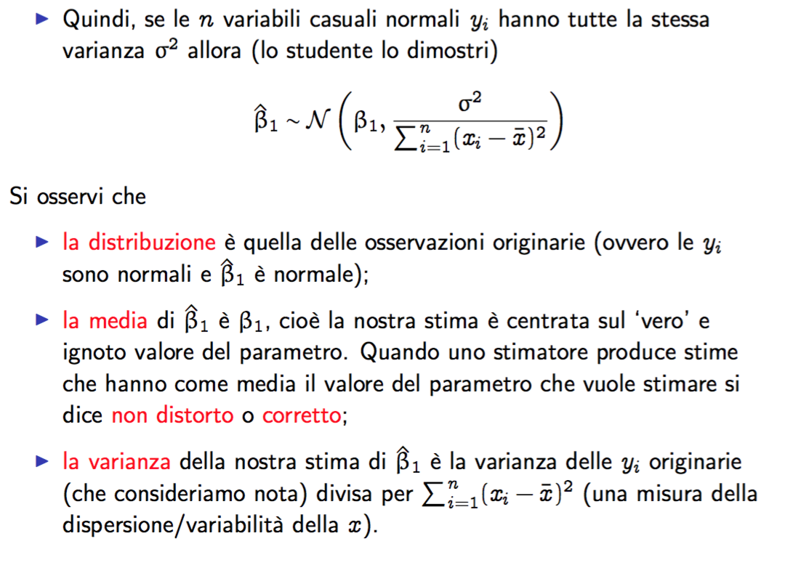
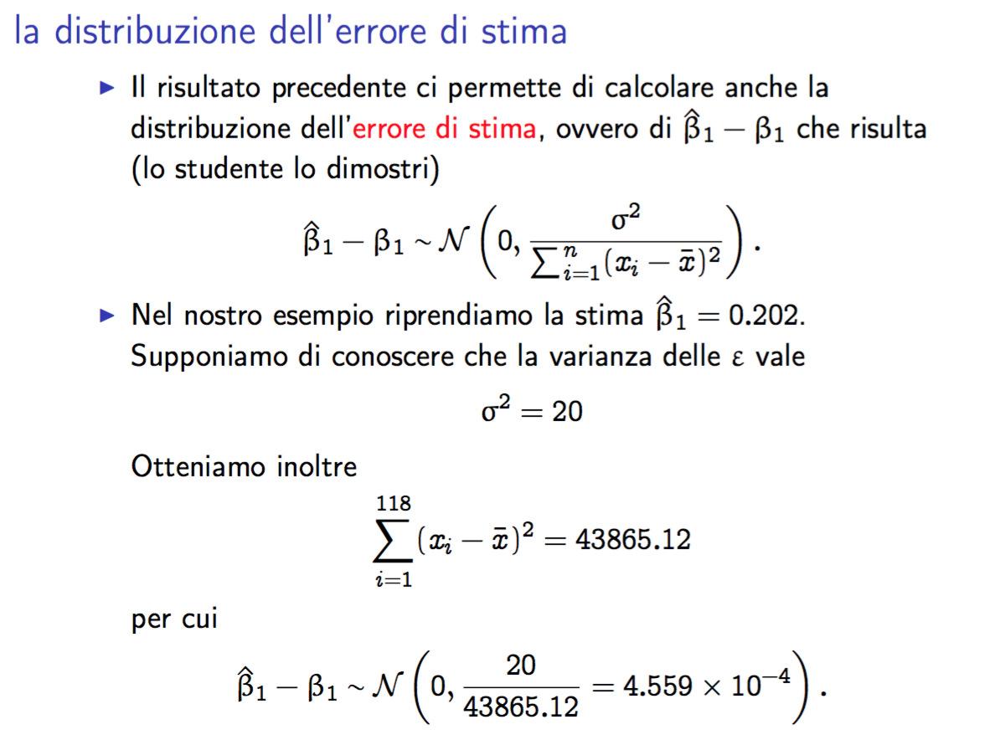
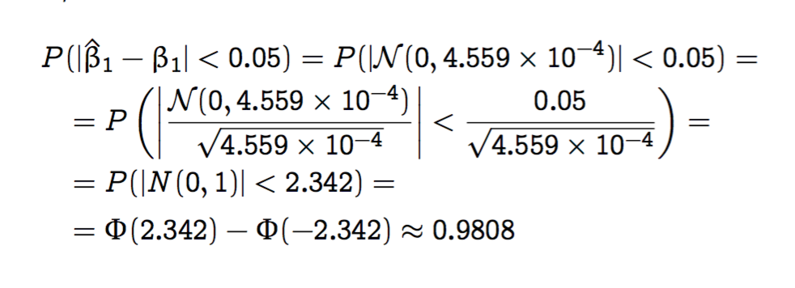
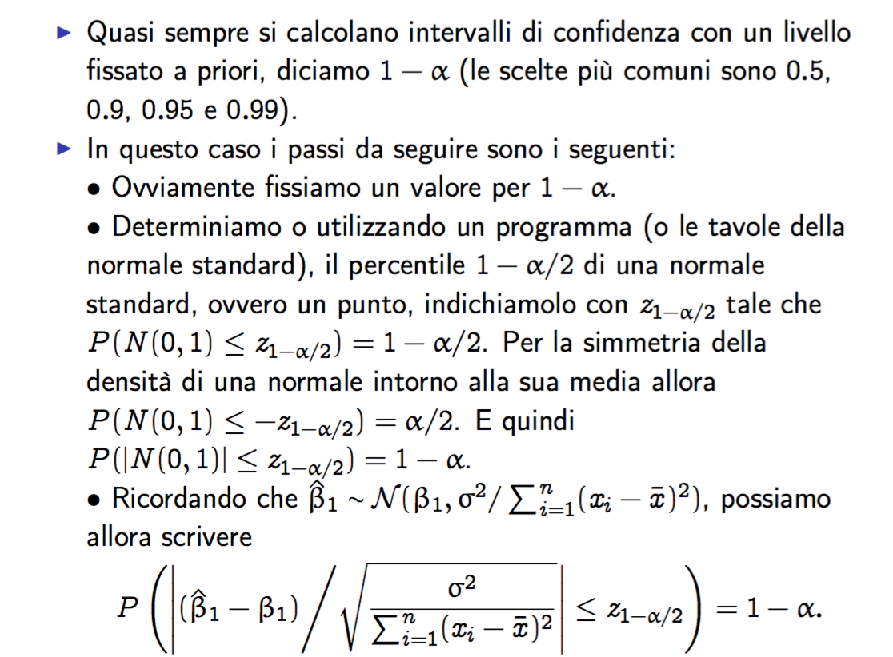
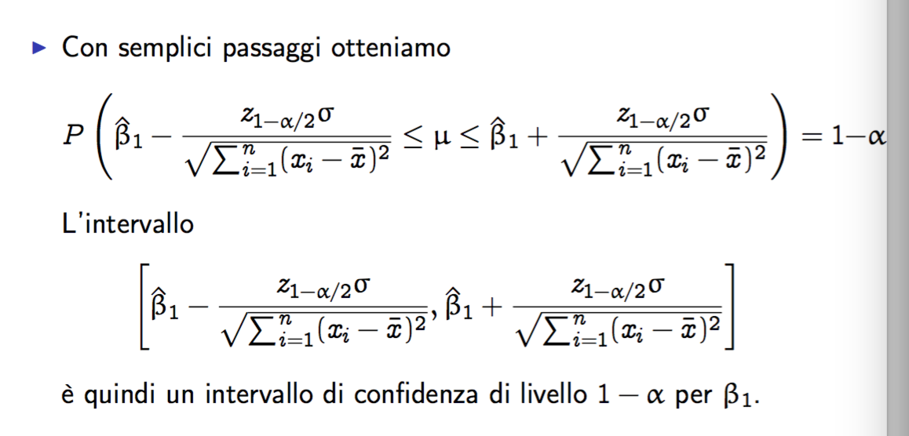

## I residui

*R^2* è un numero compreso tra 0 e 1, ma quanto bene va il mio modello?

Indicativamente a noi interessa quanto bene va il nostro modello a predirre il futuro?

Il modello ottenuto prende in cosiderazione i dati sui quali è stato calcolato ed è corretto assumere che, se vengono replicati gli stessi dati, ci sarà comunque un fattore di deversità tra la stime prodotte e i dati osservati.

La domanda diventa quindi, quanto i coefficenti stimati sono diversi dai valori corretti?
Ad esempio, se si ottiene un *beta_1cappello* uguale a 0 non si può dire che le *x* e le *y* sono tra loro indipendenti, ma che il modello lineare non è utile per spiegare *y* utilizzando *x*.

Quindi, quanto è l'errore che otteniamo con il modello ipotizzato? Quando possiamo dire che *R^2* è un valore sufficientemente buono?

Tornando al modello delle vendite, queste sono composte da due componenti:

- una componente **sistematica** (deterministica) che viene determinata dal moello di regressione e che dipende dalla spesa in pubblicità
- una componente **alleatoria** o erratica, che varia in modo stocastico e rappresenta le vendite dovute al caso e non prevedibili.

La compoenente erratica può essere modellata utilizzando una variabile alleatoria *epsilon* con media nulla, il che vuol dire che le previsione che risultano maggiori del valore medio siano confrontabili con quelle che risulatno minori.

È inoltre ragionevole assumere che *epsilon* sia indipendente sia da *x* che da *y*, ovvero che tutta la relazione tra *x* e *y* viene tutta vincolata dalla componenente sistematica. Si può quindi dire che la varianza di *epsilon* è costante.

Le ipotesi sul modello diventano quindi

- *e_i* hanno tutte la stessa distribuzione
- *E(e_i) = 0 forall i*
- per ogni i!=j, e_i è indipendente da e_j
- Le varianze degli e_i sono costanti.

Con questa definizione si ha che anche *y* è una variabile aleatoria di media *B_0 + B_1x* e varianza sigma^2, questo perché è una trasformazione lineare di una variabile alleatoria.

Sempre per quanto riguarda la distribuzione degli errori, sembra essere ragionevole che la questa sia simmetrica e che sia più probabile sbagliare tanto, ovvero che segua la distribuzione gaussaiana.

Piccolo reminder: ci stiamo facendo questo viaggione perché vogliamo sapere sa la nostra stima è dovuta al caso oppure è abbastanza corretta.

*Potrebbero essere interssanti i conti*

Idealmente la varianza dello stimatore è migliore, pertanto, dal momento per ottenere uno stimatore migliore è necessario avere delle oesservazioni diverse.

Una volta ottenuta la distribuzione dell'errore di stima è possibile calcolare la probabilità che l'errore commesso sia inferiore di una cerca soglia oppure che sia all'interno di un determinato intervallo.

Le informazioni riguardo l'intervallo prendono il nome di **intervallo di confidenza**. Di solito il livello dell'interallo di confidenza 1-Alpha viene fissato a 0.5, 0.95 e 0.99.

L'intervallo di confidenza viene quindi ottenuto utilizzando

**secondo set di slide, pagina 24, 25, 26, 27, ... 40**