# Errori possibili

Con la formulazione delle due ipotesi è possibile commettere due tipi di errori:

- **errore di primo tipo**: viene rifiutata H0 quando questa è vera.
- **errore di secondo tipo**: accettare H0 quando H0 è falsa.

Per come è stato costrutio il test statistico si ha che 

```
P(errore 1° tupo) = 1 - P(accettare h0 quando è vera)
```

e viene fissato ad `alpha`, perché `P(accettare h0 quando è vera) = 1- alpha`.

Tuttavia non viene detto nulla a riguardo dell'errore del secondo tipo.
Si sa solo che non si possono minimizzare i due errori contemporanamente, perché sono tra loro correlati.

Ma alla fine quello che conta è l'errore di primo tipo, perché la domanda che ci si pone è "*A:i dati sperimentali sono compatibili con H0?*" piuttosto che "*B:Quale tra H0 e H1 è vera?*".

L'approccio adottato prevede quindi di fissare l'errore più importante (con *alpha*) e minimizzare la probabilità d'errore del secondo tipo.

Sfruttando i dati è comunque possibile ridurre entrambi i tipi d'errore perché se il numero *n* di dati a disposizione è grande e quanto più è dispersa la variabile esplicativa, tanto più gli errori commessi sono minori.

# Commenti

Finora è stato assunto che i dati seguano una distribuzione normale, quindi prima di effettuare una regressione lineare è necessario andare a verificare che questo sia vero.

Per effettuare questa verifica servono delle tecniche grafiche ed analitiche complesse, pertanto è più ragionevole utilizzare un approccio alternativo che verifca a posteriori la normalità dei dati.

Un'altra ipotesi fatta riguarda la conoscenza della varianze delle distribuzione, ma nel lato pratico questo è un parametro ignoto.

Utilizzando il metodo dei minimi quadrati è possibile solamente stimare i coefficienti beta e non la varianza.

Tuttaivia, considerando *y = beta0 + beta1x + epsilon*, si può isolare *epsiolon* e stimarlo utilizzando i residui osservati:

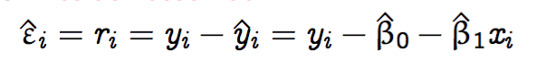

Si può quindi costrire uno stipatore per la varianza della componente di errore utilizando la varianza dei residui che è facilmente calcolabile.

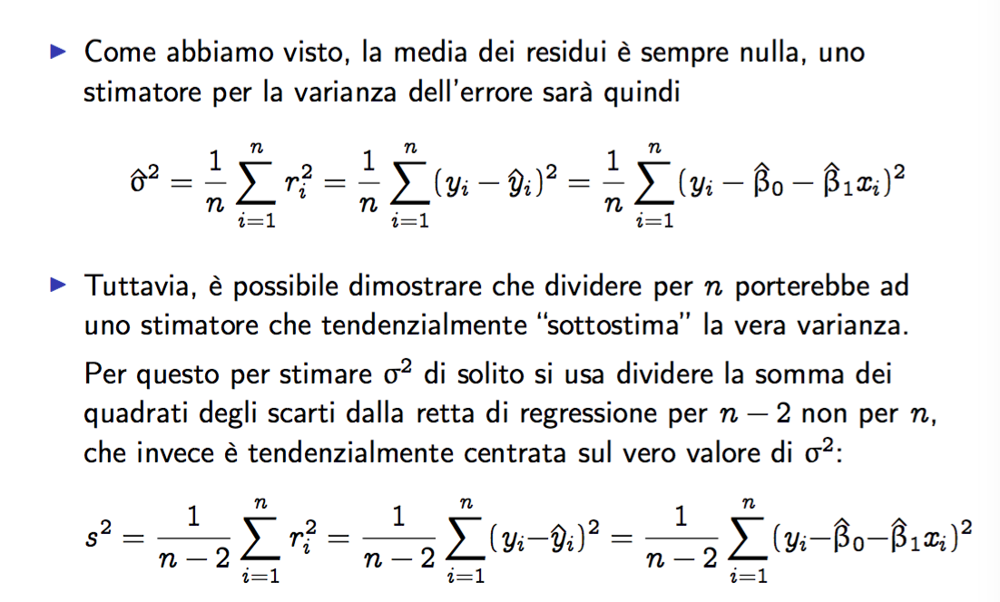

# Il problema di verifica delle ipotesi senza sigma2

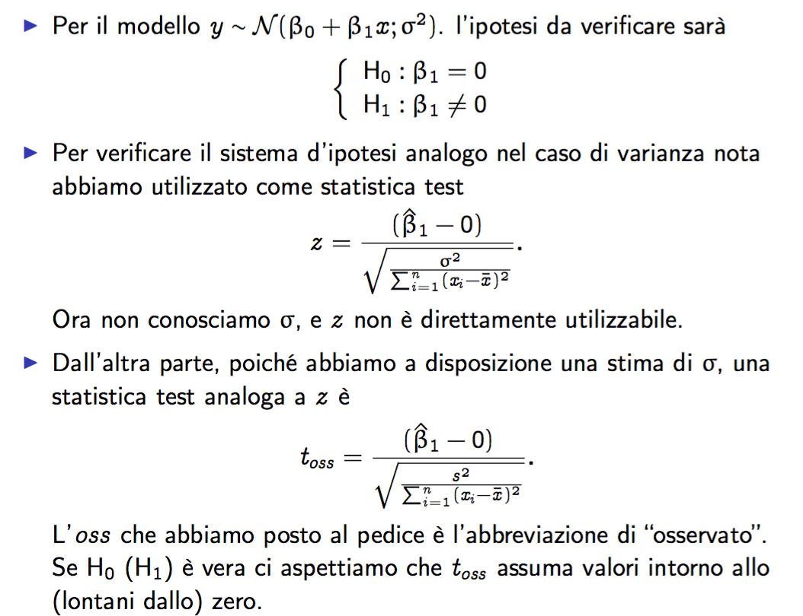

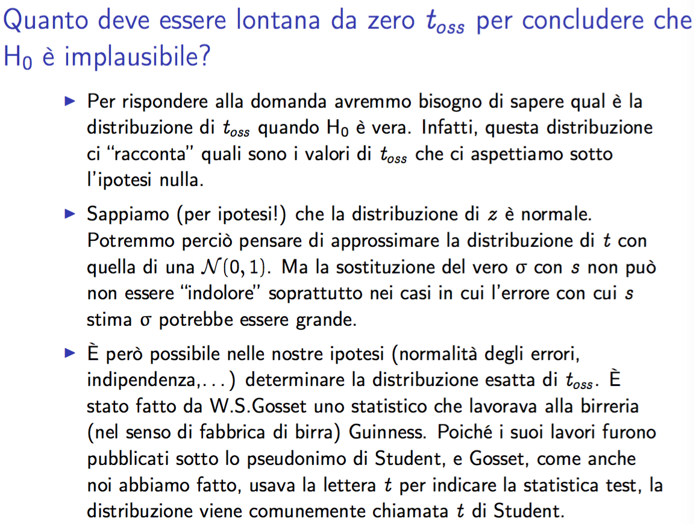

La distribuzione *t di Student* dipende da un solo parametro che prende il nome di **gradi di libertà**.
Durante a verifica dell'ipotesi sul coefficiente angolare della retta di regressione, il grado di libertà è *n-2*, ovvero è stato dimostrato che:

```
toss ∼ t di Student con n − 2 gradi di libertà.
```

Il grafico di questa distribuzione è simile a quello della normale, solo che ha delle code più pesanti.

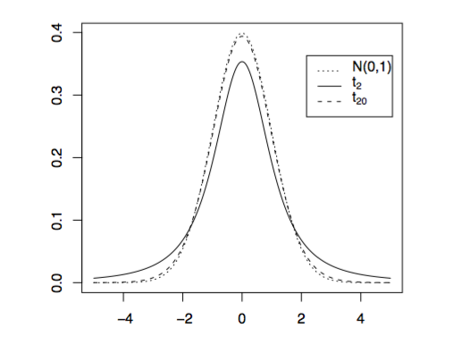

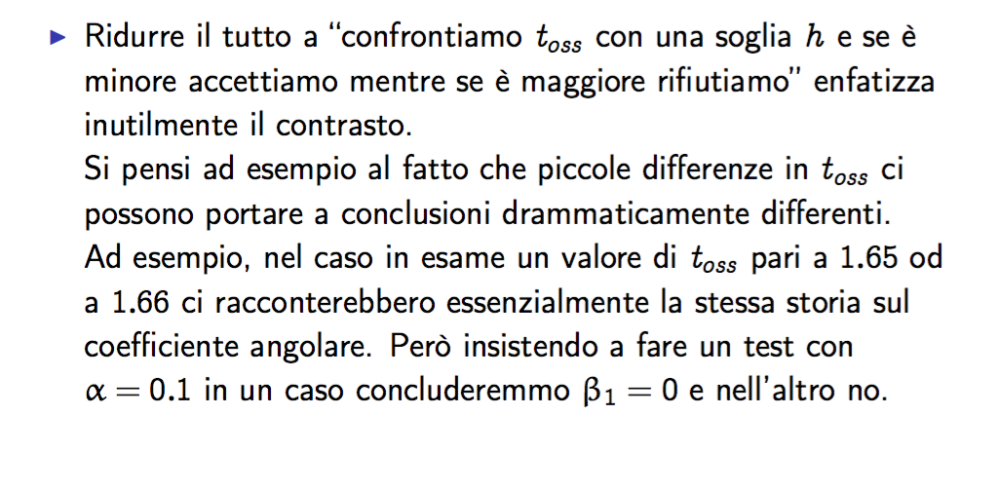

Ovvero il confronto su una certa soglia enfatizza troppo la differenza, tant'è che una piccola differenza sul valore porterebbe a dei risultati molto diversi.

L'idea è quindi quello di fissare un **livello di significatività osservato** o **p-value** uguale alla probabilità di osservare sotto H0 un valore di t_oss piò o uguamente lntanto da H0 di quanto effettivamente è osservato.

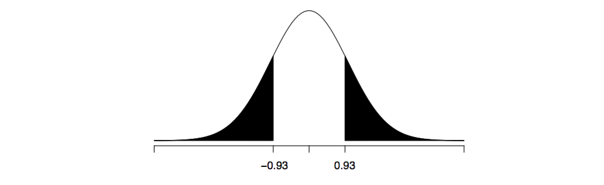

Il livello di significatività osservato costituisce una misura di qunato l'ipotesi nulla è plausibile sulla base dei dati.

Questo livello varia da 0 a 1 e più è grande, più i dati sono vicini ad H0.

- Se vale 0 vuol dire che sotto H0 non è possibile osservare nessun altro valore più lontano da H0, ovvero il valore osservato per t_oss è uno dei più lontani possibili.
- Se vale 1 vuol dire che sotto H0 tutti i possibili valori osservabili per t_oss sono "non più vicini di quello osservato, ovvero quello osservato è uno dei più vicini possibili.

*lontano da H0* equiva a dire *"lontano da 0 in entrambe le direzione"* quindi, nel caso delle vendite:

```
livello di significatività osserato = P(|t con 198 gradi| >= 9.921)
= 2xP(t con 198 grai >= 9.921)
```

Il calcolo della probabilità viene poi fatto utilizzando una tabella o un sofware apposito. Nell'esempio si ha che il livello di significativà osservato è 0.

Ovvero, che se la spesa in pubblicità via radio ha un effetto sulle ventide allora noi ci aspetteremo valori "Più lontani da H0 di qunato osservato". 

(Altra interpretazione del p-value)

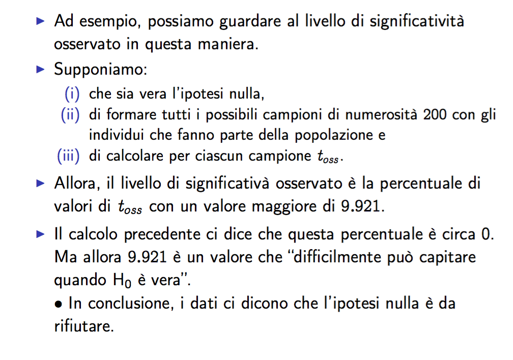

## Intevallo di confidenza

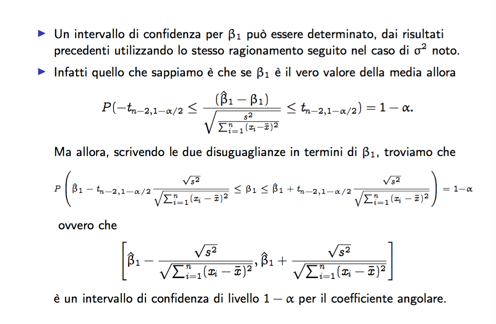

# Verifica di ipotesi su beta0

In modo simile è possibile stimare beta0, anche se risulta molto meno interessante, perché è beta1 che fornisce la relazione tra le *x* e le *y*.

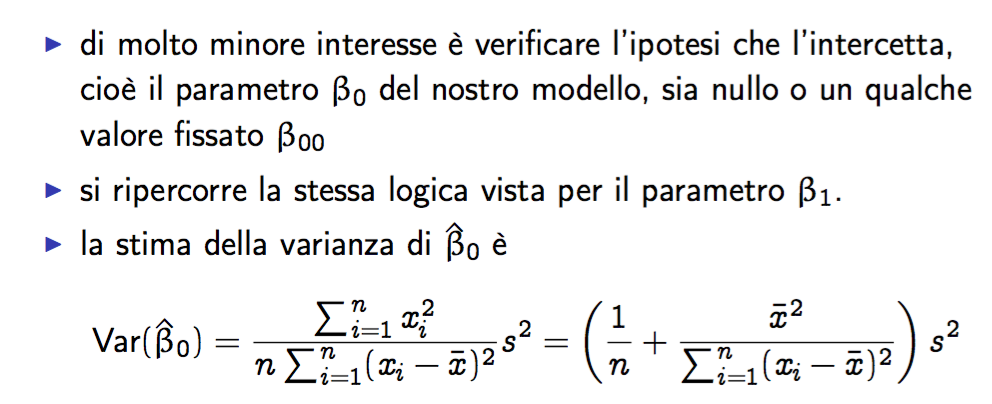

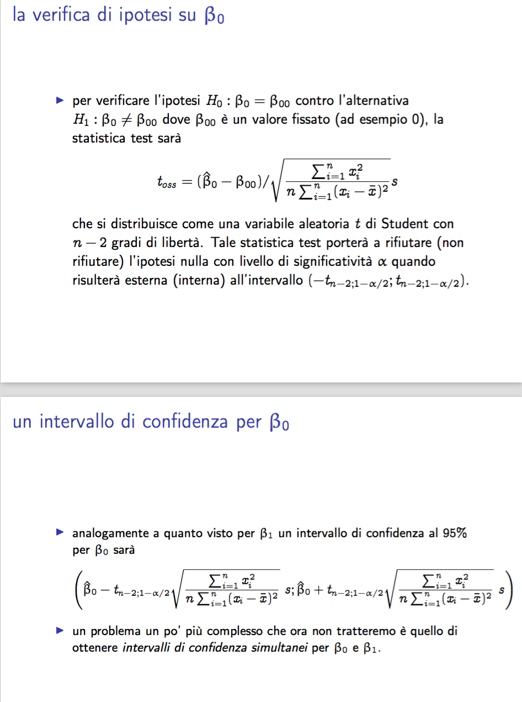

# Verifica di ipotesi globale sul modello

Per misurare la variazna spiegata dal modello abbiamo il coefficiente di determinazione *R^2* che misura la varianza spiegada dal moello rispotto a quella complessiva.
Non abbiamo però un criterio per capire se l'*R^2* osserbato è grande o piccolo.

Anche in questo caso è possbile impostare un problema di verifica di ipotesi, l'ipotesi sulla sarà l'indipendenza lineare tra *x* e *y*, mentre l'ipotesi alternativa prevedertà che la retta spieghi, almeno in parte, la relazione presente.

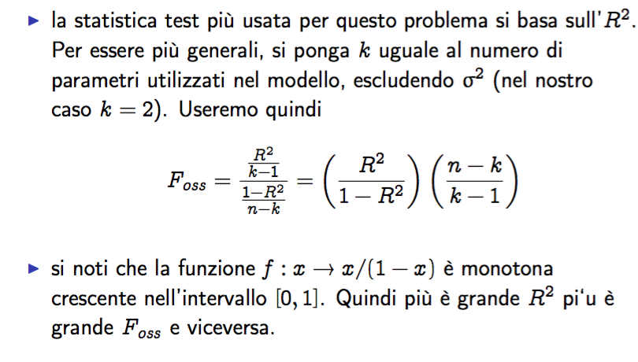

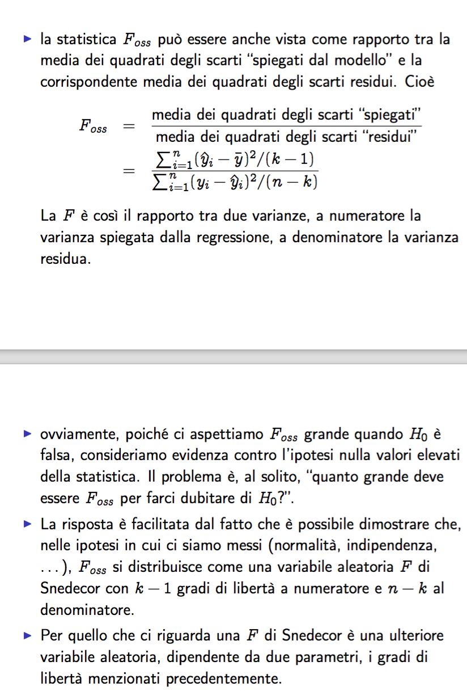

# Effettuare previsioni

Una volta fatto il modello, è carino utilizzarlo per effettuare delle previsioni o delle simulaizoni sul futuro.

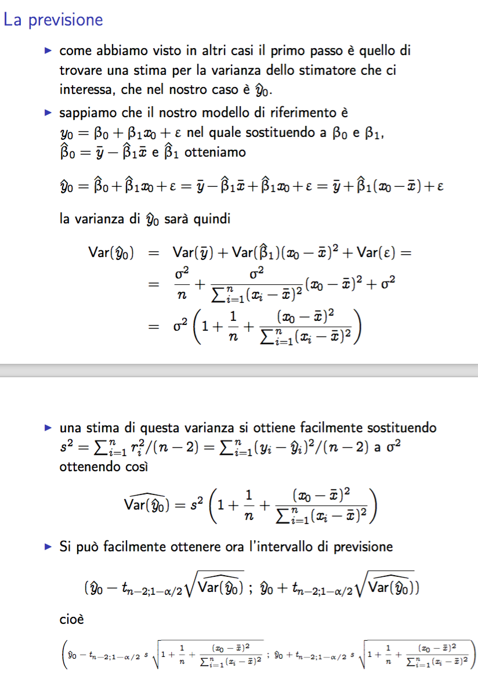


vedi slide, modlin4-2015 fino a 16