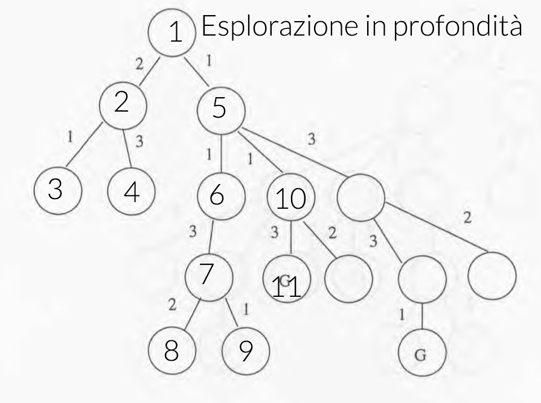
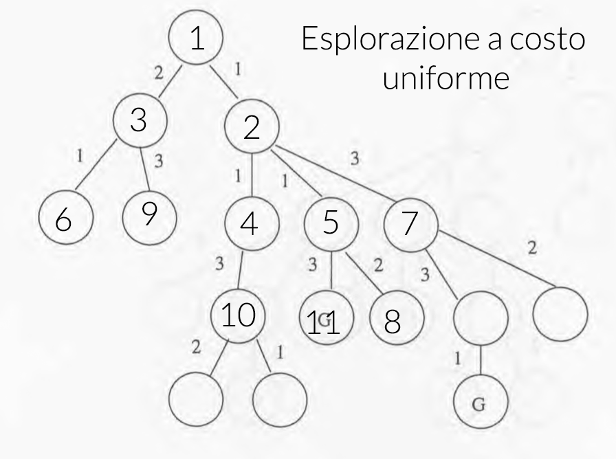

#Domande e risposte per il primo compitino di intelligenza artificiale

Note:

- Il primo compitino del 2013 e del 2011 sono molto simili.
- A* ed euristiche sembrano esserci quasi sempre

##Ricerca non informata

###Domanda 1 (20130404-d1)

Descrivere le principali strategie di ricerca non informate e confrontarle dal punto di vista della loro correttezza, completezza, ottimalità e complessità in tempo e spazio.

Considerare l'albero della figura e mostrare la sequenza di visita dei nodi per la ricerca in prodonfità, in ampiezza e con un costo uniforme, prima di arrivare ad uno dei due nodi goal (indidicati con la G).

####Soluzione

L'idea alla base di queste strategie è quella di andare a simulare l'esplorazione dei vari stati generando i successori degli stati già visitati.
Viene quindi creato un albero di ricerca dove ogni nodo rappresenta un determinato stato e i nodi che sono candidati per l'espansione vengono memorizzati in una struttura dati che prende il nome di frontiera.

L'implementazione della frontiera varia da algoritmo ad algoritmo.

La ricerca **breadth-first** (ampiezza) va ad espandere il nodo primo nodo non ancora espanso a profondità minore, utilizzando come frontiera una coda FIFO.

Questa soluzione è completa solamente se il fattore di branching dell'albero *b* è finito ed è ottima solamente se tutti gli archi hanno lo stesso costo, questo perché viene trovata la soluzione a profondità minima.

Per quanto riguarda la complessità temporale è esponenziale rispetto la profondità della prima soluzione *d*: *O(bd+1)*, questo perché nel caso pessimo può essere che il nodo goal venga espanso come ultimo nodo del livello.
Anche la complessità in termini di spazio è la stessa in quanto è necessario tenere in memoria tutti i nodi che sono stati espansi.

La ricerca a **costo uniforme** va ad espandere il nodo che ha il costo di cammino inferiore.

Questa ricerca risulta essere sia completa sia ottima, a condizione che il costo di ogni arco dell'albero sia maggiore di 0.

Sia la complessità in tempo che quella in spazio dipendono dal numero di nodi che hanno un costo di cammino minore del costo della soluzione ottima, la complessità è quindi _O(bC\*/ϵ)_ dove _C*_ è il costo della soluzione ottima e *ϵ* è il costo di arco minimo.

La ricerca **depth-first** va ad espandere il nodo a profondità massima.

Questa ricerca generalmente non è completa in quanto può trovare un cammino di profondità infinita o un ciclo, tuttavia se lo spazio degli stati è finito allora è completa.

La soluzione trovata da questa ricerca non è garantito che sia ottima, dal momento che l'algoritmo ritorna la prima che trova.

Tuttavia il vantaggio di questo algoritmo sta nella complessità.
La complessità temporale è *O(bm)* con *m* profondità massima di cammino ma la complessità spaziale è lineare _O(b\*m)_.

Delle strategie di ricerca non informate quella più interessante è quella depth-first in quanto garantisce una complessità in termini di spazio lineare, il problema è che generalmente non è ne ottima ne completa.

Esite una variante detta **iterative-deepening** che consiste nell'applicare DFS fino ad una profondità limitata (**Depth Limited**) e nel caso non venga trovata una soluzione, aumentare il limite finché non ne viene trovata una.

In questo modo si ottiene una ricerca completa, in tempo *O(bd)* e con complessità in spazio lineare. La soluzione trovata risulta anche ottima se tutti gli archi hanno lo stesso costo.

###Domanda 7 (20110214-d1)

Descrivere le principali strategie di ricerca non informate e confrontale dal punto di vista della loro correttezza, completezza e complessità in tempo e spazio.

Se volete fate esempi del loro uso su un problema di ricerca.

**Duplicata.**

## Ricerca informata

###Domanda 2 (20130404-d2)

Descrivere l'algoritmo A* e la nozione di euristica ammissibile e consistente, e discutere a cosa serva avere un'euristica con una di queste proprietà.

Nell'albero dell'esecizio uno (riportato sotto), considerare l'euristica che, per ogni nodo, ritorna la minima distanza (cioè il minimo numero di archi, non il loro costo) tra il nodo e una sua foglia discendente. 

Discutere le caratteristiche di questa euristica.

Mostrare la sequenza di visita dei nodi per la ricerca A* prima di arrivare ad uno dei due nodi goal (indicati con la G).

#### Soluzione

L'algoritmo A\* utilizza una **funzione di valutazione** per calcolare quanto è desiderabile visitare un determinato nodo.

In particolare la funzione di valutazione di un nodo è data dalla somma di altre due funzioni:

- `g(n)` che rappresenta il costo del cammino per raggiungere il nodo n
- `h(n)` che prende il nome di **funzione euristica**, una funzione che approssima il costo stimato per raggiungere il nodo goal a partire dal nodo n.

Se la funzione euristica è **ammissibile**, cioè se è una sotto-stima del costo effettivo per raggiungere il nodo *n*, allora la ricerca A\* su un albero è ottima.

Questo si dimostra supponendo che un goal sub-ottimo G2 sia stato generato e che si trovi nella coda (frontiera) e che ci sia un nodo *n* non ancora espanso su un cammino minimo verso il goal ottimo G.

> f(G2)  = g(G2)	-- perché h(G2) = 0
>
> f(G2)  > g(G)		-- perché G2 non è ottimo
> 
> f(G2)	>= f(n)	-- perché h è ammissibile

A* quindi non selezionerà mai G2 per l'espansione e di conseguenza verrà estratto prima G di G2.

Perché A\* sia ottimo anche nella ricerca su un grafo è necessario che la funzione euristica sia anche **consinstente** cioè, la funzione euristica calcolata per un nodo *n* deve essere minore o uguale a quella di un nodo *n'* sommata al costo per passare da *n* a *n'*: `h(n) <= c(n,a,n') + h(n')`, ottenendo così una funzione di valutazione non decrescente.
In questo modo si evita di scartare alcuni cammini del grafo che possono portare a soluzioni ottime.

La ricerca A\* è **completa** se il numero di nodi con `f <= f(G)` è finito.

Il tempo necessario per completare la ricerca è esponenziale rispetto la lunghezza della soluzione e l'errore commesso dall'euristica.

La complessità in spazio invece dipende dal numero di nodi con funzione di valutazione <= al costo della soluzione ottima.

A\* è quindi applicabile a problemi reali ma è necessario tenere sotto controllo l'occupazione della memoira, ed è per questo che sono state proposte delle varianti come IDA\*, MA\* (memory bounded) e SMA\*.

L'euristica *distanza dalle foglie* applicata all'esempio **non** è ammissibile in quanto non è una sottostima del costo per raggiungere un nodo goal. **sbagliato** Ad esempio, applicando questa euristica ad una foglia che non è un nodo goal si ottiene 0 come risultato il quale non può essere una sottostima del costo per raggiungere un nodo goal.

###Domanda 8 (20110214-d2)

Descrivere l'algoritmo A* e la notazione di euristica ammissibie e consistente, e provare formalemente la sua ottimalità.

**Duplicata**

###Domanda 14 (20061103-d2)

Si definisca il concetto di euristica e si dia la definizione formale di euristica ammissibile e consistente.

Si scelga un dominio e si faccia un esempio di due euristiche h1 e h2, definite in modo che tutte e due siano ammissibili e che h1 domini h2.

#### Soluzione

Un euristica è una funzione che viene utilizzata nella ricerca informata per stimare il costo per raggiungere un nodo goal a partire da un nodo *n*.

Perché sia efficace è necessario che l'euristica sia **ammissibile** cioè sia una sottostima della costo effettivo per raggiungere un nodo goal a partire da un dato nodo.

Nel caso la ricerca venga fatta su un grafo è necessario che l'euristica sia anche **consistente** cioè che dato la funzione euristica calcolata sul nodo *n* sia minore o uguale dell'euristica calcolata sul nodo *n'* sommata al costo per passare dal nodo *n* a *n'*.

Ad esempio per il problema 8-puzzle è possibile utilizzare due euristiche:

- h1(n): numero di tasselli fuori posto
- n2(n): distanza di manhattan, cioè la distanza dalla posizione desiderata di ogni tassello del puzzle.

In questo caso entrambe le euristiche sono ammissibili perché sono una sottostima del numero di mosse per completare il puzzle, ma in particolare h2 è sempre maggiore di h1 per ogni nodo, in questo caso di dice che h2 **domina** h1.

L'euristica dominante è migliore per la ricerca dal momento che è più precisa, tuttavia può essere complessa da calcolare e per tanto utilizzare l'euristica dominante non sempre è vantaggioso. 

###Domanda 20 (20090218-d1)

Definire il concetto di euristica, incluse le definizioni di euristica ammissibile e euristica consistente.

Discutere il concetto di dominanza fra euristiche e del perché questo concetto sia utile.

Infine, discutere di come si possa deriviare il modo sistematico un euristica.

#### Soluzione

Un modo sistematico per derivare delle euristiche ammissibili è quello di risolvere una versione rilassata del problema, cioè andare a risolvere lo stesso problema per il quale si vuole trovare un euristica, senza però andare a considerare alcune regole.

Ad esempio la distanza di Manhattan per 8-puzzle può essere calcolata andando a rilassare 8-puzzle, permettendo ad ogni tassello di spostarsi in un quadrato anche se questo è occupato.
 
###Domanda 18 (20061103b-d1)

Descrivere in modo preciso l'algoritmo di ricerca generico e dire come si istanzia per ottenere la ricerca A*.

Dire anche le proprietà di cui A* gode, motivandole in modo preciso, in particolare dimostrare perché A* è ottimo.

####Soluzione

L'algoritmo di ricerca generico cerca di costruire un albero utilizzando una struttura di supporto chiamata *frontiera*.

L'algoritmo inizia costruendo il nodo radice dell'albero con lo stato iniziale del problema e lo inserisce nella frontiera.

Dopodiché, finché la frontiera non è vuota, estrae un nodo dalla frontiera, verifica se questo nodo è un nodo goal e nel caso costruisce e ritorna una soluzione.
Se invece il nodo non è goal, lo espande, andando a creare e ad insereire nella frontiera un nodo per ogni suo successore.

Se la frontiera si svuota, vuol dire che il problema non ha soluzione e quindi ritorna un fallimento.

La scelta del nodo che viene estratto dalla frontiera determina la strategia di ricerca.

Da notare che un nodo dell'albero è un riferimento ad un determinato stato del problema al quale vengono aggiunte delle informazioni riguardanti le azioni disponibili, il costo di cammino, il padre, ecc. Inoltre lo stesso stato può essere associato a più nodi dell'albero. 

**A\* è già stato trattato**

###Domanda 21 (20090218-d2)

Dimostrare formalmente l'ottimalità dell'algoritmo di ricerca informato A* e presentare (nel maggior dettaglio possibile) le varianti viste a lezione che tentano di ridurre l'occupazione di memoria.

Discutere in modo comparativo i vantaggi/svantaggi di tali varianti.

#### Soluzione 

**L'ottimalità è già stata trattata**

L'idea più semplice è quella di andare a limitare il numero di nodi che possono finire nella frontiera, __IDA\*__ non inserisce nella frontiera i nodi che hanno una funzione di valutazione maggiore di un certo valore detto *cutof f*.

Se non viene trovata una soluzione, allora si ripete la ricerca utilizzando come valore di *cutof* il minimo valore della funzione di valutazione precedentemente scartato.

In questo modo verranno espansi in memoria solamente un numero limitato di nodi, sorgono però due problemi:

1. C'è la possibilità di fare molte iterazioni, e tra un'iterazione e l'altra vengono scartati tutti i nodi
2. Non viene sfruttata al massimo la memoria disponbile, specialemente nelle prime iterazioni.

Un'altra strategia è quella utilizzata da _SMA\*_ (la versione modificata di MA\*), che espande i nodi come la versione normale di A\*, con la differenza che quando la non c'è più spazio, scarta dalla coda i nodi peggiori, cioè quelli con funzione di valutazione più alta.

Quando viene scartato un nodo dalla coda, viene memorizzato sul padre del nodo il suo valore delle funzione di valutazione, in questo modo è possibile sapere il valore del figlio migliore nel caso sia necessaria una seconda espansione.

Se tutti i nodi nella coda hanno lo stesso valore di funzione di valutazione vengono scartati quelli più vecchi. 

Questa ricerca risulta completa solo se la soluzione può essere contenuta nella memoria e ottima se la soluzione è raggiungibile, sennò è possibile modificare l'algoritmo in modo che ritorni la miglior soluzione raggiungibile.

Segue che SMA\* risulta migliore di IDA\* perché non sono necessarie iterazioni e sfrutta al meglio la memoria disponbile.

##Giochi

###Domanda 3 (20130404-d3)

Nell'ambito dei giochi, descrivere l'algoritmo minimax e la potatura alfa-beta per giochi deterministici e per giochi stocastici.

Discutere la condizione in cui la potatura alfa-beta è più conveniente.

####Soluzione

L'algortimo Minimax viene utilizzato per creare una strategia di gioco tra due avversari che giocano in modo perfetto.

L'idea alla base dell'algortimo è quella di andare a massimizzare l'utilità di una mossa considerando che l'avversario Min giochi in modo perfetto.

Per Max viene quindi scelta la mossa che porta a massimizzare il valore di utilità considerando che la mossa di Min cercherà di minimizzarlo.

L'algoritmo espande l'albero fino ad arrivare alle foglie, una volta raggiunte le foglie, propaga il loro valore di utilità nei nodi interni dell'albero.

Il valore di utilità di un nodo interno associato ad una mossa di Min è pari al minimo valore d'utilità delle foglie del nodo, viceversa per max.

Questo algoritmo è completo solo se è possibile raggiungere le foglie e la complessità in tempo che è esponenziale secondo O(bm), trattandosi di una ricerca in profondità la complessità in spazio è O(bm).

L'algoritmo però è ottimo sia nel caso in cui l'avversario giochi in modo ottimo, sia nel caso in cui l'avversario giochi in modo sub-ottimo.

Una variante di questo algoritmo utilizza una funzione di valutazione che può essere calcolata anche per i nodi interni, in questo modo è possibile terminare prima la ricerca.

Per migliorare le prestazioni dell'algoritmo è possibile utilizzare la potatura 𝜶-𝜷.

Durante la ricerca nell'albero viene tenuta traccia del massimo valore per Max finora incontrato (𝜶) e del minimo valore per Min 𝜷.

In questo modo, quando si sta esaminando un nodo è possibile scartare un'interno sotto-albero.

Quando si sta valutando un nodo Max viene aggiornato il valore di 𝜶 con il massimo valore dei figli e se 𝜶 è maggiore di 𝜷 allora viene eseguita la potatura.

Viceversa se si sta esaminando un nodo Min, viene aggiornato il valore di 𝜷 e se questo risulta essere minore di 𝜶 viene fatta una potatura.

Questa potatura permette di evitare di esplorare parti dell'albero che sono associate a delle mosse svantaggiose, inoltre, se i nodi sono ordinati in modo ottimo, cioè quando cerca Min sono in ordine cresente e quando cerca Max sono in ordine decrescente, la complessità di Minimax con la potatura diventa O(bm/2).

In caso di giochi stocastici, è possibile applicare sia Minimax che la potatura 𝜶-𝜷, con la differenza che l'albero contiene anche dei nodi "chance" il cui laore di utilità è pari alla media del valore di utilità dei suoi successori.

---

##Domanda 4 (20130404-d4)

Dato il seguente problema di colorazione dei grafi:

- Variabili x1,x2,x3,x4
- Dominio {1,2,3} per tutte le variabili
- vincoli x1!=x2, x2!=x3, x3!=x4, x1!=x3, x2!=x4

Risolverlo tramite l'algoritmo di ricerca con backtracking e foward checking, mostrando l'albero di ricerca e i domini delle variabili future ad ogni passo dell'algoritmo.

Istanziare le variabile in ordine crescente di indice e scegliere i valori dal più grande al più piccolo.

##Domanda 5 (20130404-d5)

Nell'ambito della logica proposizionale, descrivere l'algoritmo del model checking, spiegando a cosa serve e descrivendo i suoi pregi e difetti.

Data la base di conoscenza che contiene le seguenti formule:

- b and c => a
- e and f => a
- d = > b
- f and h => b
- e
- g => f
- a => g

Indicare tutti i possibili letterali positivi che sono conseguenze logiche e dare un modello dell'intera base di conoscenza.

##Domanda 6 (20130404-d6)

Definire la regola di risoluzione e provare la completezza e corretteza dell'algoritmo di risoluzione.

Considerando la base di conoscenza della domanda 5 (20130404-d5), descrivere il comportamento dell'algoritmo di risoluzione per porvare se *f* è una sua conseguenza logica.

##Domanda 9 (20110214-d3)

Nell'ambito dei giochi, descrivere l'algoritmo minimax e la potatura alfa-beta. Considerare il gioco del tris su una scacchiera 2x2 dove oltre alle solite mosse:

- X può mettere una X in una cella vuota
- O può mettere una O in una cella vuota

Ogni giocatore può anche decidere di passare.

Disegnare l'albero del gioco fino al livello 2, evitando di inserire nodi che rappresentano stati che sono rotazioni o riflessione di stati fratelli già presenti (nota: dovrebbero esserci 5 foglie).

Considerare poi la funzione di valutazione *f* = numero di X - numero di O.

Indicare il valore di *f* per ogni nodo dell'albero disegnato e mostrare quali nodi vengono potati da alfa-beta.

Discutere il comportamento dell'algoritmo minimax e della potatura alfa-beta nel caso in cui non ci sia limite di pronfondità.

##Domanda 10 (20110214-d4)

conincide con la domanda 4. Stesso identico esercizio.

##Domanda 11 (20110214-d5)

Nell'ambito della logica proposizionale, discutere la tecnica del model checking, spiegandone pregi e difetti.

Data la base di conoscenza che cointene le seguenti formule:

- b and c => a
- e and f => a
- d => b
- f and h => b
- e => c
- h => d
- e
- g => f
- c => g

Dare un modello dell'intera base di conoscenza. 

Dara anche tutti i letterali positivi che sono conseguenze logiche e indicare alcuni letterali positivi che non sono conseguenze logiche.

##Domanda 12 (20110214-d6)

Definire la regola di risoluzione e dimostrare la sua completezza e correttezza per clausole di Horn. 

Far vedere come può essere usata nella base di conoscenza della domanda  20110214-d5 per provare che *g* è una sua conseguenza logica.

##Domanda 13 (20061103-d1)

Si definisca l'algoritmo di Hill-Climbing, spiegandono in quali casi sia ragionevole adottarlo e discuntendo i problemi a cui va incontro.

##Domanda 15 (20061103-d3)

Si definisca in modo preciso e formale l'algoritmo di Forward-Chaining per la logica proposizionale, discutendone e, ove appropriato, provandone le proprietà computazionali.

##Domanda 16 (20061103-d4)

##Domanda 17 (20061103-d5)

##Domanda 19 (20061103b-d2)

Descrivere nel dettaglio l'architettura del software di un agente basato su goal, motivandone il vantaggio rispetto a quella di un agente a riflesso con stato e la differenza rispetto ad un'agente basato su misura di utilità.

##Domanda 19 (20061103b-d3)

Si descriva formalmente l'algoritmo di enumerazione di modelli nella logica proposizionale per vericare se una senza 𝜶 è conseguenza logica di una base di conoscenza KB, si dica anche qual'è la complessità in tempo e spazio.

##Domanda 22 (20090218-d3)

Nel contesto della teoria del gioco perfetto, descrivere l'algoritmo alfa-beta pruning, dimostrandone formalemente la complessità nel caso più favorevole.

##Domanda 23 (20090218-d4)

Nel contesto della teoria del gioco perfetto, spiagare come si possa trattare il caso di giochi con elementi di chance.

Discutere perché non è ragionevole modellare giochi ad informazione parziale tramite la soluzione identificata per quelli con elementi di chance.

##Domanda 24 (20090218-d5)

Nel contesto della inferenza nella logica proposizionale, presentare l'algortimo di risoluzione, discuterne le proprietà computazionali, e spiegare perché utilizza sentenze in forma normale congiuntiva.

##Domanda 26 (esempio_compitino-d2)

Descrivere in modo preciso l'algoritmo di ricerca generico, e dire come si istanzia per ottenere la ricerca A*.

Dire anche le proprietà di cui A* gode, motivandole in modo preciso, in particolare spiegare perché A* è ottima.

##Domanda 27 (esempio_compitino-d3)

Descrivere in modo preciso l'algoritmo di Forward chainigng per la logica proposizionale e descrivere le sue proprietà.

##Domanda 28 (esempio_compitino-d5)

Si consideri una base di conoscenza proposizionale con solo 4 simboli, A,B,C,D. 

Dire quanti modelli possiedono le seguenti sentenze e giustificare la risposta in dettaglio.

1. (A and B) or (B => C)
2. (A and B) or D
3. (A => (B => C)) and D

##Domanda 29 (esempio_compitino-d6)

Si considere il mondo dei Wumpus visto a lezione e i seguenti fatti percepiti dall'agente:

1. nella casella (1,1) non c'è nulla
2. nella casella (1,2) c'è puzza, non c'è brezza, non c'è trappola e non c'è wumpus
3. nella casella (2,1) c'è brezza, non c'è puzza, non c'è trappola e non c'è wumpus.

Si considerino le caselle suddette insieme alle caselle (3,1), (2,2) e (1,3). Dai fatti su elencati, dalle regole che definiscono il mondo dei wumpus ed utilizzando la regola di risoluzione, si dimostri che la sentenza W_1,3 è conseguenza logica delle base di conoscenza unitamente alle osservazioni.