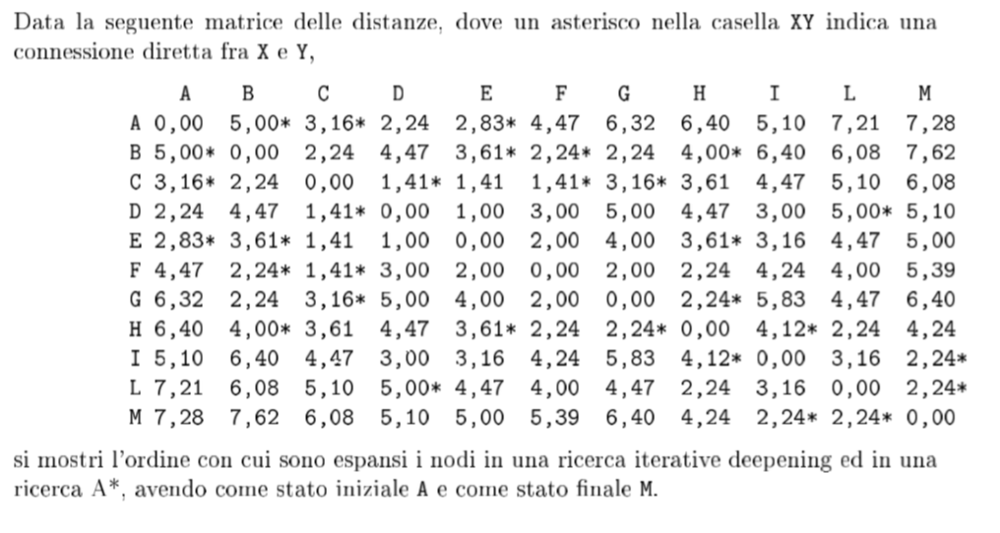
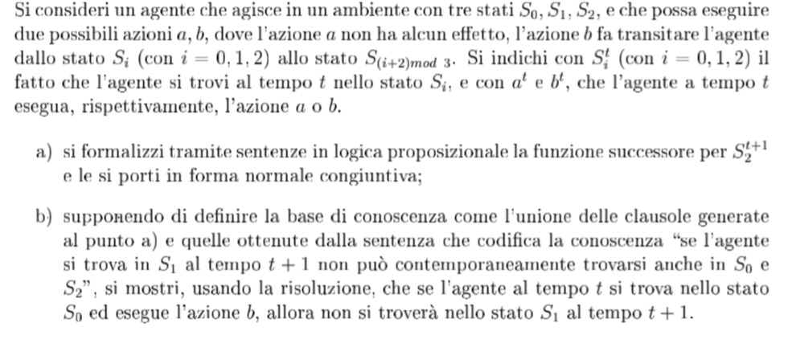

#Domande e risposte per il primo compitino di intelligenza artificiale

Note:

- Il primo compitino del 2013 e del 2011 sono molto simili.
- A* ed euristiche sembrano esserci quasi sempre

##Domanda 1 (20130404-d1)

Descrivere le principali strategie di ricerca non infomrate e confrontarle dal punto di vista della loro correttezza, completezza, ottimilità e complessità in tempo e spazio.

Considerare l'albero della figura e mostrare la seeuqnza di visita dei nodi per la ricerca in prodonfità, in ampiezza e con un costo uniforme, prima di arrivare ad uno dei due nodi goal (indidicati con la G).

##Domanda 2 (20130404-d2)

Descrivere l'algoritmo A* e la nozione di euristica ammissibile e consistente, e discutere a cosa serva avere un'euristica con una di queste proprietà.

Nell'albero dell'esecizio uno (riportato sotto), considerare l'euristica che, per ogni nodo, tirorna la minima distanza (cioè il minimo numero di archi, non il loro costo) tra il nodo e una sua foglia discendente. 

Discutere le caratteristiche di questa euristica.

Mostrare la sequenza di visita dei nodi per la ricerca A* prima di arrivare ad uno dei due nodi goal (indicati con la G).

##Domanda 3 (20130404-d3)

Nell'ambito dei giochi, descrivere l'algoritmo minimax e la potatura alfa-beta per giochi deterministici e per giochi stocastici.

Discutere la condizione in cui la potatura alfa-beta è più conveniente.

##Domanda 4 (20130404-d4)

Dato il seguente problema di colorazione dei grafi:

- Variabili x1,x2,x3,x4
- Dominio {1,2,3} per tutte le variabili
- vincoli x1!=x2, x2!=x3, x3!=x4, x1!=x3, x2!=x4

Risolverlo tramite l'algoritmo di ricerca con backtracking e foward checking, mostrando l'albero di ricerca e i domini delle variabili future ad ogni passo dell'algoritmo.

Istanziare le variabile in ordine crescente di indice e scegliere i valori dal più grande al più piccolo.

##Domanda 5 (20130404-d5)

Nell'ambito della logica proposizionale, descrivere l'algoritmo del model checking, spiegando a cosa serve e descrivendo i suoi pregi e difetti.

Data la base di conoscenza che contiene le seguenti formule:

- b and c => a
- e and f => a
- d = > b
- f and h => b
- e
- g => f
- a => g

Indicare tutti i possibili letterali positivi che sono conseguenze logiche e dare un modello dell'intera base di conoscenza.

##Domanda 6 (20130404-d6)

Definire la regola di risoluzione e provare la completezza e corretteza dell'algoritmo di risoluzione.

Considerando la base di conoscenza della domanda 5 (20130404-d5), descrivere il comportamento dell'algoritmo di risoluzione per porvare se *f* è una sua conseguenza logica.

##Domanda 7 (20110214-d1)

Descrivere le principali stratefia di ricerca non informate e confrontale dal punto di vista della loro correttezza, completezza e complessità in tempo e spazio.

Se volete fate esempi del loro uso su un problema di ricerca.

##Domanda 8 (20110214-d2)

Descrivere l'algoritmo A* e la notazione di euristica ammissibie e consistente, e provare formalemente la sua ottimalità.

##Domanda 9 (20110214-d3)

Nell'ambito dei giochi, descrivere l'algoritmo minimax e la potatura alfa-beta. Considerare il gioco del tris su una scacchiera 2x2 dove oltre alle solite mosse:

- X può mettere una X in una cella vuota
- O può mettere una O in una cella vuota

Ogni giocatore può anche decidere di passare.

Disegnare l'albero del gioco fino al livello 2, evitando di inserire nodi che rappresentano stati che sono rotazioni o riflessione di stati fratelli già presenti (nota: dovrebbero esserci 5 foglie).

Considerare poi la funzione di valutazione *f* = numero di X - numero di O.

Indicare il valore di *f* per ogni nodo dell'albero disegnato e mostrare quali nodi vengono potati da alfa-beta.

Discutere il comportamento dell'algoritmo minimax e della potatura alfa-beta nel caso in cui non ci sia limite di pronfondità.

##Domanda 10 (20110214-d4)

conincide con la domanda 4. Stesso identico esercizio.

##Domanda 11 (20110214-d5)

Nell'ambito della logica proposizionale, discutere la tecnica del model checking, spiegandone pregi e difetti.

Data la base di conoscenza che cointene le seguenti formule:

- b and c => a
- e and f => a
- d => b
- f and h => b
- e => c
- h => d
- e
- g => f
- c => g

Dare un modello dell'intera base di conoscenza. 

Dara anche tutti i letterali positivi che sono conseguenze logiche e indicare alcuni letterali positivi che non sono conseguenze logiche.

##Domanda 12 (20110214-d6)

Definire la regola di risoluzione e dimostrare la sua completezza e correttezza per clausole di Horn. 

Far vedere come può essere usata nella base di conoscenza della domanda  20110214-d5 per provare che *g* è una sua conseguenza logica.

##Domanda 13 (20061103-d1)

Si definisca l'algoritmo di Hill-Climbing, spiegandono in quali casi sia ragionevole adottarlo e discuntendo i problemi a cui va incontro.

##Domanda 14 (20061103-d2)

Si definisca il concetto di euristica e si dia la definizione formale di euristica ammissibile e consistente.

Si scelga un dominio e si faccia un esempio di due euristiche h1 e h2, definite in modo che tutte e due siano ammissibili e che h1 domini h2.

##Domanda 15 (20061103-d3)

Si definisca in modo preciso e formale l'algoritmo di Forward-Chaining per la logica proposizionale, discutendone e, ove appropriato, provandone le proprietà computazionali.

##Domanda 16 (20061103-d4)

##Domanda 17 (20061103-d5)

##Domanda 18 (20061103b-d1)

Descrivere in modo preciso l'algoritmo di ricerca generico e dire come si istanzia per ottenere la ricerca A*.

Dire anche le proprietà di cui A* gode, motivandole in modo preciso, in particolare dimostrare perché A* è ottimo.

##Domanda 19 (20061103b-d2)

Descrivere nel dettaglio l'architettura del software di un agente basato su goal, motivandone il vantaggio rispetto a quella di un agente a riflesso con stato e la differenza rispetto ad un'agente basato su misura di utilità.

##Domanda 19 (20061103b-d3)

Si descriva formalmente l'algoritmo di enumerazione di modelli nella lofica proposizionale per vericare se una senza 𝜶 è conseguenza logica di una base di conoscenza KB, si dica anche qual'è la complessità in tempo e spazio.

##Domanda 20 (20090218-d1)

Definire il concetto di euristica, incluse le definizioni di euristica ammissibile e euristica consistente.

Discutere il concetto di dominanta fra euristiche e del perché questo concetto sia utile.

Infine, discutere di come si possa deriviare il modo sistematico un euristica.

##Domanda 21 (20090218-d2)

Dimostrare formalmente l'ottimalità dell'algoritmo di ricerca infomrato A* e presentare (nel maggior dettaglio possibile) le varianti viste a lezione che tentano di ridurre l'occupazione di memoria.

Discutre in modo comparativo i vantaggi/svantaggi di tali varianti.

##Domanda 22 (20090218-d3)

Nel contesto della teoria del gioco perfetto, descrivere l'algoritmo alfa-beta pruning, dimostrandone formalempente la complessità nel caso più favorevole.

##Domanda 23 (20090218-d4)

Nel contesto della teoria del gioco perfetto, spiagare come si possa trattare il caso di giochi con elementi di chance.

Discutere perché non è ragionevole modellare giochi ad informazione parziale tramite la soluzione identificata per quelli con elementi di chance.

##Domanda 24 (20090218-d5)

Nel contesto della inferenza nella logica proposizionale, presentare l'algortimo di risoluzione, discuterne le proprietà computazionali, e spiegare perché utilizza sentenze in forma normale congiuntiva.

##Domanda 25 (esempio_compitino-d1)

Si dia la definizione formale di euristica ammissibile e consistente

##Domanda 26 (esempio_compitino-d2)

Descrivere in modo preciso l'algoritmo di ricerca generico, e dire come si istanzia per ottenere la ricerca A*.

Dire anche le proprietà di cui A* gode, motivandole in modo preciso, in particolare spiegare perché A* è ottima.

##Domanda 27 (esempio_compitino-d3)

Descrivere in modo preciso l'algoritmo di Forward chainigng per la logica proposizionale e descrivere le sue proprietà.

##Domanda 28 (esempio_compitino-d5)

Si consideri una base di conoscenza proposizionale con solo 4 simboli, A,B,C,D. 

Dire quanti modelli possiedono le seguenti sentenze e giustificare la risposta in dettaglio.

1. (A and B) or (B => C)
2. (A and B) or D
3. (A => (B => C)) and D

##Domanda 29 (esempio_compitino-d6)

Si considere il mondo dei Wumpus visto a lezione e i seguenti fatti percepiti dall'agente:

1. nella casella (1,1) non c'è nulla
2. nella casella (1,2) c'è puzza, non c'è brezza, non c'è trappola e non c'è wumpus
3. nella casella (2,1) c'è brezza, non c'è puzza, non c'è trappola e non c'è wumpus.

Si considerino le caselle suddette insieme alle caselle (3,1), (2,2) e (1,3). Dai fatti su elencati, dalle regole che definiscono il mondo dei wumpus ed utilizzando la regola di risoluzione, si dimostri che la sentenza W_1,3 è conseguenza logica delle base di conoscenza unitamente alle osservazioni.