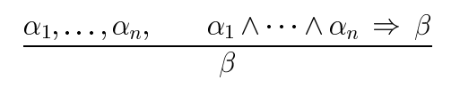

#Lezione 12 - Forward e Backward Chainging e Risoluzione

**Forma di Horn**: KB espressa come congiunzione di clausole di Horn.

> C /\ (B => A) /\ (C /\ D => B) *espressione nella forma di horn*

**Clausola di Horn**: è un simbolo proposizionale o una congiunzione di simboli che implica un altro simbolo.

**Modus Ponens**: per la forma di Horn, completo per basi di coscenza espresse nella forma di Horn.



Questo modo dice che se le precondizioni di una regola sono vere allora è vera anche la regola.

Può essere utilizzato per fare *forward chaining* o *backward chaining*, che sono entrambi algoritmi con complessità lineare in tempo.

##Foward Chaining


L'idea è quella di applicare ogni regola le cui premesse sono soddisfattte nella KB, una volta fatto ciò può essere che alcune regole della KB hanno le promesse soddisfatte grazi alle nuove informazioni precedentemente inserite, fino a quando non viene raggiunto il goal.

Se questo non viene raggiunto vuol dire che non è conseguenza logia della KB.

```
function CP-CA-Implica(KB, q) returns true or false
    locals: conto, una tabella indicizzata per clausola, che contiene inizialmente in numero di premesse
            inferiti: una tabella indicizzata per simbolo in cui ogni elemento è inizialmente false
            agenda: una lista di simboli che contiene inizlamente quelli noti come veri nella KB
    while agenda non è vuota do
        p <- Pop(agenda)
        unless inferiti[p] do
            inferiti[p] <- true
            foreach clausola di Horn c in cui appare la premessa p do
                decrementa conto[c]
                if conto[c] == 0 then do
                    if Testa[c] == q then retrun true
                    Push(Testa[c],agenda)
    return false
```

`Testa[c]` rappresenta quello che la clausola di Horn implica.

Un'osservazione che si può fare su questo algoritmo è che non viene tenuta in considerazione il goal che si vuole raggiungere, semplicemente si va a dedurre il più possibile dalla KB nella speranza che il goal q sia deducibile da KB.

Però se nella KB la query q non è già soddisfatta (non è un fatto noto) e non ci sono regole di Horn che hanno come conseguenza la query, allora non c'è speranza di riuscire a dedurre q dalla KB e quindi l'algoritmo potrebbe terminare subito.

###Completezza

Il forward chaining applicato con il *modus ponens* deriva tutte le conseguenza della KB.

FC raggiunge un punto fisso dove nessuna nuova sentenza atomia è derivata, questo perché il numero di simboli è finito.

Lo stato finale che si raggiunge applicando l'algoritmo si può considerare come un modello *m*, assegnango vero o falso ai simboli che sono stati inferiti.

Ogni clausola nella KB originale è vera in *m* perché se così non fosse   vorrebbe dire che non è ancora stato raggiunto un punto fisso (slide 46).

Quindi *m* è un modello per KB e se KB |= q, allora q è vere in ogni modello della KB, incluso anche *m*.

##Backward chaining

L'idea è quello di lavorare all'indietro a partire dalla query *q*.

Per provare *q* attraverso la KB, prima si controlla che *q* non sia già conosciuta o si provano trammite la KB tutte le premesse si una regola che deriva *q*.

È importante evitare i cicli, bisogna quindi controllare se un nuivo sotto goal è già presente nella pila dei goal.

Si può anche ottimizzare il lavoro, se ho un nuovo sottogoal posso controllare se l'ho già provato vero o se è già fallito.

## Forward VS Backward

Forward è più orientata ai dati e viene utilizzata per l'elaborazione incosncia e automatica, come il riconoscimento dei dati.

A causa dell'approccio utilizzato viene eseguito del lavoro irrilevante per il goal.

Backward è invece focalizzato sul goal, per questo motivo è più adatto al problem solving e la complessità di questa strategia può essere molto minore che lineare nella complessità di KB (Forward è lineare). 

##Regola di risoluzione

**Forma normale congiuntiva (CNF)**: forme di scrittura che utilizza congiunzione di disgiunzione di letterali (dove la disgiunzioni di letterali è una clausa di Horn).

> (A \/ !B) /\ (B \/ !C \/ !B)

La **risoluzione** è una regola di inferenza per CNF completa e corretta per la logia proposizionale.


In pratica si va a togliere un l_i e m_j che sono tra loro complementari (lo stesso letterale sia negato che non).

Questa cosa fa la verifica del modello perché vuol dire che se L e M sono vere e anche la proposizione che si deduce è vera, vuol dire che il letterale tolto non influenzava la verità di L e M.

###Conversione in CNF

> B_1,1 <==> (P_1,2 \/ P_2,1)

1. Eliminare il se e solo se

> (B_1,1 => (P_1,2 \/ P_2,1)) /\ ((P_1,2 \/ P_2,1) => B_1,1)

2. Eliminare il => rimpiazzando A => B con !A \/ B

> (!B_1,1 \/ P_1,2 \/ P_2,1) /\ (!(P_1,2 \/ P_2,1) \/ B_1,1) 

3. Spostare la negazione all'interno delle parentesi usando le regole di De Morgan

> (!B_1,1 \/ P_1,2 \/ P_2,1) /\ ((!P_1,2 /\ !P_2,1) \/ B_1,1) 

4. Si applica la legge distrubutiva dell'OR sull'AND

> (!B_1,1 \/ P_1,2 \/ P_2,1) /\ (!P_1,2 \/ B_1,1) /\ (!P_2,1) \/ B_1,1) 

A questo punto abbiamo la CNF.

###Algoritmo risolutivo

La regola di soluzione è le regola di inferenza precedentemente vista, l'aloritmo è quello che applica le regole per andare a risolvere il problema.

L'algoritmo funzione per contraddizione, cioè va a dimostrare che KB /\ !𝜶 è insoddisfacibile.

Da notare che l'algoritmo dice se 𝜶 è conseguenza logica o meno dalla KB, senza fornire una prova del risultato.

```
function CP-Risoluzione(KB, 𝜶) return true oppure false
    clausole <- insieme di clausole nella rappresentazione CNF di KB /\ !𝜶
    new <- {}
    loop do
        foreach C_i C_j in clausole do
            resolvents <- CP-Risolvi(C_i, C_j)
            if resolvents contiene la clausola vuota then return true
            new <- new ∪ resolvents
        if new ⊆ clausole then return false
        clausole <- clausole ∪ new
```

`CP-Risolvi(C_i, C_j)` restituisce l'insieme dei risolventi ottenuti applicando la regola di risoluzione in tutti i modi possibili per le due clausole. Questo perché data una coppia di clausole è possibile risolverle in più modi diversi. 