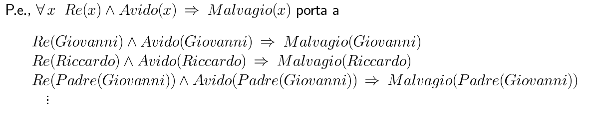
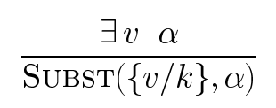
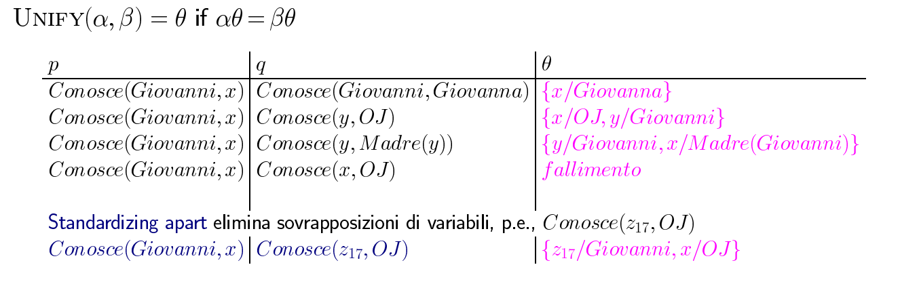
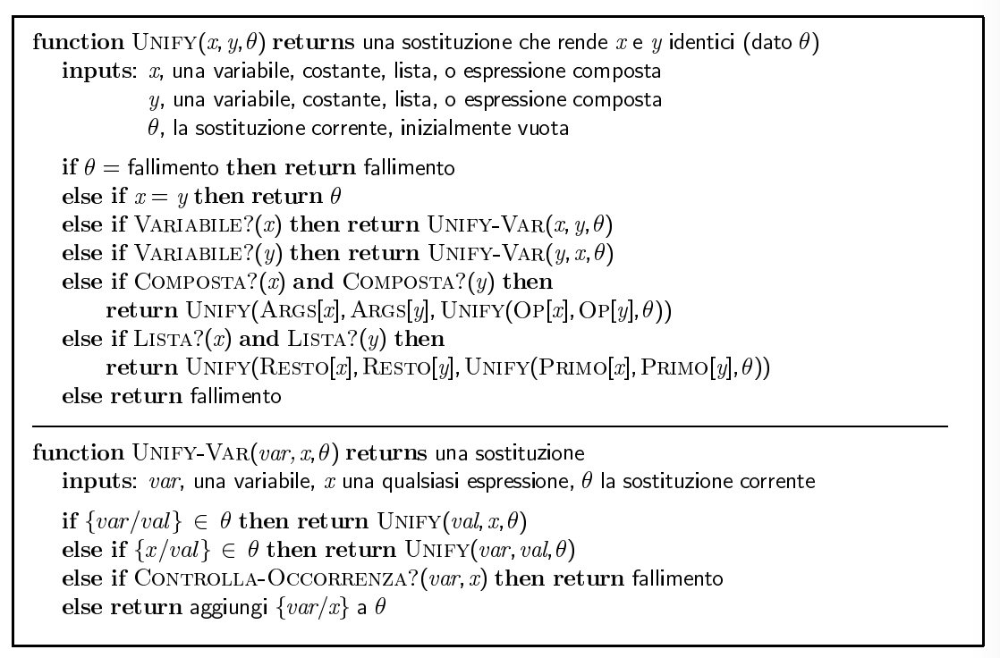

#Lezione 14 - Inferenza nella logica del primo ordine

Per poter fare inferenza è necessario trovare un modo per gestire i vari quantificatori.

##Istanziazione unviersale

Nel caso del quantificatore universale è possibile dare una rappresentazione con un enumerazione di tutte le possibili istanzazioni del termine, in ⋀ tra loro.

In questo caso si va a sostiturire ogni vabiarbile *v* con i vari **termini ground** (termini in cui non compaiono variabili).

Il risultato diella trasfomrazione viene rappresentato con `Subst(𝜃,𝜶)` e indica il risultato dell’applicazione della sostituzione 𝜃 alla formula 𝜶.

Se non ci sono simboli di funzione allora il numero di istanziazioni è finito.

##Istanziazione esistenziale

L'idea è quella di andare a generare una nuova costante *k* che non appartiene alla base di conoscenza, la quale va a prende il posto del simbolo che soddisfa l'esistenza.

Non è noto quale sia l'entità associata a *k*, ma si sa che *k* riferisce un'entità che soddisfa la condizione esistenzale.

Questo perché la formula esistenziale afferma che esiste un qualche oggetto che soffisfa una certa condizione e l'istanziazione va a dare un nome a questo oggetto, senza specificare di che oggetto sia.

Se una sentenza contiene entrambi i quantificatori, in particolare *∀y ∃x*, non è possibile utilizzare una singola costante di **Skolem** per istanziare *x*, questo perché dovrei avere infinite costanti, in questo caso viene usata una **funzione di Skolem** che genera le varie costanti. (*verrà approfondito più avanti*)

L'istanziazione esistenziale può essere applicata una sola volta per sentenza esistenziale e la nuova KB non è equivalente a quella vecchia, ma è soddisfacibile se e solo se la vecchia KB era soddisfacibile.

Mentre l'istanziazione di un quantificatore universale può essere applicata più volte per aggiungere nuove sentenza alla base di conoscenza e la nuova KB è logicamente equivalente a quella vecchia.

##Inferneza mediante riduzione alla inferenza proposizionale

L'idea è quella di istanziare i vari quantificatori, per poi considerare i vari predicati applicati ai termini ground come se fossero dei letterali nella logica proposizionale.
Questo procedimento prende il nome di **proposizionalizzazione**.

L'istanziazione del quantificatore esistenziale avviene utilizzando una costante di Skolem, mentre per quello universale avviene applicato tutte le possibili sostutizioni di termini ground presenti nella KB.

Il tutto funziona se non sono presenti simboli di funzione, perché nel caso ci siano delle funzioni possono essere generati infiniti simboli.

Questo processo garantisce che una sentenza ground è conseguenza logica della nuova KB se e solo se è conseguenza logica della KB originaria.
Di fatto, ogni KB espressa nella logica di primo ordine può essere proposizionalizzata in modo da preservarne le conseguenze logiche.

L'idea è quindi quella di andare a proposizinalizzare sia KB che la query, applicare la riduzione e restituire il riusltato.
Quest'idea è corretta per il teorema di Herbrand.

> **Teorema di Herbrand**: se una sentenza 𝜶 è conseguenza logica di una FOL KB (*base di conoscenza espressa nella logica del primo ordine*) essa è conseguenza logica di un sottoinsieme finito della KB in versione proposizionale.

Per gestire la presenza di funzioni, si considerano solo le costanti della FOL-KB e si verifica se 𝜶 è conseguenza logica. Se questa non lo è si prendono in considerazioni anche i termini ground generati da una sola invocazione di funzioni, e se anche in questo caso non è conseguenza logica, si considerano fino a due invocazioni di funzioni, e così via finché non si trova che 𝜶 è conseguenza logica.

Questo metodo di fare inferenza è sia **corretto** che **completo** per le basi di conoscenza che non hanno funzioni. Corretto perché utilizza tecniche di inferenza per la logica proposizionale che sono corretto, e completo in caso non ci siano funzioni perché in questo caso il numero di proposizioni generabili è finito.

Inoltre, prima o poi questo algorito riesce a dimostrare che 𝜶 è conoscenza logica, ma se 𝜶 non è conseguenza logica l'algoritmo non termina, non si può ottenere un risultato migliore in quanto la soddisfacibilità booleana è un problema semi-decidibile.

Con *p* predicati *k*-ari e *n* costanti, ci sono *p \* nk* istanziazioni, considerando inoltre che l'algoritmo di riduzione ha complessità esponenziale, la situazione è disastrosa.

C'è anche un'altro problema con la proposizionalizzazione ed è legato al fatto che i quantificatori universali generano tanti fatti che sono irrilevanti.
Conviene quindi andare ad applicare l'istanziazione universale solo quando è strettamente necessario.

##Unificazione

Si può ottenere l'inferenza immediatamente se è possibile trovare una sostituzione 𝜃 tale che `Re(x)` e `Avido(x)` corrispondano a` Re(Giovanni)` e `Avido(y)`.

Questo perché può capitare che variabili che si trovano in "*scope*" diversi abbiano lo stesso nome.

L'unificazione è quel processo che trova le sostituzioni che rendono identiche espressioni logiche diverse.

Applicando l'unificazione può capitare che si ottenga solamente l'uguaglianza sintattica, con dei predicati che contengono termini che non sono ground. 
In questo caso l'algoritmo funziona comunque, tant'è che il predicato ottenuto appplicando la sostituzione rappresenta un sottinsieme dei termini ground, che può essere anche infinito.

Con le sostituzioni che hanno dei termini non ground c'è un'ordinanento parziale dato dalla quantità di termini ground generabili a partire dalle varie sostituzioni.

Quando c'è la scelta tra più sostituzioni conviene tenere quella più generale in modo da avere maggiori possibilità di scelta (**most general unifier**).

Si dice che una sostituzione 𝜃1 è più generale di una sostituzione 𝜃2 se 𝜃1 impone meno vincoli sul valore delle variabili, per ogni coppia di di espressioni unificabili esiste un singolo unificatore più generale MGU.

In questo modo è possible rimandare il più possibile l'istanziazione del quantificatore universale.

###Algoritmo di unificazione

**Standardizzazione separata**: può capitare che in due formule distinte ci siano variabili con lo stesso nome, durante il processo di unificazione questo può creare dei problemi, è necessario quindi standardizzare prima le formule in modo che non ci siano conflitti sul nome delle variabili.

Dati due predicati:

- *Predicato1(arg1,1, ...arg1,n)*
- *Predicato2(arg2,1, ...,arg2,m)*

Per poter unificare è necessario che i due predicati siano uguali sintatticamente e che abbiano la stessa lunghezza (*n = m*).

Bisogna poi porre uguali tra loro i vari argomenti dei predicati, tenendo in considerazione che la stessa variabile può compararire in più argomenti dello stesso predicato.

Questo algoritmo ritorna sempre la **MGU**

Due sostituzioni possono essere tra loro composte, applicando prima una sostituzione all'altra e poi andando ad aggiungere alla prima gli elementi della seconda sostituzione.

Per poter comporre due sostsituzioni è necessario che queste siano compatibili tra di loro.

