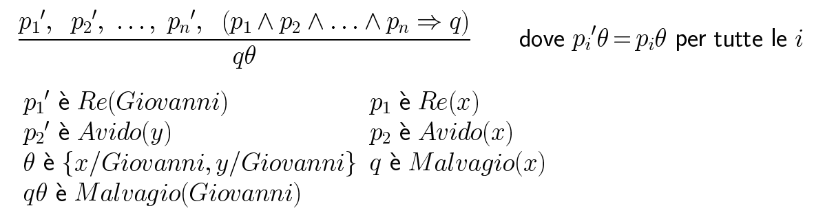
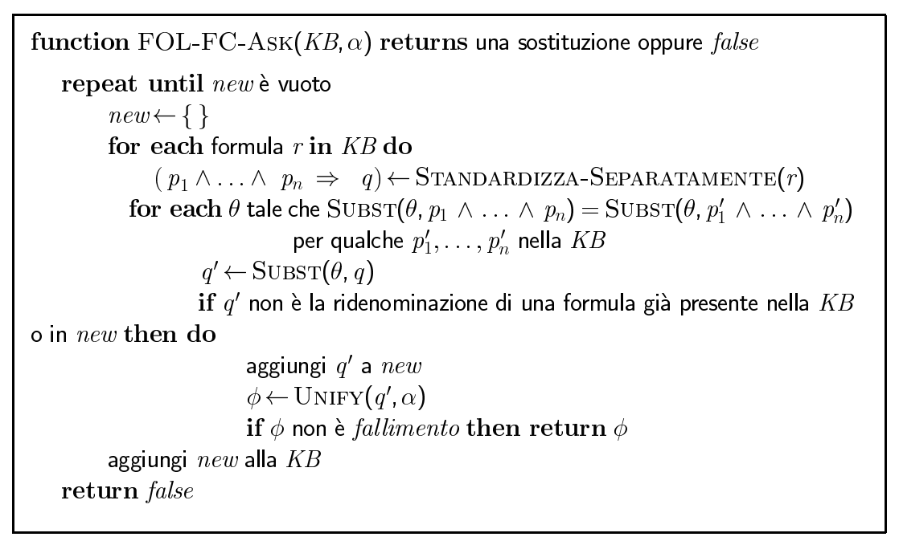

#Lezione 15 - GMP e Forward Chaining

##Modus Ponens Generalizzato

Se i vari *p'i𝜃* sono uguali ai *pi𝜃* per una determinata sostituzione 𝜃 allora si possono ridurre ad un unico *q𝜃*.

A noi interessa usare la sostituzione più generale possibile in quanto a noi vogliamo arrivare ad avere il maggior numero possibile di soluzioni ground.

GMP viene utilizzato con una base di conoscenza in clausole definite.

Le **clausole definite** del primo ordine sono le clausole di Horn riportate nella logica proposizionale, con la differenza che possono includere delle variabili, le quali vengono considerate quantificate universalmente, dal momento che quelle quantificate esistenzialmente vengono sostituite con una costante di Skolem.

###Correttezza di GMP

Bisogna dimostrare che se *p'1...p'n* e *p1 ⋀ ... ⋀ pn => q* allora si può inferire *q𝜃*, dato che *p'i𝜃 = pi𝜃* per ogni *i*.

Lemma: per ogni clausola definita *p* abbiamo *p |= p𝜃* per mezzo di UI:

1. *p1 ⋀ ... ⋀ pn => q |= (p1 ⋀ ... ⋀ pn => q)𝜃 = p1𝜃 ⋀ ... ⋀ pn𝜃 => q𝜃*
2. *p'1 ... p'n |= p'1 ⋀ ... ⋀ p'n |= p'1𝜃 ⋀ ... ⋀ p'n𝜃*

Da 1 e 2 si riesce a ricarvare *q𝜃* usando il Modus Ponens ordinario.

###Esempio di base di conoscenza

##Forward Chaining in FOL

L'algoritmo è analogo a quello utilizzato nella logica proposizionale con la differenza che c'è da tener conto della presenza delle variabili e che queste vengono istanziate il più tardi possibile.

Partendo dai fatti noti si fanno scattare tutte le regole presenti nella KB le cui premesse sono soddisfatte, aggiungendo le varie conclusioni ai fatti noti. Si ripete il processo finché non si trova una risposta oppure non è più possibile aggiungere fatti.

La base di conoscenza è in forma di Horn, con i quantificatori esistenziali istanziati e i quantificatori universali non ancora istanziati.

**Standardizzazione separata**: serve per evitare conflitti con i nomi delle variabili.

###Esempio di applicazione

###Considerazioni

L'algoritmo è **corretto** e **completo** per le clausole definite di primo ordine, questo perché essendo clausole definite l'esecuzione dell'algoritmo termina sempre.

La correttezza deriva dal fatto che viene semple applicato il Modus Ponens Generalizzato che è corretto.

Se ci sono solo clausole definite del primo ordine e non c'è nessuna funzione (**datalog**) allora FC termina in un numero poninomiale di iterazioni: _p\*nk_ che coincide con il massimo numero di fatti ground distinti che possono essere presenti nella KB. (*p* predicati *k*-ari e *n* costanti).

In generale l'algoritmo può non terminare se 𝜶 non è una conseguenza logica e questo è inevitabile perché il problema è semi-decidibile.

Allo stesso modo la presenza di funzioni porta a generare un numero possibilmente infinito di clausole.

Si può osservare che non c'è bisogno di matchare una regola alla iterazione *k* se non è stata aggiunta una premessa alla iterazione *k-1*.

Quindi conviene matchare ogni regola le cui premesse contengono un letterale appena aggiunto, questo per ridurre il numero di operazioni di match, dal momento che si tratta di un'operazione costosa.

Per velocizzare il match si può **indicizzare** la base di conoscenza in modo da permette il recupero di fatti conosciuti in *O(1)*.

Il matching di premesse congiuntive rispetto a fatti conosciuti è un problema NP-hard.

Da questo ne segue che FC è lagarmente utilizzato in basi di conoscenza deduttive (cioè che non hanno funzioni).

