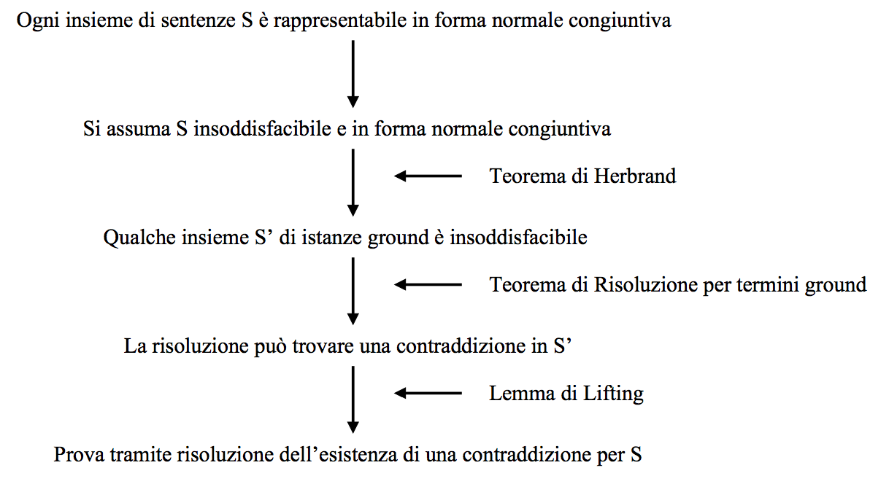

#Lezione 18 - Risoluzione in FOL

Anche in FOL è possibile applicare la regola di risoluzione, con la differenza che vengono ridotti due predicati, che una volta unificati sono tra loro complementari.

##Conversione a CNF

Per poter applicare la risoluzione è necessario che la base di conoscenza sia in CNF.

Per passare alla CNF:

1. Eliminare le implicazioni.
2. Spostare la negazione all'interno, tenendo conto dei vari quantificatori che possono essere negati.
3. Standardizzare le variabili.
4. **Skolemizzare**: ogni variabile esistenziale viene sostituita con una costante di Skolem. Se la variabile esistenziale è all'interno di un quantifiatore esistenzale è necessario utilizzare una **funzione di Skolem**, che va a sostituire tutte le variabili esistenziali che sono all'interno di un qunatificatore universale.
5. Rimuovere i quantificatori universali.
6. Distribuire ⋀ su ⋁.

Se un quantificatore esistenziale si trovata all'interno di due quantificatori esistenziali *∀x,q*, le funzioni di Skolem devono ricevere due parametri *F(x,q)*.

L'algoritmo di inferenza rimane sempre lo stesso, per provare KB|=𝜶, si cerca di provare KB⋁!𝜶, se viene generata la clausola vuota, allora KB|=𝜶.

##Strategie di appplicazione della regola di risoluzione

Nella logica proposizionale si può puntare a raggiungere un punto fisso per provare a generare la clausola vuota, tuttavia applicare questa strategia nella logica del primo ordine porta ad un'esplosione combinatoria.

È improtante dimostrare la completezza di queste strategie.

- **Unit clause**: si *preferisce* effettuare la risoluzione con una delle sentenze costituite da un singolo letterale, in modo da avere diminuire la dimensione delle clausola risolvente. Questa strategia è **completa** perché preferisce la clausola unitaria, se non è possibile si continua in modo normale.
- **Unit Resolution**: si esegue la risoluzione coinvolgendo **sempre** una clausola unitaria (**incompleta** in generale, ma completa per le clausole di Horn).
- **Set of support**: utilizza un set di supporto dal quale vengono prelevate le sentenze e dove venogno posti i vari risolventi. Inizialmente il set di supporto è composto dal goal (!𝜶). L'idea è quella di effettuare delle risoluzioni che sono utili per arrivare alla clausola vuota. **Completo** perché vengono fatte solamente delle scelte che portano alla risoluzione.
- **Input resolution**: combina sempre una sentenza di input (KB e Query) con il risolvente corrente. **Incompleta**.
- **Linear resolution**: come l'input resolution ma ammette anche la combinazione del risolvente con uno dei suoi avi, ottenendo così una strategia **completa**.
- **Subsumption**: elimina tutte le sentenze che sono *subsumed* (più specifiche di altre), in modo da diminuire il numero di clausole da gestire. Es: se ho sia *P(A)* che *P(x)*, posso rimuovere la clausola *P(A)*.

In ogni caso se la KB contiene una funzione e non implica 𝜶, allora l'algoritmo non termina. 

##Uguaglianza

Ci sono 3 approcci diversi per trattare l'uguaglianza:

1. **Assiomatizzazione**: si aggiungono degli assiomi che descrivono le proprietà dell'uguaglianza ed assiomo opportuni per ogni predicato e funzione. Questa è la stategia più corretta a livello logico, però dal punto di vista computazinale è poco pratico.
2. **Demodulation** o **Paramodulation**: se *x=y* e *Unify(x,z) = 𝝝* allora rimpiazzo *z* con *SUBST(𝝝,y)*.
3. **Estensione** dell'algoritmo di unificazione: i termini equivalenti vengono unificati in un unico termine.

##Completezza della Risoluzione

Non vediamo la dimostrazione completa.

##Riassunto

- La proposizionalizzazione e l'uso dell'unficazione permetteno di evitare l'istanziazione delle variabili coinvolte in una prova.
- Il modus ponens generalizzato usa l'unificazione e permette l'applicazione di forward e backward chaining su clausole definite.
- GMP è completo per le clausole definite, per dei Datalog il problema è sempre decidibile.
- Forward Chaining è completo e polinomiale per i Datalog, però effettua inferenze in modo indiscriminato.
- Backward Chaining è utilizzato in Programmazione Logica e viene "rinforzato" con delle opportune tecniche di compilazione.
- La risoluzione generalizzata è completa per le KB in CNF. Se si usa il principio di induzione non è più completa.
