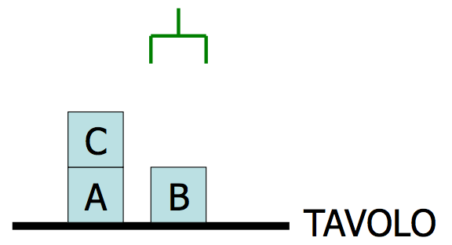
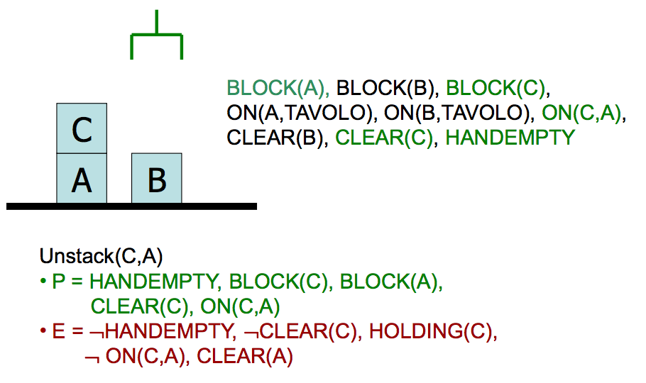
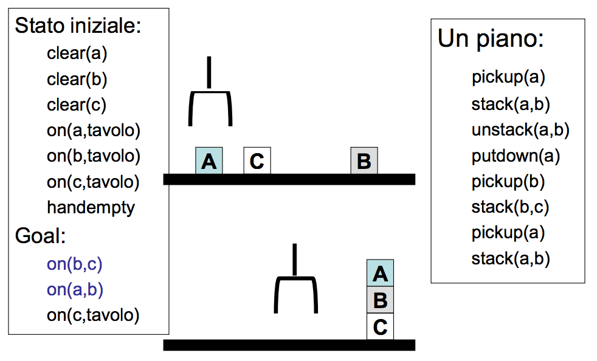

#Lezione 20 - Planning 2

##Planning con il calcolo delle situazioni

L'idea base è di rappresentare il problema di planning in FOL, inserendo nella base di conoscenza delle sentenze che modellano il mondo e che sono invariabili e delle altre sentenze che rappresentano lo stato corrente, le quali variano man mano che vengono attuate le azioni previste dal piano.

Utilizzando questa rappresentazione è possibile utilizzare l'inferenza per provare una sequenza di azioni. Così fancendo un piano equivale ad una prova delle regole associate alle azioni a partire dalla situazione che caratterizza lo stato iniziale.

Questo approccio è teoricamente corretto, c'è però un problema pratico in quanto nel caso pessimo la complessità dell'inferenza è esponenziale.
Inoltre, applicando la risoluzione viene trovata una prova (piano) che non è necessariamente il piano migliore. In più la risoluzione risponde con un "Si, c'è un piano ma non te lo dico".

Uitlizzando la rappresentazione logica ci sono altri tre problemi tipici:

- **Problema del frame**: quando si passa da una situazione ad un'altra bisogna risuscire a determinare se cambia il valore di un predicato che non è stato coinvolto dalla trasformazione, cioè se la trasformazione ha causato un side-effect.
- **Problema della qualifica**: perché un'azione possa essere applciata devono essere soddisfatte delle precondizioni, ma come possono essere rappresentate? In alcuni casi risulta complesso riuscre ad esplicitare tutte le condizioni necessarie e sufficenti per poter esegure un'azione. Per specificare in modo corretto tutto ciò può essere necessario dover andare ad inserire un elevato numero di clausole nella KB.
- **Problema della ramificazione**: versione duale della qualifica, descrivere in modo dettagliato gli esiti di un'azione può richiedere un elevato numero di clausole.

Quindi è meglio utilizzare un linguaggio ristretto con un algoritmo specializzato (planner) piuttosto che una soluzione generale, ottenendo così una soluzione più efficente.

##STRIPS

Approccio classico usato negli anni 70 nel quale gli stati vengono rappresentati come una congiunzione di letterali ground e i goal sono congiunzioni di letterali o variabili quantificate esistenzialmente.

Non c'è biosgno di specificare completamente lo stato, facendo ciò significa che quello non specificato viene assunto falso (closed world).

Vengono così rappresentati molti casi con poca memoria e spesso vengono rappresentati solo i cambiamenti dello stato piuttosto che l'intera situazione, limitando il problema del frame.

Al contratrio di un dimostratore di teoremi, non viene provato se il goal è vero, ma viene certcata una sequenza di azioni che lo raggiunge.

In STRIPS le azioni vengono rappresentate come operatori, ognuno dei quali è composto da 3 componenti:

- **Descrizione dell'azione**
- **Precondizioni**: espresse come congiunzione di letterali positiv
- **Effetti**: congiunzione di letterlai positivi o negative che descrivono come la situazione cambia quandi si applicao l'operatore.

```
Op[
    Action: Go(there),
    Precondizioni: At(here) ⋀ Path(here,there),
    Effetti: At(there) ⋀ ¬At(here)
]
```

Tutte le variabili sono quantificate universalmente e tutte le variabili di situazione sono implicite: le precondizioni devono essere vere nello stato precedente dell'applicazione dell'operatore, gli effetti sono veri immediatamente dopo.

###Il noioso mondo dei blocchi



Il mondo dei blocchi è un micro mondo che consiste in un tavolo, un insieme di blocchi e un manipolatore robotico.

Alcuni vincoli del dominio:

- Un solo blocco può essere immediatamente sopra un altro
- Un qualsiasi numero di blocchi sul tavolo
- Il manipolatore può mantenere un solo blocco

Una possibile rappresentazione è data da

```
on(a,tavolo)
on(c,tavolo)
on(b,a)
handempty
clear(b)
clear(c)
```

Un goal è composto da una serie di proposizioni, ogni stato che soddisfa le proposizioni goal può essere considerato come stato goal.

L'azione `Unstack(x,y)` può essere rappresentata come:

```
Unstack(x,y)
    P = HANDEMPTY, BLOCK(x), BLOCK(y), CLEAR(x), ON(x,y)
    E = ¬HANDEMPTY, ¬CLEAR(x), HOLDING(x), ¬ON(x,y), CLEAR(y)
``` 

Ad esempio l'applicazione dell'azione può avere il seguente effetto:




Le azioni eseguibili sono:

```
Unstack(x,y)
    P = HANDEMPTY, BLOCK(x), BLOCK(y), CLEAR(x), ON(x,y)
    E = ¬HANDEMPTY, ¬CLEAR(x), HOLDING(x), ¬ON(x,y), CLEAR(y)
Stack(x,y)
    P = HOLDING(x), BLOCK(x), BLOCK(y), CLEAR(y)
    E = ON(x,y), ¬CLEAR(y), ¬HOLDING(x), CLEAR(x), HANDEMPTY
Pickup(x)
    P = HANDEMPTY, BLOCK(x), CLEAR(x), ON(x,TAVOLO)
    E = ¬HANDEMPTY, ¬CLEAR(x), HOLDING(x), ¬ON(x,TAVOLO)
PutDown(x)
    P = HOLDING(x), BLOCK(x)
    E = ON(x,TAVOLO), ¬HOLDING(x), CLEAR(x), HANDEMPTY
```

####Esempi di piani




###Generazione di piani

La pianificazione può essere fatta a partire dallo stato iniziale o da quello goal.

####Forward Planning

L'idea è quella di partire dallo stato iniziale e provare ad applicare tutte le possibile azioni fino a che non si trova una sequenza di azioni che porta ad uno stato goal.

Equivare quindi ad una **ricerca nello spazio degli stati**, dove per ogni stato vengono generati tanti successori quante sono le azioni applicabili, in un modo analogo alla ricerca breadth-first, senza tener conto della rilevanza o meno delle azioni. Un azione è **rilevante** se un suo effetto combacia con la prosizione del goal.

C'è il solito problema che se ci sono molte azioni applicabili ad uno stato si ottiene un fattore di branching enorme.

####Backward Planning (Chaining)

Si parte dalla **specifica del goal** (non dallo stato) e si cercano delle azioni rilevanti che soddisfano parte del goal, vengono così lasciate "aperte" le precondizioni delle azioni scelte e diventa necessario andare a soddisfare queste precondzioni con altre azioni.

Si ripete questo procedimento fin che non si ottengono delle precondizioni che vengono soddisfatte dallo stato iniziale.

Con questa strategia il fattore di branching è limitato, la ricerca nello spazio dei goal, questo perché si considera la rappresentazione del goal e non degli stati.

Trattandosi di una ricerca in profondità c'è il rischio di ciclare, è quindi necessario inserire degli opportuni controlli. Infine, deve essere possibile effettuare il back-tracking delle scelte nel caso non si arrivi ad una soluzione.

###Planning in STRIPS

Vengono utilizzate due strutture dati:

- **Lista di stati**: contiene tutti i predicati che sono correntemente veri
- **Pila di goal**: una pila di goal da risolvere, con il goal corrente in testa alla pila.

Se il goal corrente non è soddisfatto dallo stato presente, STRIPS esamina gli effetti positivi dei vari operatori, e inserisce l'opertatore e la lista delle precondizioni dell'operatore sulla pila (**sotto-goal**).

Quando il goal corrente è soddisfatto lo rimuove dalla pila.

Quando un operatore è in testa alla pila, registra l’applicazione dell’operatore sulla sequenza del piano e usa gli effetti per aggiornare lo stato corrente.

```python
Strips(initial-state, goals)
    state = initial-state, plan = [], stack = []
    push goals on stack
    repeat until stack is empty
        if top of stack is goal and matcher state then
            pop stack
        else if top of stack is a conjunctive-goal g then
            select an ordering for the subgoal g
            push them on the stack
        else if on top of stack is a simple goal then
            choose an operator o whose add-list matcher goal
            replace goal sg whit operator o
            push the preconditions of o on the stack
        else if top of stack is an operator o then
            state = apply(o, state)
            plan = [plan:o]

```

Un `conjunctive-goal` è un goal composto da più proposizioni.


