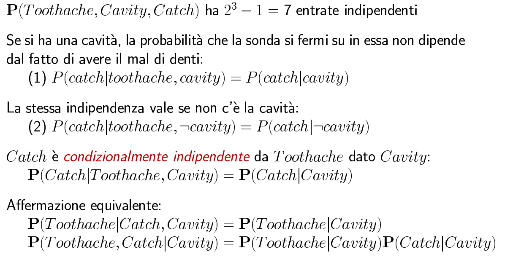
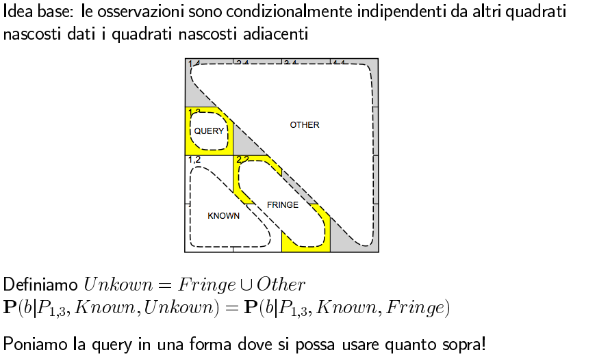
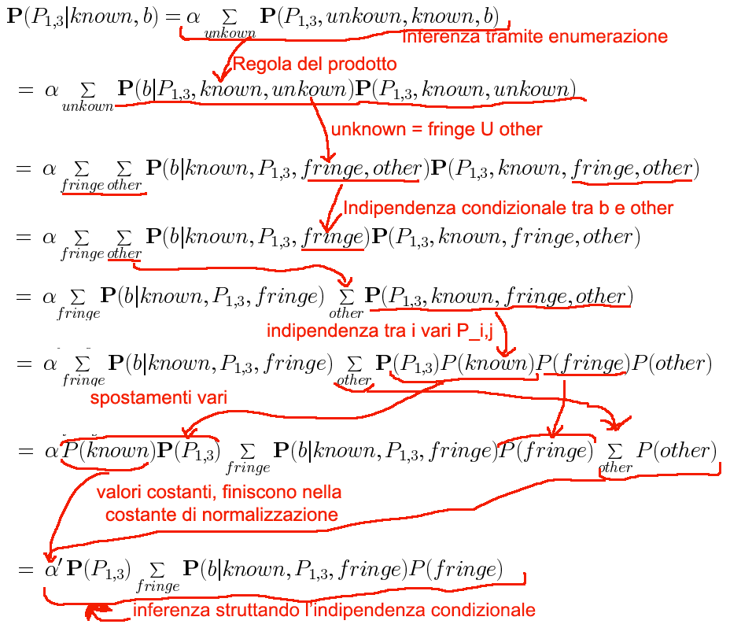

#Lezione 26 - Incertezza 2

L'indipendenza assoluta è molto rara.

##Indipendenza condizionale

Ovvero alcuni fatti sono indipendenti da altri sotto determinate condizioni.

Quindi nella applicazioni pratiche è possibile utilizzare l'indipendenza condizionale.

La distribuzione della probabilità congiunta si può quindi scrivere come (deriva dall'applicazione della Chian rule):

> **P**(Toothache, Catch, Cavity) = **P**(Toothache | Cavity)**P**(Catch | Cavity)**P**(Cavity)

Servono quindi 2 valori per _**P**(Toothache_ | _Cavity)_, perché una volta fissato un valore di *Cavity* basta avere un solo valore dal momento che l'altro valore può essere calcolato complementando a 1.

Con questa strategia si riesce a ridurre la dimnesione della rappresentazione della probabilità congiunta da esponenziale a linare.

L'indipendenza condizionale rappresenta la forma più basilare e robusta di conoscenza sugli ambienti incerti.

C'è sempre da tenere a mente che se viene aggiornata la probabilità di un evento, c'è almento un'altra probabilità da aggiornare dal momento che la somma deve sempre essere 1.

##Naive Bayes

Utilizza la regola di Bayes per fare inferenza probabilistica.

Questo modello prende il nome di naive perché assume l'indipendenza condizionale tra gli eventi che non è sempre vero.

In questo modo per trovare la causa più probabile è possibile calcolare il valore di probabilità per ogni possibile valore della causa trovando così quello più probabile.

### Bayes nel mondo nel Wumpus

##Riassumendo

Utilizzando il calcolo delle probabilità si ottiene un formalismo per esprimere l'incertezza.

In particolare la distribuzione congiunta delle probabilità specifica la probabilità di ogni evento atomico e grazie a questa distribuzione si riesce ad effettuare l'inferenza tramite enumerazione, andando a sommare i singoli eventi atomici (tenendo anche in considerazione le variabili nascoscoste).

Questa distribuzione può essere rappresentanta in forma tabellare, tuttavia se il dominio applicativo non è banale la tabella risultante è troppo grande, pertanto è necessario prendere in considerazione l'indipendenza tra eventi e l'indipendenza condizionale.