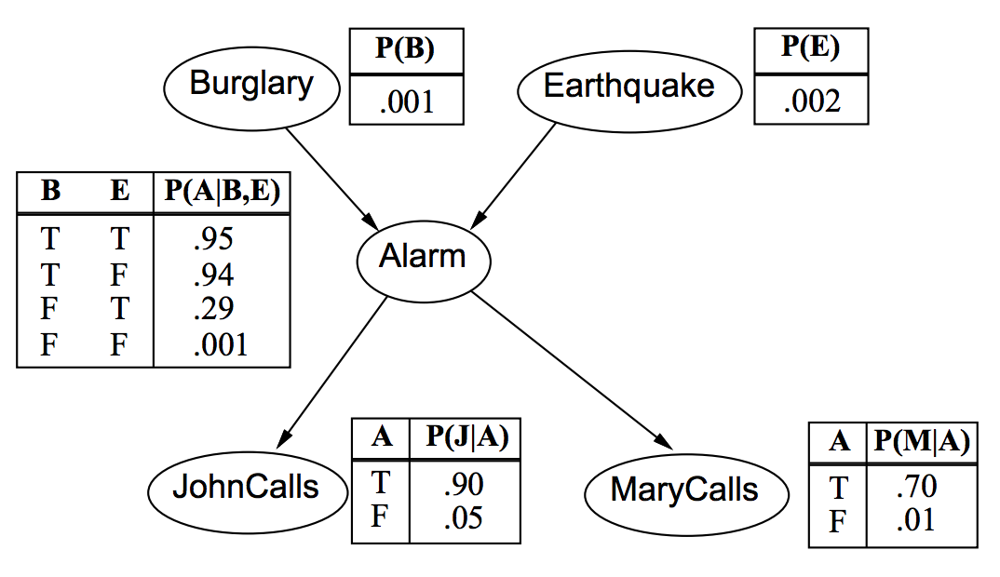
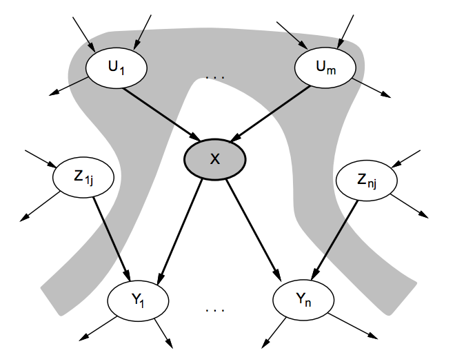
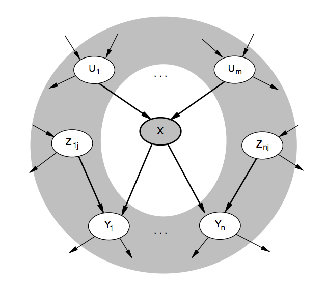

#Lezione 27 - Reti Bayesiane

L'idea è quella di andare a rappresentare la distribuzione congiunta delle probabilità sotto forma di un grafo e con delle tabelle più piccole.

Si ottiene così una notazione grafica per rappresentare asserzioni condizionalmente indipendenti.

La sintassi è quindi quella di un grafo con un insieme dei nodi, ognuno dei quali rappresenta una variabile.
Il grafo è diretto e aciclico, dove un arco rappresenta un'influenza diretta tra due variabile.
Per ogni nodo viene calcolata la distribuzione condizionale dati i suoi genitori _**P**(Xi|Parents(Xi)_.

Nel caso più semplice, la distribuzione condizionale viene rappresentata come una tabella della probabilità condzionale **CPT** data la distribuzione Xi per ogni cominazione di valori discreti assunti per i genitori. (Noi non tratteremo il caso continuo)

Rete bayesiana per il problema del dentista.
Si può notare che c'è un nodo per ogni variabile e la variabile *Weather* è disconnessa dal momento che è assolutamente indipendente.

##Esempio giocattolo

Un tizio ha un'allarme che può rilevare sia un'infrazione da parte di un ladro, sia da un terremoto. I vicini John e Mary, se sentono l'allarme, chiamano il tizio per avvisarlo.

Variabili (booleane): *Burglar*, *Earthquake*, *Alarm*, *JohnCalls*, *MaryCalls*.

*Per motivi di spazio, le variabili vengono abbreviate con le lettere iniziali.*

Dal grafo è possibile notare che:

- Ci sono due eventi indipendenti, *Burglary* e *Earthquake*, e lo si capisce dal momento che non hanno genitori. In questo caso viene utilizzata la probabilità a priori e di conseguenza la CPT contiene un solo valore.
- Le CPT contengo i valori di probabilità che l'allarme scatti, dal momento che per ottenere la probabilità che l'allarme non scatti si può ottenere complementando a 1.
- Se l'allarme potesse assumere *n* valori (es: *Suona, NonSuona, Intermittente*) sarebbero state necessarie *n-1* colonne per rappresentare i valori della tabella del nodo *Allarm*.
- La rete modella l'indipendenza condizionale tra le variabili *JohnCalls* e *Burglary* dato *Allarm*.

##Compattezza

La distribuzione congiunta completa avrebbe bisogno di *2n-1* locazioni di memoria.

Una CPT per variabili booleane Xi con *k* genitori booelani ha *2k* righe per per combinazioni dei vari genitori.
Ogni riga richiede un solo numero, dal momento che l'altro si può calcolare con *1-p*.

Pertanto, se ogni variabile non ha più di *k* genitori, la rete completa richiede *n2k* locazioni di memoria.
Cioè l'occupazione cresce in modo lineare anziché esponenziale. (Nella rete precedente sono 10 locazioni contro 31)

##Semantica globale e locale

La semantica **globale** di una rete definisce la distribuzione congiunta completa espressa come il prodotto delle distribuzioni condizionali locali:

> **P**(Xi,...,Xn) = Prod[1..n]**P**(Xi | Parents(Xi))

La rete bayesiana rappresenta quindi una fattorizzazione della distribuzione di probabilità congiunta. Se cambia la topologia della rete, cambia anche la fattorizzazione.

La stessa fattorizzazione può essere ottenuta applicando la **chain rule** alla distribuzione congiunta completa e semplificando i vari termini utilizzando la nozione di indipendenza e indipendenza condizionale, secondo quanto speficicato dalla topologia della rete.

Questa rappresentazione oltre ad essere compatta ha anche il pregio di mettere in evidenza le relazioni causa/effetto tra le variabili.

La semantica **locale** riguarda l'indipendeza condizionale tra un nodo e i suoi non discenti dati i genitori.

Quindi, se conosco il valore dei genitori del nodo *X*, il nodo *X* è condizionalmente indipendente dai nodi *Z*.

Questa definizione non comprende tutte le relazioni di indipendenza condzionale. Una definzione più approssimata è quella della **Markov blanket**

Ovvero, ogni nodo è condizionalmente indipendente da tutti gli altri dato il suo **markov blanket**: genitori, figli e genitori dei figli.

Ricapitolando:

- Semantica globale --> distribuzione congiunta completa
- Semantica locale --> indipendenza condizionale tra un sotto insieme di nodi

##Costruzione di una rete bayesiana

Una volta fissato l'ordinamento e un nodo Xi, l'insieme *Parent(Xi)* deve essere un sotto-insieme delle variabili *X1...Xi-1*. Le *Xj* mancanti derivano dall'indipendenza condizionale tra le variabili *X1...Xi-1*.

La costruzione richiede sempre e comunque un tempo esponenziale perché deve considerare tutte le possibili cominazioni per verificare l'indipiendenza condizionale.

Resta da definire come ordinare le variabili e come stimare i dati mancanti.
Entrambi possono fornire da un esperto che conosce il dominio applicativo.

La scelta dell'ordinamento influenza notevolmente la dimensione del grafo. Ordinare le variabili mettendo prima le cause e poi l'effetto porta ad avere una rete più compatta rispetto all'ordinamento inverso.

Ad esempio, utilizzando come ordinamento *M, J, A, B, E* si ottiene la rete seguente che richiede 13 numeri per essere rappresentata.

## Compiti di inferenza

Con una rete bayesiana è possibili calcolare la probabilità a posterirori marginale **P**(Xi|E=e) e congiuntive **P**(Xi,Xj | E=e), riducendole ad una serie di query semplici (scomponendola con la regola del prodotto).

È possibile inoltre utilizzare una rete per prednere decisioni ottimali  del tipo P(outcome|action, evidence).

Allo stesso modo si possono fare delle meta-query, ovvero ricavare informazioni su quali variabili influenzano maggiormente la distribuzione di probabilità, ovvero quale evidenza mi conviene cercare.

