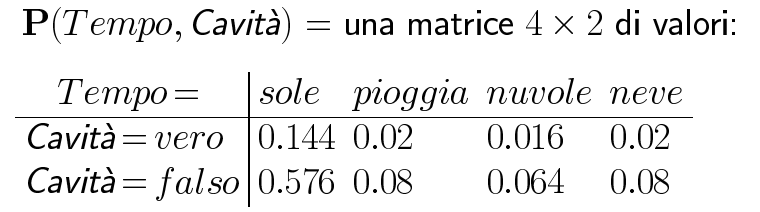
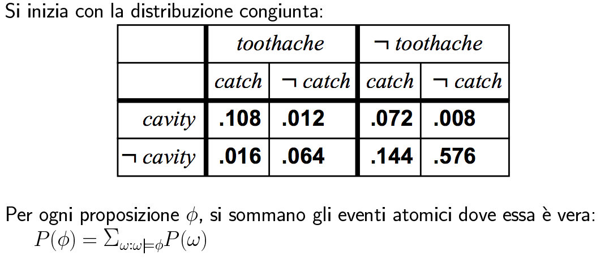
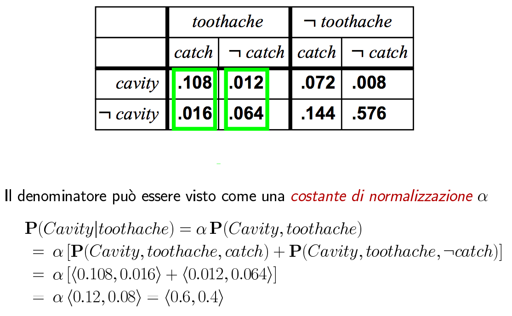

#Lezione 25 - Incertezza

Nel mondo reale ci sono vari problemi che causano incertezza:

- Osservabilità parziale, non si hanno tutte le informazioni, ad esempio le condizioni atmosferiche, i ritardi di trenitalia, incidenti, ecc.
- Sensori rumorosi
- Incertezza dell'esito delle azioni che possono fallire a causa di elementi esterni
- Immensa complessità nel modellare i vari eventi.

Pertanto utilizzare un approccio completamente logico potrebbe portare a soluzioni errate oppure richiede ipotesi molto forti.

Conviene quindi utilizzare delle asserzioni probabilistiche che riassumono sia elementi di pigrizia che di ignoranza, ovvero con un solo numero si va a riassumere tutte le evenzidenze senza doverle enumerare (pigrizia) oppure si riesce a lavorare senza avere a disposizione tutti i fatti (ignoranza).

Si va quindi a considerare la probabilità che un certo evento occorra, questo prende il nome di **probabilità soggettiva o bayesiana** e lega le proposizioni al propio stato di conoscenza.

> P(A25|nessun incidente) = 0.06
> 
> Ovvero la probabilità di arrivare in tempo partendo 25 minuti prima sapendo che non si è verificato un incidente è del 6%.

Utilizzando la probabilità a priori si riesce ad ottenere un aggiornamento continuo dei valori che vengono aggiornati man mano che la conoscenza dell'agente cambia.

Il problema diventa quindi quello di scegliere l'azione in base alla probabilità di successo

In questo caso la scelta dell'azione dipende dalle preferenze dell'agente, dal momento che non c'è una scelta migliore.

La **teoria dell'utilità** è utilizzata per rappresentare e inferire preferenze, la **teoria delle decisioni** accorpa la teoria dell'utilità con le probabilità.

##Probabilità a priori e condizionale

A priori rapprenseta la probabilità incondizionata delle preposizioni sul dominio, ad esempio *P(Tempo = sole) = 0.72*, e corrispondo a gradi di credenza sull'arrivo di una nuova evidenza.

Vengono poi utilizzate delle distribuzioni di probabilità per fornire dei valori per tutti i possibili assegnamenti, ad esempio se *Tempo* può assumere i valori *<sole, pioggia, nuvole, neve>*, *P(Tempo) = <0.72, 0.1, 0.08, 0.1>*, da notare che le distribuzioni di probabilità sono tutte **normalizzate**, ovvero sommano a 1.

Si parla inoltre di probabilità congiunta per un insieme di variabili alleatori, che fornisce la probabilità per ogni evento atomico su tali variabili.

Dal momento che si tratta di eventi indipendenti la probabilità congiunta è data dal prodotto delle probabilità.

La probabilità congiunta permette di effettuare l'inferenza probabilitstica, perché ogni elemento della tabella è la somma dei possibili eventi.

Per espriemere l'effetto di nuova conoscenza, è possibile utilizzare la **probabilità condizionale** o a posteriori per influenzare il valore, ad esempio *P(Cavità* | *Mal_Di_Denti) = 0.8*, ovvero adesso che so di aver mal di denti la probabilità di avere una carie aumenta.

Inoltre, se arriva una nuova evidenza che aumenta la probabilità, la credenza meno specifica **rimane valida** ma non è necessariamente utilie, ad esempio *P(Cavità* | *Mal_Di_Denti, Cavità) = 1*.

Infine è possibile che della nuova conscenza non influenzi la distribuzione di probabilità congiunta, ad esempio *P(Cavità|Mal_Di_Denti, Vince_Inter) = P(Cavità|Mal_Di_Denti) = 0.8*

I fattori della **chain rule** possono essere semplificati se tra delle probabilità c'è una relazione di indipendeza, questo perché mantenere in memoria una distribuzione di *n* variabile booleane richiede *2n* locazioni di memoria, questo perché devo considerare tutte le possibili di combinazioni. In realtà ne servono *2n-1* perché si può sfruttare il fatto che la somma deve essere 1.

Questa complessità, sommata al fatto che fare inferenza probabilistica è più complessa dell'inferenza logica rende la maggior parte dei problemi intrattabili. *forse è una cosa pessimistica, però il punto è che il problema è tanto complesso*.

##Inferenza tramite enumerazione

Una volta creata la tabella della distribuzione di probabilità congiunta permette di andare a calcolare le probabilità dei vari eventi.

Se un evento atomico compare più volte, la sua probabilità viene considerata solo una volta.

Così come si possono calcolare le probabilità condizionali

###Normalizzazione

Quando si vuole calcolare la distribuzione di una probabilità di una variabile, si può considerare la probabilità normalizzata, ovvero moltiplicare le probabilità per una costante in modo che la somma sia 1.

Da notare che la **P** (in grassetto) indica la distribuzione di probabilità e *Cavity* indica una variabile.

Con questo è possibile utilizzare la tabella delle probabilità congiunte per ottenere la distribuzione della probabilità per la variabile *Cavity* sapendo di avere mal di denti.

L'idea è quindi quella di calcolare la distribuzione sulla variabile della query (*Cavity*), fissando le variabili di evidenza, ovverro i fatti dati a priori (*tootache*) e sommando sulle variabili nascoste (*catch*) che vengono considerate non influenti per la distribuzione di probabilità della variabile.

###Formalmente

La sommatoria per tutti i possibili valori delle variabili nascoste prende il nome di **marginalizzazione**, e viene effettuata per evitare che l'aggiunta di nuove evidenze porti a delle incosistenze.

Problemi ovvi, descrizione:

1. Nel caso pessimo devo accedere a tutti i valori delle *n* variabili
2. Devo poter tenere in memoria tutta la distribuzione congiunta
3. O la distribuzione è nota a priori oppure vengono utilizzate delle stime. Tipicamente è necessario stimare i dati, ma per riuscire ad avere una stima corretta è necessario avere tanti dati.

Non si riesce a migliorare la complessità in tempo, ma con oppurtuni accorgimenti si riesce a migliorare la complessità in spazio.

####Indipendenza

Due variabili sono *A* e *B* sono indipendenti se e solo se

> **P**(A | B) = **P**(A) o **P**(B | A) = **P**(B) o **P**(A e B) = **P**(A)***P**(B)

Se fossero tutte dipendendi servirebbe un entry per ogni possibile combinazione di valori (8 della tabella del dentista x 4 valori del tempo), mentre con l'indipendenza del tempo si ottengono due tabelle, una da 8 entry per il dentista e una separata da 4 per il tempo.

In questo caso si parla di **indipendenza assulta** che porta ad avere un notevole risparmio di memoria, tuttavia nel mondo reale le variabili non sono indipendenti.