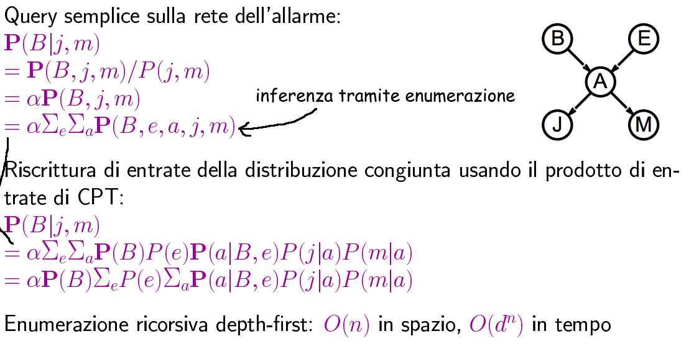
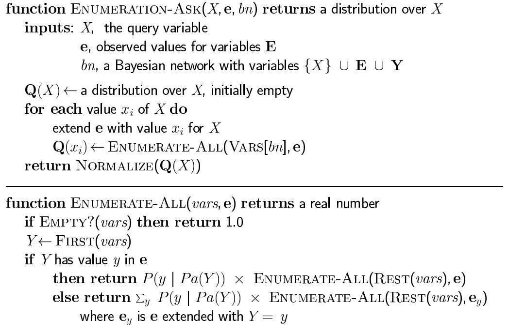
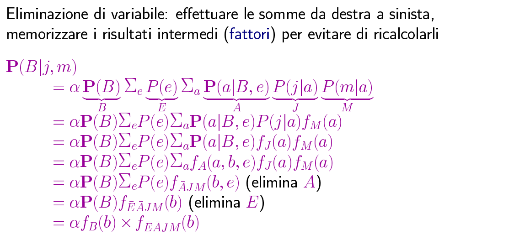
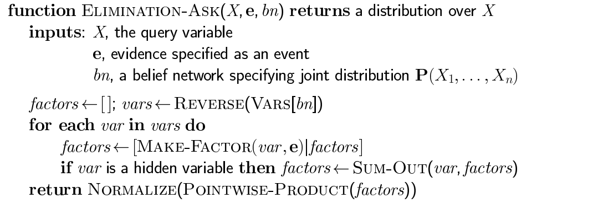
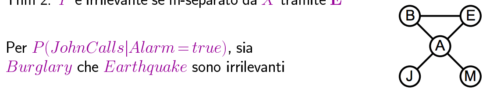

#Lezione 28 - Reti Bayesiane 2

Con le reti Bayesiane è possibile fare **inferenza esatta** tramite enumerazione.

Una possibile query è **P**(B|j,m), per ottenere la distribuzione di probabilità della variabile *B* dato che entrambi i vicini hanno chiamato.

L'inferenza per enumerazione viene poi fatta riducendosi alla tabella della distribuzione di probabilità congiunta, andando a sommare sui valori delle variabili nascoste (marginalizzazione sulle variabili nascoste).

La distribuzione della probabilità congiunta può essere poi fattorializzata utilizzando la semantica globale data dalla topologia della rete bayesiana.

Nel caso pessimo, per calcolare la distribuzione congiunta servono _n\*2n_ operazioni (variabili booleane), sfruttando la topologia si riesce a scendere a *O(n)* per il tempo e *O(dn)* per lo spazio.

## Algorimto di enumerazione

L'algoritmo esegue il calcolo delle varie sommatorie, riscorsivamente, in profondità e a partire da quella più a sinistra. Da notare che prima di ritornare la risposta alla query, questa deve essere normalizzata.

Questo approccio è inefficente dal momento che esegue dei calcoli ripetuti, ad esempio per rispondere alla query precedente calcola *P(j|a)P(m|a)* per ogni valore di *e*.

*Nell'albero i pallini rappresentano le operazioni e gli archi rappresantano i valori*

Per limitare il numero di calcoli si può costruire l'albero con un approccio bottom-up, considerando le sommatorie da destra a sinistra ed effettuando i calcoli sono quando è necessario.
In questo modo si riesce facilmente ad individuare il caso in cui ci siano dei sotto alberi uguali.

## Inferenza tramite eliminazione di variabile

*c'è un esempio nel libro che spiega il prodotto pointwise*

In pratica viene creato un tabellone, con una colonna per ogni variabile da cui dipende il fattore. Ad ogni riga corrisponde un valore e nel caso del prodotto point-wise vengono fatte le moltiplicazioni delle corrispettive righe dei fattori.

L'algoritmo risultante è il seguente:

Da notare che l'algoritmo inizia rovesciando le variabili e con i fattori vuoti.

Quando viene trovata una variabile nascosta si esegue il `Sum-Out` della variabile, il quale per ogni valore possibile delle altre variabili, fissa un valore ed esegue la sommatoria dei valori al variare della variabile da sommare.

Come sempre alla fine viene normalizzata la risposta.

## Variabili irrilevanti

Effettuando l'inferenza esatta è possibile che alcune variabili siano irrilevanti per la query.
Dalla topologia di una rete bayesiana si riesca a capire quali sono.

In particolare (**teorema**), la variabile *Y* è irrilevante a meno che non sia un **antenato** della query *X* o delle variabili di evidenza.

Una versione alternativa si ottiene con il grafo **moralizzato**, ovvero una rete bayesiana con tutti i genitori "sposati" e con archi non direzionati.

In questo caso si dice che *F* è **m-separato** da *G* tramite *H* se e solo se è separato tramite *H* nel grafo moralizzato.
In particolare *Y* è irrilevante se m-separato da *X* tramite *E*.

L'algoritmo di eliminazione può quindi rimuovere queste variabili prima di valutare la query.

## Complessità dell'inferenza esatta

Le considerazioni precedenti portano ad un miglioramento all'efficenza, ma nel caso pessimo, il tempo di esecuzione è comunque esponenziale.

Più nel dettagli, se una rete è **singolarmente conessa**, ovvero ogni coppia di nodi è connessa da al più un cammino (non diretto) il costo in tempo per l'algoritmo di eliminazione di variabile è _O(dkn)_.

Nel caso di reti più che connesse singolarmente, il problema di inferenza può essere ridotto a 3-SAT, pertanto si tratta di un problema NP-hard.