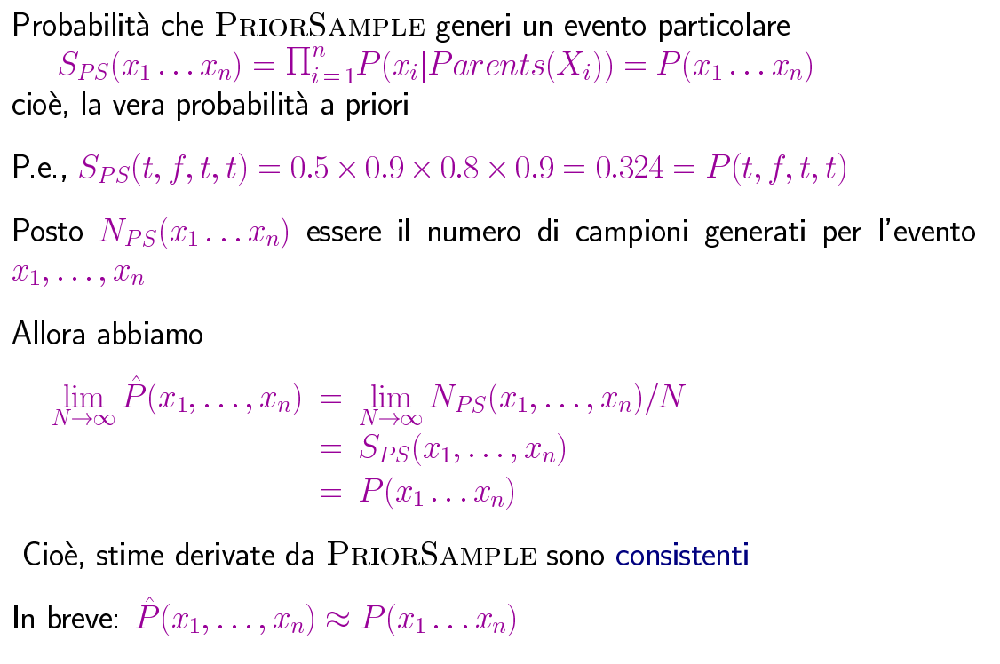
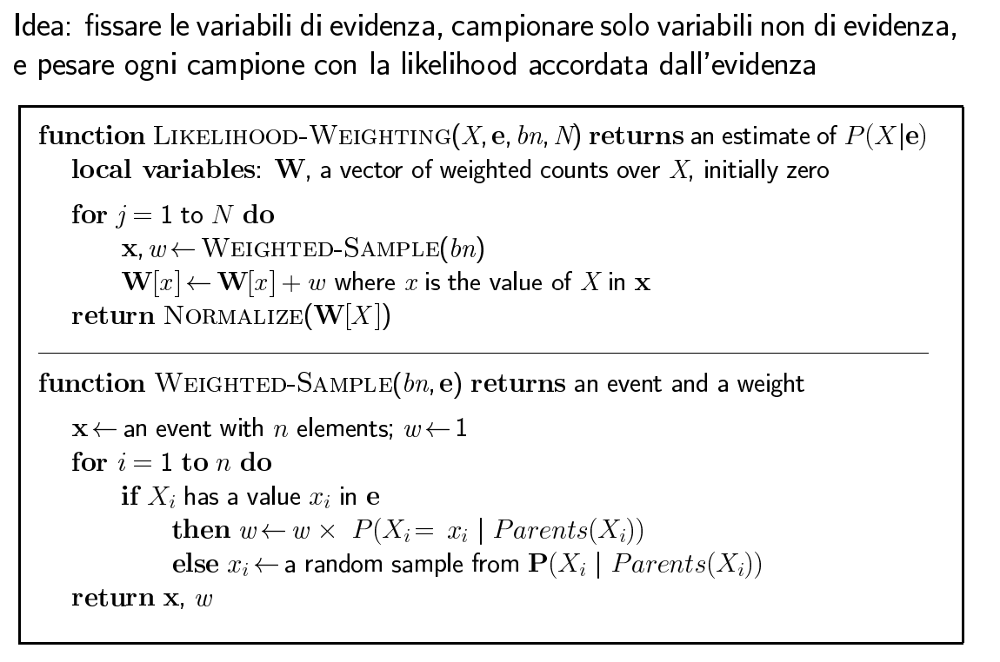
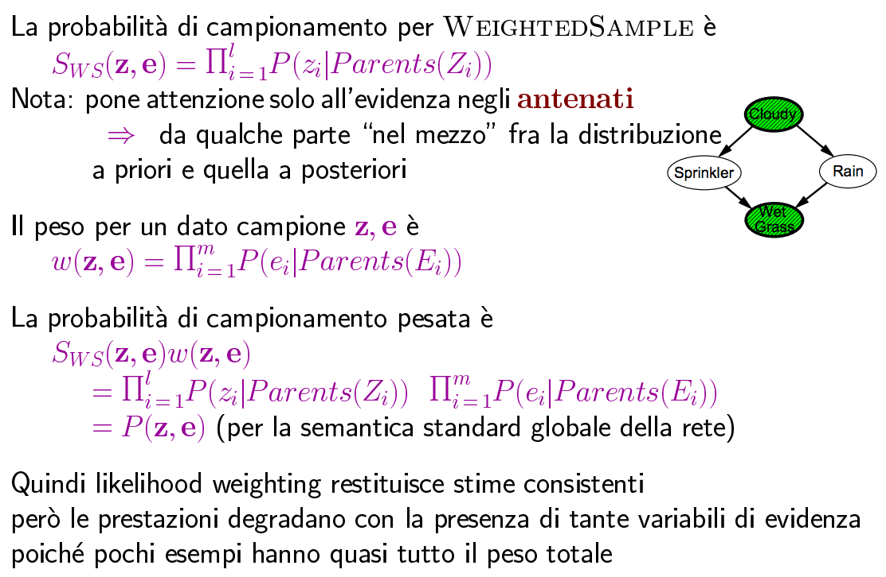

#Lezione 29 - Inferenza approssimata

Fare inferenza essata è tipicamente costoso.
Tipicamente si preferisce trovare un'ordinamento per le azioni in modo da scegliere quella migliore e pertanto basta avere una relazione d'ordine piuttosto che il valore essatto.

## Inferenza tramite simulazione stocastica

L'idea di base è:

1. Estrarre *N* campioni da una distribuzione di campionamento *S*
2. Calcolare la probabilità a posteriori approssimata *P'*
3. Mostrare che converge alla vera probabilità *P*, ovvero aumentando il numero di campioni, il risultato converga al valore della probabilità.

## Campionamento da una rete vuota

Con rete vuota si intende che nessuna variabile è istanziata con un valore. 
C'è una rete bayesiana con un nodo per ogni variabile e gli archi che rappresentano le relazioni con i genitori. Si hanno inoltre a disposizione le tabelle di probabilità condizionale per ogni nodo.

Per generare un campione si parte dai nodi che non hanno genitori, creando devi valori per quel nodo, seguendo la loro distribuzioni di probabilità.

Una volta generati i campioni, si fissano i valori e si considera il resto della rete, generando il resto del campione utilizzando le probabilità condizionali.
Terminato ciò si ritorna il campione generato.

**Rete vuota:** rete che non considera evidenza, ovvero le cui variabili non sono assegnate. 

Vengono quindi generati tanti esempio che vengono poi utilizzati per stimare la distribuzione di probabilità congiunta.
Di conseguenza se un determinato campione compare più volte, maggiore è la sua probabilità di comparire.

*SPS(x1, ..., xn)* è la probabilità che venga generato un determinato evento.

 
## Rejection Sampling

Si vuole stimare la probabilità a posteriori data una certa evidenza, pertanto si usa `PriorSample` per generare i vari campioni, e vengono scartati tutti i campioni che non concordano con l'evidenza.

I campioni rimanenti vengono utilizzati per stimare la probabilità di un determinato valore per la variabile query.

*X* sono le variabili di query, **x** è il campione generato, *x* è il valore della query *X* per l'esempio **x**.

Se la probabilità dell'evidenza è bassa, vengono generati pochi campioni consistenti con l'evidenza, pertanto per raggiungere un risultato significativo è necessario generare molti campioni.

## Likelihood weighthing

Per evitare il problema di rejection sampling, vengono fissati i valori per le variabili di evidenza, in modo da generare solo campioni consistenti.
Ogni campione viene poi pesato con la likelihood accordata dall'evidenza, altrimenti si perderebbe la consistenza con la distribuzione di probabilità a priori.

Il peso iniziale viene fissato ad *1*, dopodiché per ogni variabile di evidenza fissata, viene moltiplicato il peso per la probabilità di ottenere quel determinato valore di evidenza, dato il valore dei genitori del nodo.

In questo caso si va a stimare la probabilità delle variabili che non hanno evidenza *SWS(**z**,**e**)*, così facendo si tiene in considerazione solamente l'evidenza degli antenati, mentre il peso per un dato campione *w(**z**,**e**)* rappresenta la probabilità dell'evidenza per le variabili fissate.

Utilizzando questa strategia si generano solamente campioni consistenti con le variabili di evidenza, in un modo più efficente rispetto alla versione precedente, tuttavia se le variabili di evidenza sono tante la stima della probabilità diventa meno accurata.

##Inferenza approssimata tramite MCMC

- Rejection sempling genera tanti campioni e butta via quelli non consistenti
- Likelihood weighting genera solo campioni consistenti con l'evidenza, ma è necessario tenere traccia di un peso. Inoltre per generare un campione si riparte da capo.

Markov Chaining Monte Carlo genera dei campioni modificando il campione corrente, andando a cambiare in valore di una variabile, rispettando comunque il valore di probabilità della variabile.

L'algoritmo inzia creando un campione randome per le variabili **Y**, dopodiché, viene calcolata la distribuzione di probabilità andando ad creare nuovi campioni cambiando il valore delle variabili per cui non si ha evidenza considerando la distribuzione di probabilità dalla dalla **Markov blanket** della variabile che si vuole aggiornare.

**c'è un pacchetto di slide alternativo che non è condiviso con il pseudo-codice dell'algoritmo e un'esempio**

Per stimare **P**(*Rain*|*sprinkler*,*wetgrass*) viene campionato *Cloudy* e *Rain* considerando il loro Markv blanket, tenendo conto di quanti campioni generati hanno *Rain* vero e quanti ce falso.

Supponendo di creare 100 campioni, 31 dei quali con *Rain* vero, la distribuzione risulta **P**(*Rain*|*sprinkler*,*wetgrass*) = *<0.31,0.69>* ovvero la normalizzazione dei campioni ottenuti.

...convergenza al cammino...

Il campionamento utilizzando il Markov blanket risulta facilmente implementabile in modo parallelo.

Ci sono però dei problemi computazionali legati al riconoscere se è avvenuta la convergenza e legati alla dimensione del Markov blanket.

... cose, probabilità, altre cose ...

... vedi libro, sia seconda che terza edizione ...

## Riassumento

L'inferenza esatta tramite l'enumerazione di variabili è polinomiale sui polialberi (reti singolarmente connesse) ma NP-Hard in generale. Se i domini delle variabili sono grandi, il calcolo può essere oneroso.

Per fare inferenza approssimata risulta migliroe con Likelihood weigthing e MCMC.
LW è indipendente dalla topologia, ma si comporta male nel caso ci sia molta evidenza.
La convergenza piuò essere lenta per le probabilità vicine a 1 o 0. Si possono trattare cominazioni arbitrarie discrete e continue