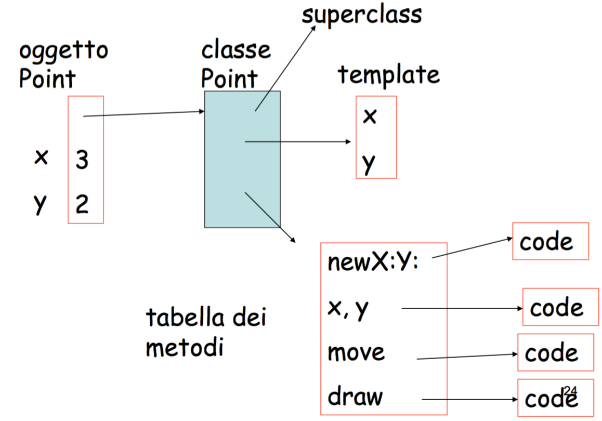
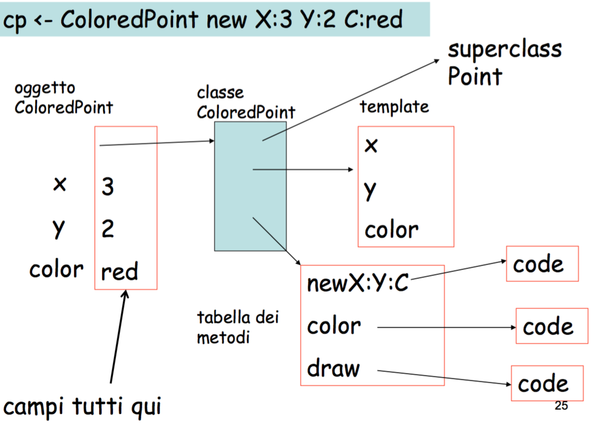

#Lezione 19 - Oggetti 3

Tutti gli oggetti vengono messi nello heap e vengono riferiti da una variabile presente nello stack.

È quindi necessario avere un sistema di garbage collection per togliere dallo heap gli oggetti che non servono più.

Quando si utilizzano oggetti di classe derivate, questi sono composti da un record di attivazione relativo all'oggetto della classe base e da un secondo record di attivazione conenente le informazioni aggiuntive e con un riferimento al primo.

```c++
ref(Point) p=new Point(1.1,3.0); 
ref(ColorPt) cp= new ColorPt(2,4.2,red);
```

Per definzione un `ColorPoint` è un sotto tipo di `Point`, quindi al posto di un `Point` è possibile utilizzare `ColorPoint`.

Quindi:

```c++
p :- cp; //Assegnamento
```

è un operazione legale per il subtyping, mentre

```c++
cp :- p
```

è sempre legale ma serve un controllo a runtime per verificare che l'oggetto puntato da `p` sia un `ColorPoint`, altrimenti è necessario sollevare un'errore.

```c++
ref(Point) r=new Point(1,2); 
ref(ColorPt) cp= new ColorPt(3,4,red); 
r.distance(cp);
cp.distance(r);
r:-cp
r.distance(cp);
```

la memoria dopo la creazione dei due oggetti è:

```c++
HEAP:
1* [AL=def P., x=1, y=2, equals=(1*,eq), distance=(1*,dist)]
2* [AL=def P., x=3, y=4, equals=(2*,eq), distance=(2*,dist)]
3* [AL=2*, c=red, equals=(3*,eq’)]

STACK
1[CL=0,AL=0, r = 1*]
2[CL=1,AL=1, cp = 3*]
```

Per l'esecuzione di `r.distance(cp)`, dove il tipo statico di `r` è `Point`, viene scelta come funzione da invocare è `distance` di `Point`.

Tuttavia la funzione `distance` si aspetta un parametro di tipo `ref(Point)` ma riceve una variabile di tipo `ref(ColorPoint)`.

Quindi a runtime il codice di `distance` deve essere compatibile con `ColorPoint`, in particolare `ColorPoint` deve contere `x` e `y`, ma queste variabili non vengono trovate nel record puntato da `cp` e pertanto bisogna risalire utilizzando l'access link per trovalrle nel record corrispondente al sotto oggeto di tipo `Point`.

Un'altra istruzione interessante è `cp.distance(r)`, dal momento che nel record puntato da `cp` non è presente `distance`, pertanto è necessario cercare la funzione utilizzando l'access link.

Segue che gli oggetti della classe base e derivata hanno una forma diversa, quindi le operazione da fare per raggiungere i campi dati possono essere stabilite solo a runtime.

A compile time è solo possibile definire delle strategie di ricerca per recuperare i vari valori e trattandosi di una ricerca a runtime alcuni errori possono non essere scoperti a compile time.

Ad esempio, l'istruzione `cp.equals(r)` da un errore a runtime perché la funzione invocata ha bisogno di utilizzare dei campi dati che non sono presenti nell'oggetto puntato da `r`.

Per rilevare questo errore il compilatore deve inserire un controllo di tipo a runtime.
Ma non è così semplice, perché possono verificarsi dei casi ancora più tricky:

```c++
r :- cp;
r.equals(new Point(...));
```

A compile time i tipi statici coincidono, però a runtime viene eseguita la funzione `equals` di `ColorPoint` e ciò porta ad un errore.
Non tutti i compilatori sono in grado di prevedere questi errori.

Quindi il compilatore può scegliere di mettere i controlli di tipo sempre oppure accontentarsi di non riscuiscre a mettere abbastanza controlli.

**Recall variance** (?) Simula (ma anche Java) assume che se `B <: A` allora anche `ref(B) <: ref(A)`.

```c++
A class B; ref(A) a; ref(B) b;

proc assignA(ref(A) x) 
begin
    x:-a
end;

assignA(b);
```
Questo crea un errore di tipo (`b` diventa di tipo `ref(A)`) che viene rilevato solo a tempo di esecuzione.

##Smalltalk

Linguaggio completamente nuovo in cui ogni cosa è considerata come un oggetto, comprese le classi.

*È proprio estremista come linguaggio, ha anche la cintura esplosiva*

Tutte le operzioni venogno richieste inviando un messaggio ad un oggetto e l'unico errore di tipo si verifica quando viene inviato ad un oggetto un messaggio che non è in grado di riconoscere.

Non sono quindi presenti tipi statici e il controllo dell'errore viene fatto a runtime, rendendo la cosa molto inefficente.

In ogni caso è un linguaggio **type-safe** in quanto ogni errore di tipo viene segnalato, anche se questo viene rilevato solamente a runtime.

La definizione di una classe avviene in un modo simile alla compilazione di un form, mentre la definzione dei metodi è più strana

```obj-c
newX:xval Y:yval ||
    ^self new x:xval y:yval
```

In questo caso si definisce il metodo `newX:Y:` che ha come corpo `self new...` cioè invia a `self` il messaggio `newx:y:`, `^` serve per ritornare un valore.

```obj-c
newOrigin ||
    ^self new x:0 y:0

initialize ||
    pi <- 3.1415926535897238653
```

Altri metodi generici per la classe `Point` possono essere

```obj-c
x:xcord y:ycord ||
    x <- xcord
    y <- ycord

x || ^x
y || ^y
```

Il metodo `x || ^x` permette di accedere al valore di `x`. Questo metodo è necessario perché in Smalltalk tutti i campi dati sono privati.

```obj-c
i < j ifTrue: [i + j] ifFalse:[j - 1]
```

In questo caso viene inviato a `i` il messaggio `<` con argomento `j`.
La chiamata a questo metodo ritorna quindi un valore che può essere `True/False`.

Al valore ritornato dal metodo viene inviato il messaggio `ifTrue: [i + j] ifFalse:[j - 1]`, il quale in base al valore esegure il ramo then o else.

Questo perché sia `True`/`False` che i blocci di codice, come `[j-1]`,  sono degli oggetti che possono essere valutati.

```obj-c
index <- 1.
[index <= array size]
    whileTrue: [array at: index put:0. 
                index <- index +1]
```

Il ciclo `while` viene implementato come un messaggio che viene invato al valore ritornato da `[index <= array size]`.
Se viene ritornato `True` viene eseguito il corpo, dopodiché viene rieseguito il tutto.

La struttura di un `while` può essere schematizzata come:

```obj-c
{C = (A whileTrue: B)} = ^A ifTrue: B;C ifFalse: []
```

In Smalltalk anche i numeri sono degli oggetti, in particolare c'è la classe `Integer` dalla quale derivano `small` e `big`.

Si può quindi definire una funzione `factorial` per `Integer`:

```obj-c
factorial ||
    self <= 1
        ifTrue: [^1]
        ifFalse: [^(self-1) factorial * self]
```

In Smalltalk è presente anche un oggetto `super` che rappresenta la classe base, in questo modo quando si ridefinisce un metodo è comunque possibile richiedere l'esecuzione del metodo originale delle classe base inviando lo stesso messaggio all'oggetto `super`.

Dal momento che non ci sono tipi statici la scelta del metodo da invocare in risposta ad un determinato messaggio si basa solamente sul nome del metodo e il numero dei parametri, la combinazione *nome messaggio* e *arietà* prende il nome di **selettore**.

###Rappresentazione degli oggetti



Ci sono due parti, una parte principale relativa all'oggetto di tipo `Point` che contiene i dati dell'oggetto e un puntatore ad un altro oggetto che rappresenta la definizione della classe `Point`, la quale contiene tutte le altre informazioni come:

- un puntatore a `super`
- un puntatore alla tabella dei metodi, un altro oggetto che contiene tutti i metodi della classe e i riferimento al loro codice sorgente
- un puntatore al template della classe.

L'oggetto template serve per permettere al codice di una classe derivata di risalire alla posizione delle variabili all'interno di un oggetto della classe base e viceversa.



Da notare che la tabella dei metodi della classe `ColoredPoint` contiene solo i nuovi metodi, inoltre, l'oggetto di tipo `ColoredPoint` contiene tutti i campi dati, compresi quelli della classe base.

Spiegando meglio l'utilità del template: se ad un oggetto di una classe derivata invio un messaggio che esegue un metodo della classe base, questo metodo ha informazioni solamente riguardo la struttura della classe base e non di quella derivata, viene quindi utilizzato il template per risalire alla posizione della variabile all'interno dell'oggetto di classe derivata.
Questo perché i campi dati di una classe derivata possono avere un ordine diverso rispetto a quelli della classe base.

Quando viene inviato un messaggio ad un oggetto di classe derivata viene:

1. Cercato il metodo nella tabella dei metodi per la classe derivata
2. Se non viene trovato, si cerca nella tabella della superclasse
3. Se non viene trovato, si continua a cercare nella gerarchia.

Questo approccio è costosto, pertanto i linguaggi moderni utilizzano vari stratagemmi per velocizzare il processo.