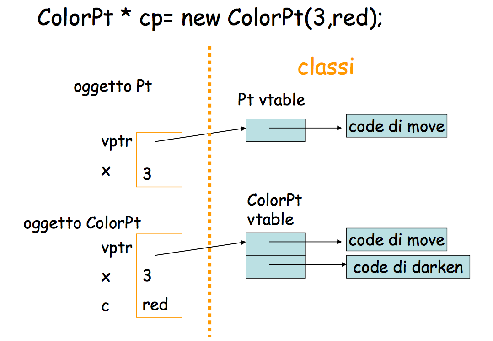
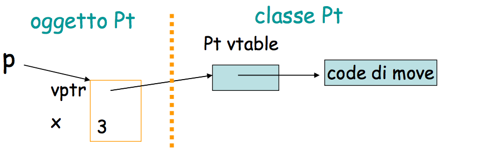
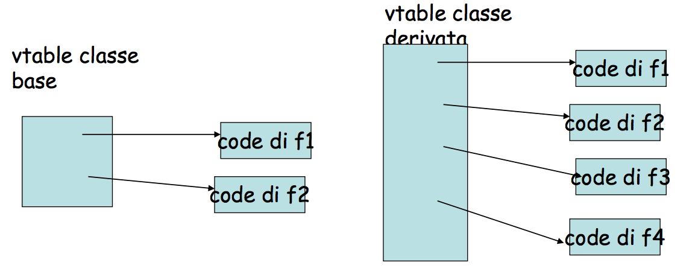
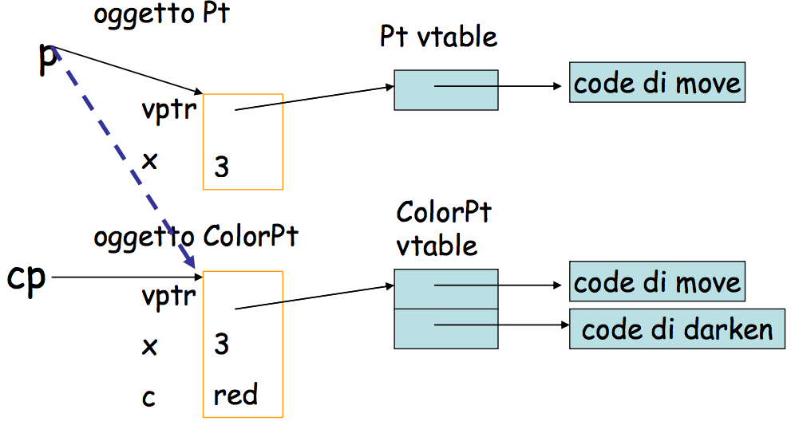

#Lezione 21 - C++

Lo scopo principale del linguaggio è quello di andare ad aggiungere caratteristiche OO al C restando comunque compatibile con il C puro.

Il C++ aggiunge anche un maggiore controllo statico dei tipi mantenendo comunque l'efficenza del C, al punto che un programma C compilato dal compilatore C++ deve essere efficente come se fosse compilato da un compilatore C.

*Se non si usa una caratteristica allora non si deve pagare per essa*

Questo non vuol dire che i costrutti C devono essere tradotti come fa il compulatore C, ma solo che la loro efficenza deve essere la stessa.

In C++ non c'è garbage collection, non per questioni di efficenza, in quanto poteva essere introdotta solo per gli oggetti, ma perché il C++ **non è type-safe**, in quanto non è possibile determinare se un determinato oggetto è inutile, perché ogni variabile intera può essere convertita in un puntatore. Quindi il vero problema è dato dalla presenza dei cast e non da questioni di efficenza.

##Classi in C++

Le classi sono state implementate a partire dalle strutture, aggiungendo il concetto di astrazione.

Ci sono quindi delle variabili di tipo classe che non sono puntatori ad oggetti. Gli oggetti possono anche essere allocati nello stack dei record di attivazione ed esiste il concetto di assegnazione tra gli oggetti che va oltre all'assegnamento dei puntatori.

##Caratteristiche

Il C++ è un linguaggio progettato bene che offre un buon controllo di tipi, tuttavia ci sono dei punti complessi e pertanto alcuni programmatori utilizzano solo parti del linguaggio. 
Oltretuttto, il C++ non impone un buono stile di programmazione, perché per esempio il vincolo dei tipi può essere raggirato.

Tra i vari miglioramenti al C, ci sono:

- Il tipo bool che può essere considerato come un intero
- L'utilizzo dei riferimenti per gli oggetti nello heap
- Prevede l'overloading di operatori e funzioni in base alla definizione dell'utente
- Template di funzione per ottenere il polimorfismo parametrico con le variabili di tipo
- Oggetti
- Eccezioni

##La parte OO

Noi ci contreremo di più nella parte legata agli oggetti. Tra le varie cose ci concetremo principalmente su:

- Classi
- Oggetti
- Dynamic lookup
- Astrazione, con vari livelli di accessibilità: public, private e protected
- Ereditarietà, che può essere singola o multipla
- Subtyping, legato all'ereditarietà ma non coincide con questa perché esiste anche l'ereditarietà privata.

L'astrazione in C++ risulta molto buona, oltre ai 3 livelli di visibilità c'è la possibilità di definire classi friend.

La relazione tra subtyping e ereditarietà sono tra loro collegate.

È presente il polimorfismo parametrico utilizzando le classi template template.

Typechecking statico migliore rispetto a quello del C.


###Il lato oscuro del C++

La maggior parte dei problemi del C++ deriva dal vincolo della retrocompatibilità con il C.

Alcuni di questi sono:

- Cast e conversioni automatiche
- Oggetti allocati sullo stack
- Overloading (che risulta essere complicato)
- Ridefinizione/Overriding: quando un metodo della classe astratta ha la stessa firma di un metodo della classe base. Solo che nel caso dell'overriding la classe base ha marcato il metodo come virtuale. La ridefinizione è più generale. In C++ questi due concetti si sovrappongono e possono causare dei comportamenti inattesi.
- Ereditarietà multipla, che causa un numero multiplo di problemi implementativi.

Quando lo stesso programma utilizza overloading, overriding, ridefinizioni e dynamic lookup c'è il rischio che la situazione diventi molto caotica.
Aggiungendo poi l'ereditarietà multipla, il tutto diventa complesso sia da implementare che da capire.

###Cast e conversioni

I cast permettono di eseguire delle operazioni **type-unsafe**, come la conversione da un intero a un puntatore.

In generale le conversioni tra puntatori non portano modifiche ai valori, viene solo cambiato il tipo del puntatore, che da quel momento in poi viene considerato di un tipo diverso, il valore del puntatore e il valore dell'oggetto puntato non cambiano. 

Con l'ereditarietà multipla il valore del puntatore deve essere modificato, questo perché quando si cambia il tipo di un puntatore ad una classe derivata al tipo di una classe base, il valore del puntatore deve essere modificato in modo che il puntatore riferisca il sotto-oggetto specifico.

Il programmatore devi quindi occuparsi di questioni tecniche legate al linguaggio.

###Oggetti allocati sullo stack

Nei linguaggi ad oggetti come Simula e Smalltalk, gli oggetti veongo allocati solo sullo heap. 
In C++, gli oggetti possono essere allocati sia sullo heap che sullo stack, questo per mantere la retro compatibilità con il C.

Esiste quindi l'assegnazione tra variabili di tipo classe, che è diversa dall'assegnazione di due puntatori.

Quando si effettua un'assegnazione tra una variabile di tipo derivato ad una variabile di tipo base si perde il subtyping in quanto l'oggetto di classe derivata viene "tagliato" in modo che abbia la stessa dimensione dell'oggetto di classe base e non si riesce quindi ad avere il dynamic lookup.


###Il punto della situazione

```c++
class Pt{
    public: // metodi per leggere ma non modificare
        Pt(int xv);
        Pt(Pt* pv);
        int getX();
        virtual void move(int dx);
    protected: //metodo che cambia i dati
        void setX(int xv);
    private: // i dati sono privati
        int x;
} // seguono le dichiarazioni dei costruttori e member functions 

...

Pt x=Pt(2); // sullo stack
Pt * px=new Pt(3); // sullo heap
```

L'invocazione dei metodi di una classe, come `getX()`, avviene nel classico modo, prima si fa il push del RA di `getX` e poi si fa il salto al codice della funzione.

Per i metodi **virtuali** come `move(int dx)` viene generato del codice diverso per permettere il dynamic lookup, questo perché il compilatore non riesce a stabilire qual'è il metodo che verrà chiamato.

```c++
class ColorPt : public Pt{ // public inheritance ColorPt <: Pt
    public:
        ColorPt(int xv, int cv);
        ColorPt(Pt* pv, int cv);
        ColorPt(ColorPt * cp);
        int getColor();
        virtual void darken(int t); // nuova
        virtual move(int dx); //overriding
    protected:
        void setColor(int cv); // nuova
    private:
        int color;
}
```

I costruttori di `ColorPt` devono invocare quelli di `Pt` in modo da poter costruire il sotto-oggetto di classe base, inoltre il campo `x` di `Pt` è privato e non c'è altro modo di assengarlo.

Ad esempio il costruttore di `ColorPt` può essere:

```c++
ColorPt(int xv,int cv) : Pt(xv)
{
    color=cv;
}
```

`ColorPt` ha tutti i membri di `Pt` più o meno come se avessero la stessa specifica che hanno in `Pt:

- i `public` sono visibili a tutti anche negli oggetti
`ColorPt`
- i `protected` sono visibili in `ColorPt` e nelle classi
derivate da `ColorPt`
- i `private` sono `private` anche negli oggetti `ColorPt`
ed quindi non sono accessibili dai nuovi metodi di
`ColorPt`, possono essere utilizzanti solo con i metodi di `Pt`

###Dynamic lookup

L'overriding di un metodo virtuale può essere fatto con:

```c++
void Pt::move(int dx) {
    x=x+dx;
}
void ColorPt::move(int dx)
{
    Pt::move(dx);
    darken(1);
}
```

Il dynamic lookup deve dipendere dal valore dinamico dell'oggetto di invocazione, che è sconosciuto al compilatore. 
Per questo motivo viene utilizzata una **vtable** per ogni classe, cioè una tabella che contiene le informazioni riguardanti i metodi virtuali della classe.
La tabella contiene solamente i metodi virtuali perché l'invocazione dei metodi non virtuali viene decisa a compile time.

Quindi ad ogni oggetto viene associato un record contenente un puntatore `vptr` che punta alla tabella dei metodi virtuali per la classe dell'oggetto. 



Per eseguire il metodo

```c++
Pt * p = new Pt(3);
p->move(2);
```

il compilatore produce il codice 

```c++
(*(p->vptr[1] )) (p,2)
```
*Da notare che l'indice della tabella dei metodi virtuali parte da 1 e non da 0. È una notazione del libro anche se si tratta di un libro di informatica.*

Tutto questo è stato fatto perché non è possibile determinare il tipo dinamico dell'oggetto puntato da `p`.
Tra l'altro lo stesso codice prodotto dal compilatore funziona anche se l'oggetto puntato da `p` è di tipo `ColorPt`, perché gli elementi della  tabella dei metodi virtuali di una classe derivata hanno lo stesso ordine (sono **conformi**) di quelli della tabella della classe base.



In C++ l'erediterietà è **conforme**, cioè sia i campi dati, sia i metodi virtuali che vengono ereditati da una classe derivata compaiono nello stesso ordine con il quale compaiono della classe base.

Così facendo è possibile evitare di utilizzare un puntantore al sotto-oggetto come succede con Smalltalk, racchiudendo tutte le informazioni di un oggetto o di una classe in uno stesso record.

*Ripetendo il concetto:* la prima parte della vtable di una classe derivata conincide con l'ordine dei metodi della vtable della classe base (**vtable conformi**).



Questo permette di scrivere le seguenti istruzioni

```c++
 p = cp; 
 p->move(2); 
```



Il compilatore produce il codice `(*(p->vptr[1]))(p,2)` che funziona correttamente sia se l'oggetto puntato da `p` è di tipo `Pt` sia se è di tipo `ColorPt`, questo grazie alla conformità delle vtable.

La stessa strategia non può funzionare in Smalltalk perché non essendoci un tipo statico il compilatore non riesce a farsi un idea di che tipo di oggetto potrebbe essere puntato, inoltre due oggetti di due classi in relazione gerarchica potrebbero avere lo stesso metodo in posizioni diverse a causa del fatto che Smalltalk non impone la conformità.

Volendo si potrebbe utilizzare una mega tabella con tutti i possibili metodi virtuale ma questa imporrebbe troppa rigidità e sarebbe troppo inefficente.

###Dynamic lookup VS overloading/overriding/ridefinzione

**Overloading**: operatore/metodi con lo stesso nome e parametri formali con tipi diversi, la scelta dell'operatore/metodo viene fatta a  compile time per ogni invocazione.

**Overriding**: metodo di una sotto-classe con nome e tipo degli argomenti uguali a quelli di un metodo virtuale della classe base e il tipo del risultato può essere sotto-tipo.

**Ridefinizione**: in una sotto-classe c'è un metodo con lo stesso nome  di un meotodo della classe base che non è stato dichiarato come virtuale