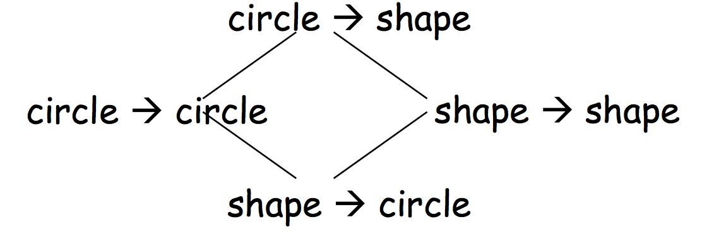
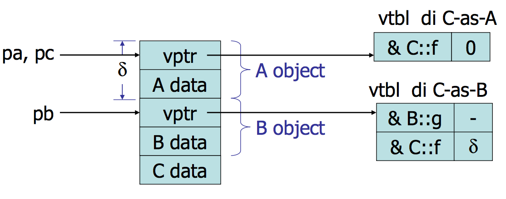

#Lezione 23 - Subtyping (tra funzioni) e Ereditarietà multipla

##Subtyping tra funzioni

Il subtyping `A <: B` al posto di `B` possiamo usare `A`. Inoltre, se `B::f` è overriddato in `A::f`, il dynamic lookup prevede che venga invocato `A::f` al posto di `B::f` se il tipo dinamico dell'oggetto di invocazione è `A`.

In un certo senso si può dire che dovunque funziona l'invocazione di `B::f` funziona anche l'invocazione di `A::f` che si avvicina alla definizione di sotto tipo, si può quindi dire che `A::f <: B::f`?

Il subtyping può essere definito in due modi:

- **Covariante sul codominio**: *A->B'* ha come sotto tipo *A->B* se *B* è un sotto tipo di *B'*.

> If B <: B' then A->B <: A->B'

- **Contro-variante sul dominio**: *A'->B* ha come sotto tipo *A->B* se  *A'* è un sotto tipo di *A*.

> If A' <: A then A->B <: A'->B

Nel caso ci siano più parametri si ha che `A::f <: B::f` se le due funzioni sono contro-varianti sul dominio e covarianti sul valore di ritorno. Ovvero se i parametri di `A::f` sono dei sotto-tipi dei parametri di `B::f` e se il valore di ritorno di `A::f` *è più specifico* del valore di ritornodi `B::f`, cioè il tipo del valore di ritorno di `B::f` è sotto tipo di `A::f`.

> B::T f(T<sub>1</sub>, ..., T<sub>k</sub>) e A::S f(S<sub>1</sub>, ..., S<sub>k</sub>) 
> 
> A::f <: B::f
> 
> se T<sub>1</sub>, ..., T<sub>k</sub> <: S<sub>1</sub>, ..., S<sub>k</sub> e S <: T

Ad esempio, se `circle <: shape`:



Nell'esempio non si riescono a trovare altri sotto tipi per `shape -> circle`, perché non c'è nessuna classe più generica di `shape` e nessuna più specifica di `circle`.

Tuttavia si può risalire la gerarchia, rendendo più specifico `shape` o più generco `circle`.

Quindi `circle -> circle <: circle -> shape`, perché ovunque è richiesta l'esecuzione di una funzione `circle -> shape` è possibile utilizzare una funzione `circle -> circle`, questo perché le due funzioni hanno lo stesso dominio e il codominio di `circle->circle` è un sotto tipo del dominio di `circle -> shape`.

Inoltre, `shape -> circle <: circle -> circle`, questo perché qualunque sotto tipo di `circle` è anche sotto tipo di `shape`, quindi le invocazioni di `circle -> circle` sono compatibili con `shape -> circle` e i risultati sono dello stesso tipo.

Da notare che tutto questo ragionamento si **basa sui tipi**, non viene tenuto in considerazione che cosa fa effettivamente una funzione, quindi il sotto-tipaggio tra funzioni **non implica** che le due funzioni facciano le stesse cose o che siano corrette.

In C++ la regola per il subtyping tra funzioni è più rigida, viene imposto che i domini delle funzioni siano uguali, quindi:

> T<sub>1</sub>,...,T<sub>k</sub> = S<sub>1</sub>,...,S<sub>k</sub> e S <:T

Questo perché il tipo del risultato di una funzione di ritorno non viene considerato dall'algoritmo di overloading resolution, quindi l'overriding può cambiare il tipo del valore di ritorno senza interferire con l'overloading resolution.

In questo modo quando viene scelto un metodo virtuale non c'è il rischio che il dynamic lookup invochi un metodo che si aspetta dei parametri di tipo diverso.

Se non ci fosse questo vincolo un metodo della classe base potrebbe essere overriddato da un metodo che si aspetta dei parametri diversi e se ci sono più override dello stesso metodo, la scelta del metodo da invocare diventerebbe ambigua.

Ricapitolando, in C++ l'unico subtyping tra funzioni consentito è:

```c++
Point* move(int); <: ColorPoint* move(int);
```

##Ereditarietà Multipla

In C++ una classe può avere più classi basi, in questo modo si possono ereditare funzionalità indipendenti che possono essere utilizzate per creare nuove funzionalità.

Ci sono però vari problemi, primo tra tutti è che la vtable della classe ottenuta per ereditarietà multipla deve essere conforme con quelle di tutte le classi base.

```c++
class A {
    public:
        int x;
        virtual void f();
};
class B {
    public:
        int y;
        virtual void g();
        virtual void f();
};

class C: public A, public B { //L'ordine delle classi base è importante
    public:
        int z;
        virtual void f();
};
...
C *pc = new C;
A *pa = pc;
B *pb = pc;
```

L'ordine con cui vengono dichiarate le classi base influisce sulla struttura dell'oggetto, quindi la classe `class C: public A, public B` è diversa dalla classe `class C: public B, public A`.

Questo perché l'ordine con cui vengono dichiarate le classi base corrisponde con l'ordine dei sotto oggetti.

Anche per questo motivo il valore di `pc` è diverso dal valore di `pb`.



La parte iniziale di un oggetto `C` è identica ad un oggetto `A`, dopodiché c'è una parte identica ad un oggetto di tipo `B` e per finire ci sono le parti aggiunte dalla classe `C`.

La classe `C` ha quindi due vtable, una conforme alla classe `A` e l'altra conforme alla classe `B`. C'è anche una colonna aggiuntiva con contenete l'offset dal puntatore all'inzio dell'oggetto. Questo è necessario perché se viene invocata `C::f` utilizzando un puntatore di tipo `B*` si ha come valore l'inizio del sotto oggetto di tipo `B` e quindi per trovare il corretto indirizzo di inzio dell'oggetto è necessario utilizzare il **displacement** presente nella colonna della vtable, così facendo l'esecuzione di `f` riesce ad accedere sempre agli indirizzi corretti.


Quindi, alla compilazione di `pb->f(...)` il compilatore produrrà il codice `(*(pb->vtbl[2]))(pb,...)` mentre per `pc->f(...)`, `(*(pc->vtbl[1]))(pc,...)`.

Il valore dell'offset (*displacement*) viene preso in considerazione nel codice compilato per la funzione, non nell'invocazione. Quindi supponendo di avere

```c++
C::f(){
    x=x+2
}
```

per calcolare l'indirizzo di `x` il compilatore utilizza `o + disp + dx` dove `dx` è la distanza della variabile `x` dall'inizio dell'oggetto, indicato da `o`. Il valore del displacement viene *passato* alla funzione quando viene invocata a runtime, recuperandolo dalla vtable corretta.

L'offset non viene preso in considerazione nella compilazione dell'invocazione `(*(pb->vtbl[2]))(pb,...)` perché varia in base al tipo dinamico, quindi il compilatore non riesce a stabilire l'offset a compile time.

Le complicazioni causate dall'ereditarietà multipla sono quindi:

- La classe derivata ha diverse vtable, una per ogni classe base.
- Un puntatore `B*` ad un oggetti di tipo `C` punta ad un indirizzo differenzte dell'oggetto rispetto ad un puntatore `A*` o `C*`.
- Le vtable contengono degli offeset per alcuni metodi.

###Esercizio

```c++
class A{
    public:
        int x;
        A(int a=0){x=a;}
        virtual void f(){g();}
        virtual void g(){cout<< “g di A”<<endl;}};
class B{
    public:
        int y;
        B(int b=0){y=b;}
        void r(){f();}
        virtual void h(){cout<<"h di B"<<endl;}
        virtual void f(){h();}
};
class C: public A, public B{
    public:
        int z;
        C(int a=0, int b=0, int c=0):A(a),B(b){z=c;}
        virtual void f(){h();}
        virtual void s(int x) {r();}
};
```

####Domanda 1

Si chiede di disegnare in dettaglio la struttura di un oggetto della classe `C` spiegando le ragiuni di questa struttura


> **Attenzione**: l'ordine delle classi base influisce sull'ordine dei sotto oggetti

Come prima cosa conviene disegnare l'oggetto principale indicando i vari sottooggetti e i campi dati, seguendo l'ordine di come compaiono nei sotto oggetti.

> **Attenzione**: i metodi che **non** sono marcati come virtuali **non** devono comparire da nessuna parte del disegno, perché le loro invocazioni vengono decise a compile time, quindi non hanno senso si esistere a runtime.

Dopo aver definito i sottooggetti si passa alle vtable, andando ad aggiungere i metodi virtuali e solo una volta completate tutte le vtable si passa ad inserire il displacemen, questo perché il displacement serve se lo stesso metodo virtuale compare contemporaneamente su più vtable.

L'oggetto ha questa struttura per garantire la conformità con gli oggetti delle classi base e il displacement serve per calcolare gli indirizzi corretti per i metodi virtuali che vengono definiti su più vtable.

####Domanda 2

Si chiede di spiegare il tipo dei parametri formali dei metodi: `s`, `r`, `C::f`, `B::f`, e `B::h` e anche di descrivere come vengono compilate le invocazioni contenute nel corpo di questi 5 metodi.

> **Attenzione** per riverirsi all'oggetto di invocazione si utilizza `o`.

 `C::s(C*)`, `B::r(B* )`, `C::f(C*)`, `B::f(B*)`, `B::h(B*)`
corpo di `C::s`:

- `s(C* o){o->r();}` il compilatore sa che `o` punterà sempre all’entrata principale, `r` è non virtuale, quindi produrrà un push+jump, ma, visto che `B::r` aspetta un `B*`, deve passare come parametro implicito *(o+δ)*. 
- `r(B* o){o->f();}`, l’overloading resolution individua `B::f (B*)` che è virtuale, quindi l’invocazione viene compilata con: `*(o->vtbl[2])(o)` nota che c’è concordanza tra il tipo di `o` e il parametro formale di `B::f(B*)`, quindi niente conversioni.
- `C::f(C* o){o->h(B*);}` `C::f` può venire invocata con oggetto d’invocazione di tipo statico `A*`, `C*`, e `B*`. Nei primi due casi il valore dinamico di o sarà certamente l’entrata principale di un oggetto `C`, mentre nell’ultimo caso sarà l’entrata secondaria di un oggetto `C`, per compilare l’invocazione ad h è necessario sapere quale caso si applica, quindi il codice di `C::f` sarà: `*((o+ δ -disp)->vtbl)[1](o+ δ -disp)` se `disp= δ` si usa `o` in quanto punta all’entrata secondaria, altrimenti `disp=0` e quindi si usa `o + δ` (cioè l’entrata secondaria)
