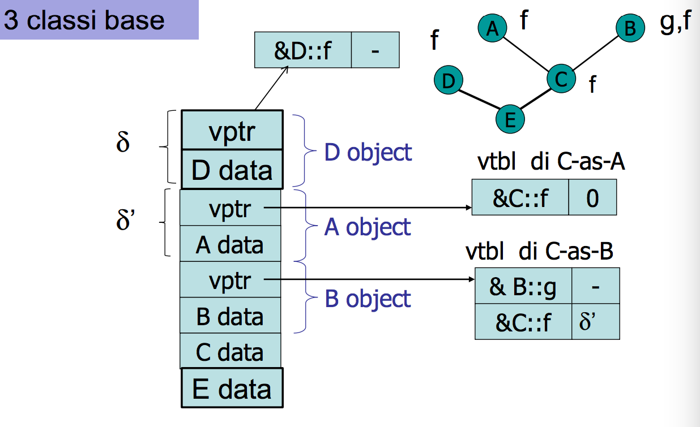
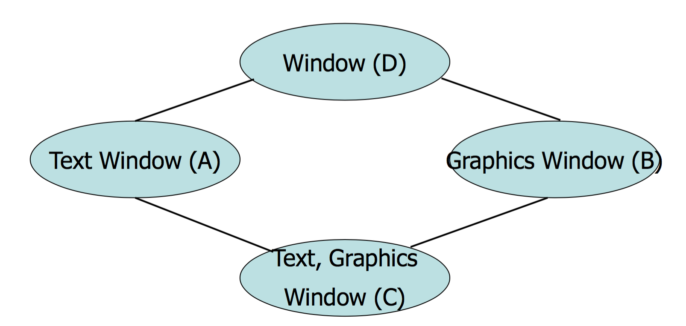
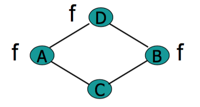

#Lezione 24 - Eredità Multipla 2

**Precisazione sul displacement della vtable**: se un metodo della classe derivata esegue l'override di un metodo virtuale di **una sola classe base** non serve considerare il displacement.

**Precisazione sul dynamic lookup**: se in una qualche gerarchia di classi, c'è un metodo `f` virtuale che viene ridefinito in più sottoclassi, l'istruzione `C::f` invoca il metodo `f` della classe `C`, in questo caso l'invocazione viene decisa a compile time e non utilizza  il dynamic lookup.

##Cosa fa veramente il compilatore

Utilizzando il flag `-fdump-class-hierarchy` il compilatore `g++` mostra la struttura delle classi.

Dai risultati forniti dal compilatore si riescono a vedere le due vtable. In particolare tutti i metodi overriden della classe derivata si trovano nella prima vtable e nelle entrate delle altre vtable c'è un riferimento al record relativo alla prima vtable.


Tuttvia questa potrebbe essere un'ottimizzazione effettuata dal compilatore, non è detto che sia un'implementazione standard.
Negli esercizi si può utilizzare l'approccio visto in classe (default) oppure se si vuole utilizzare questo approccio è da specificare.

##Cast pericolosi

Supponiamo di avere 5 classi, `A0`, `A1`, `B` che deriva da `A0`, `C` che deriva da `A1` e `D` che deriva da `B` e `C`.

Il seguente frammento di codice compila correttamente

```c++
A0* a0 = new A0;
A1* a1 = new A1;
D* d = (D*) a0;
d = (D*) a1;
```

Questo porta ad un errore a runtime, perché non esiste nessun oggetto di tipo `D`. 

##Caso con 3 classi base



In questo caso il compilatore da un errore, perché `E` non ridefinisce `f` e c'è un'ambiguità nella scelta, quindi il compilatore per non sapere né leggere né scrivere, solleva un'errore.

Nel caso ci fosse anche `E::f` le varie tabelle utilizzerebbero `&E::f`, con displacmente `0`, `δ` e `δ + δ'`.

Se non ci fossero né `D::f` né `E::f`, l'istruzione `E* e = new E(); e->f()` è senza dubbio corretta, ma come fa il compilatore a trovare `f`? Dal momento che `f` viene eriditata da `C`, aggiunge al valore di `e` il displacement per arrivare al sotto-oggetto `C`. 

##Conflitto nei nomi

Per risolvere il conflitto dell'esempio precedente si possono utilizzare 3 strategie:

- **Risoluzione implicita**: sceglie il compilatore che metodo invocare
- **Risoluzione esplicita**: il compilatore segnala errore se il programmatore non disambigua in modo esplicito.
- **Avoid name clash**: il compilatore non permette che si verifichino questi conflitti.

Nessuna delle 3 è le migliore, ma la risoluzione esplicita è la meno peggio.

##Ereditarietà a Diamante

Utilizzando l'ereditarietà multipla può essere che compaia il diamante della morte, ovvero quando si ha una classe `D`, dalla quale derivano `A` e `B`, e si aggiunge alla festa una classe `C` che eredita sia da `A` che da `B`.



Per gestire questa situazione si possono utilizzare due strategie diverse:

- Si tengono due copie dei dati dell'oggetto `D`, quando un metodo della classe `C` deve accedere ad un dato dell'sottooggetto `D` deve specificare con l'operatore di scoping `::`, alcune istruzioni non possono essere più eseguite, come `D* d = new C()`.
- Si tiene una copia sola dei dati, rischiando però di avere delle incoerenze.

C++ permette di utilizzare entrambe le strategie. Se non viene specificato nulla vengono tenute due copie dei sotto-oggetti, mentre con l'**ereditarietà virtuale** viene utilizzato un singolo sotto-oggetto.


Ovvero il sotto oggetto di tipo `D` viene distaccato e sostituito con un puntatore.
Il nuovo sotto oggetto ha una vtable che contiene dei riferimenti ai metodi che sono stati overridati da `A`.

Da notare che in questo modo viene aggiunto un livello di indirezione che crea dei problemi quando è necessario fare un downcast, dal momento che la distanza δ non è più costante. È quindi necessario utilizzare il **dynamic cast** il quale utilizza delle informazioni presenti nella vtable del sotto oggetto `D` per recuperare l'indirizzo dell'oggetto `A`.


Il tutto può essere riassunto dicendo che il sotto oggetto virtuale viene messo in fondo all'oggetto derivato, man mano che si effettuano derivazioni, la distanza del sotto oggetto virtuale aumenta.
Trattandosi poi di un valore che varia dinamicamente, questa distanza deve essere specificata nella vtable degli oggetti.


###Casi strani



Se viene usata l'ereditarietà virtuale, il compilatore solleva un errore perché nella vtable del sotto oggetto `D` non può contenere due definizioni di `f`. Se anche `C` defince `f`, allora non ci sono problemi.

Se invece `f` viene overridata solamente da `A`, allora non ci sono problemi.

C'è un problema anche con i costruttori, in questo caso il compilatore impedisce ai costruttori di `A` e `B` di invocare i costruttori di `D`, solo il costruttore di `C` può invocarli, questo perché c'è un solo sotto oggetto.

Dal momento che come si eredita viene deciso quando viene progettata la classe, è necessario tenere conto di come verrà utilizzata la classe quando si sceglie che tipo di ereditarietà utilizzare. Questo perché l'ereditarietà virtuale o meno, influenza come altre classi possano derivare la classe che si sta definendo.

##Classi astratte

Sono classi non completamente definite, che possono essere utilizzate solamente per definire dei sottotipi conformi ad essa.

Perché una classe sia virtuale è sufficente che un metodo abbia corpo nullo `=0`.

Sono state introdotte per rendere meno problematica l'ereditarietà ultima, dato che servono solamente a fissare l'ordine delle vtable delle classi derivate.