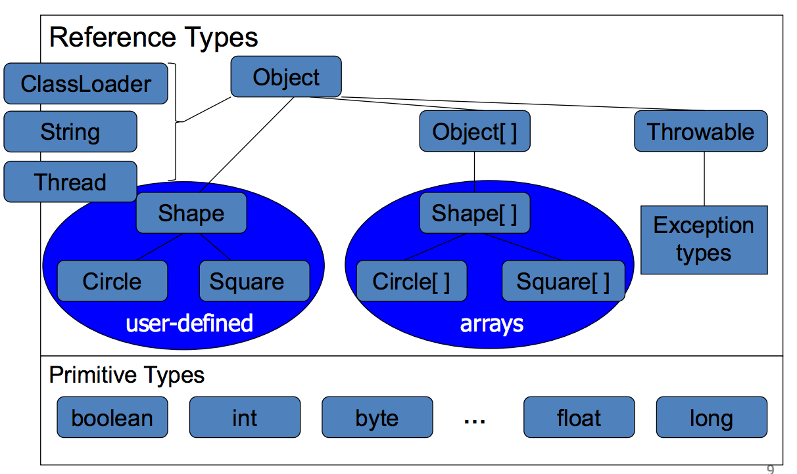
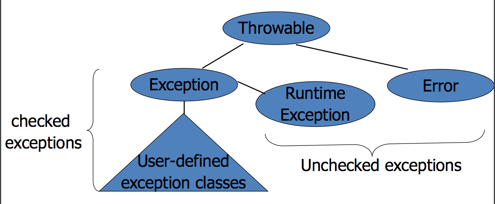

#Lezione 26 - Java

Nasce negli anni '90 con il nome di Oak per far funzionare delle "smart tv".

Per il Java è presente sia un compilatore che un interprete: il programmatore compila il codice Java con il compilatore, il quale produce il *Java bytecode* che può essere interpretato dalla **Java Virtual Machine**.

L'utilizzo dell'interprete fornisce maggiore sicurezza, dal momento che durante l'esecuzione si ha un maggior controllo sulle istruzioni che si stanno eseguento.
Viene comunque fornita la possibilità di effettuare delle chiamate native.

Obiettivi del linguaggio:

- **Portabilità**: il linguaggio deve poter essere "internet-wide", ovvero compatibile con i vari sistemi operativi;
- **Reliability**: i programmi devono evitare crash e comportamenti in attesi, programmi solidi e rubusti;
- **Safety**: il linguaggio deve controllare che non vengano eseguite istruzioni maligne;
- **Dynamic Linking**: il programma può essere eseguito anche se tutte le classi che lo compongno non sono presenti, ciò deriva dal fatto che il programma può essere caricato da più computer connessi in rete;
- **Multi-Threaded**: possibilità di scrivere programmi concorrenti;
- **Simplicity**: il linguaggio deve essere facilmente comprensibile dai programmatori medi, ovvero la sinstassi deve ricordare quella del C++ (era il linguaggio del momento);
- **Efficenza**: tenuta in secondo piano.

Java non ha lo stesso problema del C++ per quanto riguarda l'ereditarietà dal momento che non deve mantenere la retrocompatibilità con il C.
Non sono quindi presenti i cast e l'aritmetica dei puntatoro, inoltre il paradigma OO può essere integrato maggiormente nel linguaggio.


## Compilazione in Bytecode

Il compiltatore Java produce un programma in Bytecode che può essere eseguito dalla JVM.

Questa scelta assicura:

- **Portabilità**: basta avere l'implementazione della JVM compatibile con il sistema operativo per poter eseguire il programma scritto in Bytecode.
- **Safety**: interpretare da maggior controllo
- **Efficency**: questo approccio risulta **meno** efficente perché interpretare è più costoso del compilare. Con il tempo è stato introdotta la compilazione JIT (Just In Time).

## Type-safeness

Il controllo sui tipi viene fatto a 3 livelli:

- Type check sul codice sorgente scritto in Java, che risulta più efficace dal momento che non c'è da tenere in considerazione l'aritmentica dei puntatori e cast. Ciò ha permesso anche di implementare la garbage collection.
- Ogni istruzione Bytecode viene poi *typecheck-ata* prima di essere eseguita (check statico eseguito quando viene caricato il Bytecode).
- Controlli a runtime, come i limiti degli array e i down-cast (ad esempio da Object a String).

L'efficenza diminuisce a causa del numero dei controlli, specialmente per quelli eseguiti a run time.

## Oggetti e riferimenti

In Java **quasi** tutto è un oggetto, infatti i tipi primitivi non sono oggetti per creare un compromesso tra semplicità ed efficenza.

Per semplificare il linguaggio è stato poi posto il vincolo che gli oggetti possono essere acceduti solamente tramite puntatori, che prendono il nome di **riferimenti** e che vengono "nascosti" dal compilatore.
Di conseguenza l'unica assegnazione tra oggetti è quella tra i puntatori.
 
Il passaggio dei parametri alle funzioni avviene sempre per valore. Quando viene passato un oggetto, viene forinto il valore del puntatore (riferimento).



In Java vale l'**array covariance**, ovvero se `Shape` è sotto tipo di `Circle`, anche `Shape[]` è sotto tipo di `Circle[]`. Questo è uno dei punti discutibili del Java.

La classe `ClassLoader` rapprenseta la classe che viene utilizzata per caricare dinamicamente le altre classi. Risulta importare avere la possibilità di utilizzare più `ClassLoader` per una questione di sicurezza: è possibile avere un loader per caricare delle classi ritenute sicure che esegue meno controlli sulla sicurezza e fornisce privilegi maggiori e avere altri loader meno permissivi.

Tutti gli oggetti Java estendono (ereditano) da una classe, se questa non è specificata viene utilizzato di default `Object`, che contiene alcuni metodi generici come `toString()`, `equals()` e altri metodi legati alla concorrenza.

## Tipi e sotto tipi in Java

- **Tipi primitivi**: non sono oggetti, `int` `bool`
- **Reference Type**: vengono utilizzati i riferimenti per gli oggetti,  classi, interfaccie e array. Inolre, la sintassi non prevede l'utilizzo di `Object*` a contrario del C++.
- **Type Conversion**: se `B <: A` e `A x` allora è possibile fare il cast di `x` a `B` (programmazione generica). Tutti questi cast vengono verificati a run time e possono sollevare delle eccezioni.

## Garbage Collection

Grazie alla concorrenza è possibile effettuare la garbage collection, che è necessaria per la type safety dal momento che se non ci fosse, sarebbe compito del programmatore gestire la memoria (evita i dangling pointer).

La garbage collection utilizza un'approssimazione per determinare se un oggetto servirà in futuro o meno.
L'approssimazione risulta comunque accurata e raramente sbaglia. In ogni caso è necessaria per il buon funzionamento del programma.

## Dynamic linking

Le classi che compongono il programma possono venire caricate nella JVM in modo incrementale per velocizare l'inizio dell'esecuzione del programma.

È una sorta di lazy-evaluation delle classi: se durante l'esecuzione una classe non serve questa non vienne caricata.

Risulta fondamentale che le classi abbiano un'interfaccia chiara che permette il controllo del programma con le classi mancanti rapprentando la loro interfaccia. **Sistemami!**

## Java VS C++

Semplicazioni:

- Non c'è l'ereditarietà multipla;
- Non c'è l'overloading degli operatori, solo delle funzioni;
- Non ci sono coercizioni automatiche nell'overloading resolution

```java
class A : f(int)
class B extends A : f(double)

A a = new A();
a.f(2.4);   //C++ invoca f(int)
            //Java da un errore di compilazione a causa della conversione Double -> Int
a = new B();
a.f(2.4)
// C++ invoca f(int) per via del tipo statico
//Anche in questo caso Java segnala l'errore. 
//(non ne sono sicuro, ma sembra avere senso perché staticamente non sa il tipo dinamico)
```

- Non ci sono puntatori espliciti e le relative operazioni.

Punti in cui il Java migliora il C++:

- Garbage collection e metodi `finalize`
- Costruttori e costruttori delle superclassi, per la costruzione dei sotto oggetti
- Classi e metodi final
- Ereditarietà multipla ma solo con interfacce
- Eccezioni integrate nelle classi e controllo degli handlers
- Overloading
- Enforcing delle regole di overriding dei metodi che sono virtuali
- Concorrenza

Aspetti negativi del Java:

- Array covariance (trattata dopo);
- Realizzazione della concorrenza non sempre accettabile, specialmente in ambito real time, però si tratta già di un passo avanti rispetto al C++;
- Programmazione generica inizialemente assente (introdotta negli anni 2000) e comunque è stata implementata in modo diverso dal solito dal momento che il Java con Generics viene compilato allo stesso modo del Java senza Generics, mantenendo la retrocompatibilità.

### Garbage collection e finalize

Gli oggetti vengono deallocati solamente dal garbage collector, evitando così i puntatori a null.

Possono esserci dei problemi nella deallocazione se l'oggetto in questione possiede delle risorse o ha dei lock.

Sono stati quindi introdotti i metodi `finalize` che vegnono invocati dal garbage collector in modo da liberare le risorse.
Questi metodi possono essere quindi invocati prima di deallocare l'oggetto o all'uscita del programma.

La necessità di liberare spazio non è sempre la motivazione giusta per liberare le risorse, perché può creare problemi quando l'oggetto ha un lock (per la programmazione concorrente).

È una convenzione invocare `super.finalize` all'interno del metodo, anche se non è obbligatorio.

### Costruttori e super

Java garantisce che il costruttore venga invocato per ogni oggetto e questo deve essere possibile anche con l'ereditarietà.

In particolare il costruttore della sotto classe **deve** chiamare il costruttore della super classe, altrimenti viene inserita dal compilatore la chiamata al costruttore senza parametri.

Se questo costruttore non è presente si verifica un errore di compilazione.

C'è un'eccezione nel caso un costruttore invochi un altro costruttore della stessa classe.

Da notare che la convezione adotta è diversa da quella per `finalize`.

### Final

Keyword che permette di limitare l'ereditarietà. Le classi o metodi marcati come `final` non possono essere ridefiniti (es: `java.lang.String`).

Questo è importante per la sicurezza, dal momento che il programmatore può limitare il comportamento delle sotto-classi.

Ogni metodo di una classe risulta "*virutale*" finché non viene marcato come `final`.

### Ereditarietà mutlipla con inferfacce

Il subtyping per le classi è simile al C++: staticamente tipato, sottoclasse collegata al sottotipo e ereditarità singola.

Le interfacce permettono di definire delle classi astratte che non hanno implementazione, anche se esiste comunque la possibilità di definire le classi astratte che hanno un'implementazione parziale.

Per ottenere il *multiple subtyping* le inferfacce permettono l'ereditarietà multipla.

In questo modo a compilazione si riesce a distinguere il caso in cui viene usato come tipo statico la classe base o un'interfaccia, ottenendo una maggiore efficenza nel caso venga utilizzata la classe base, dal momento che in questo caso il dynamic lookup può essere basato sulla conformità.

Nel caso dell'utilizzo di un'interfaccia non viene più garantita la conformità, pertanto il codice prodotto risulta diverso dal momento che deve effettuare la ricerca dinamica del metodo da invocare (ci sono dei barbatrucchi per ottimizzare la ricerca).

L'utilizzo delle interfacce permette di avere l'ereditarietà multipla evitando il diamante della morte che si può verificare nel C++.
C'è però un costo maggiore dovuto al fatto che la ricerca dei metodi da invocare deve essere fatta a runtime.

### Eccezioni

Il funzionamento è standard con il `throw`/`catch` utilizzando il dynamic scope per la selezione dell'handler (primo trovato).

Ci sono alcune differenze legate al fatto che le eccezioni sono un oggetto e pertanto è permesso il subtyping delle eccezioni.

Inoltre, la firma dei metodi deve dichiarare queli eccezioni possono essere sollevate e che non sono `Exception`, questo perché c'è una gerarchia delle eccezioni.



Se un metodo può sollevare delle eccezioni, queste devono essere sotto-tipo di `Exception` e devono essere dichiarate nella firma/prototipo.

Le `RuntimeExcpetion` rappresentano tutte le eccezioni legate agli errori runtime, come l'out of bound di un'array o un class cast fallito.

Le cose fighe sono:

- Le eccezioni di un thread rimangono dentro il thread
- È possibile utilizzare un sopratipo per catturare più sotto-tipi di eccezioni.

### Overloading

Si basa sulla firma del metodo, utilizzando il nome e il tipo degli argomenti.

I metodi con lo stesso nome ma con parametri diversi sono in concorrenza, la decisione del metodo da invocare viene presa durante la compilazione da sorgente a Bytecode, senza tenere conto delle conversioni automatiche.

Quindi o c'è un metodo che ha la firma che coincide con i tipi di invocazione o viene sollevato un errore (vedi esempio precedente).

Non è possibile effettuare l'overload degli operatori.

### Overriding

In Java tutti i metodi sono virtuali, quindi per effettuare l'overriding basta utilizzare la stessa firma del metodo.

La firma del metodo rispetto ad un metodo della super classe può variare in tre modi:

- Tipi degli argomenti
- Tipo del valore di ritorno
- Eccezioni sollevate

Per fare l'override gli argomenti devono avere lo stesso tipo, il valore di ritorno può essere un sotto tipo, il metodo può sollevare meno eccezioni e la visibilità può essere solamente ampliata.

Le ridefinizioni di un metodo non sono bloccanti come con il C++: un metodo della classe derivata può overriddare un metodo conforme della classe base, ma non oscura altri metodi della classe base che hanno lo stesso nome ma parametri diversi. Questi altri metodi vengono ereditati normalmente e rimangono visibili nella classe derivata.

### Array covariance problem

```java
class A {};
class B extends A {};

B[] b = new B[10];
A[] a = b; //Ok, perché B[] <: A[]
a[0] = new A(); //Eccezione a runtime perché B <: A
```

Tuttavia il compilatore non segnala errori, ma a runtime viene sollevato in quanto si prova ad eseguire un assegnamento del tipo `B x = new A();`.

Questo problema deriva dalla versione originale di Java e ormai non può essere più modificata per una questione di retrocompatibilità con i programma già esistenti.

### Conversioni automatiche int->double

```java
public class A1{
    public void f(double x)
    {
        System.out.println("f di A1 ");}
    }
}

public class B1 extends A1{
    public void f(int x)
    {   
        System.out.println("f di B");}
    }
}

public class Main1{
    public static void main(String[] args){
        A1 a=new A1();
        B1 b=new B1();
        a.f(2); //Ok con conversione automatica, A1::f
        b.f(2); //Ok, B1::f
        a.f(2.1); //Ok, A1::f
        b.f(2.1); //Ok, A1::f dato che B1::f(int) non copre il metodo ereditato
        a=b;
        a.f(2.1); //Ok, A1::f
        a.f(2);   //OK, ma stampa A1::f per via del tipo statico
    }
}
```

Nell'ultimo caso con `a.f(2)` l'overloading resolution sceglie `f(double)` perché è l'unico che risce a vedere. A runtime non vengono trovati override del metodo e di conseguenza viene invocato il metodo di `A1`.