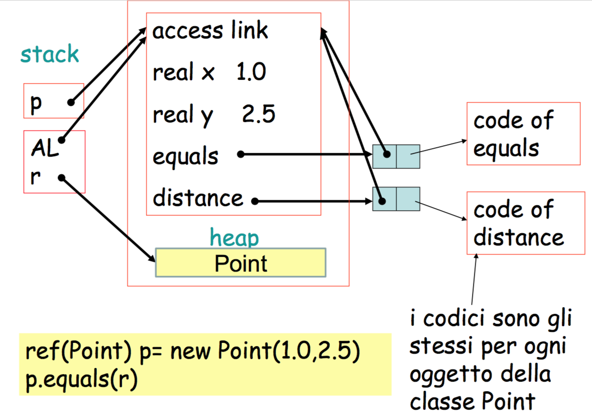
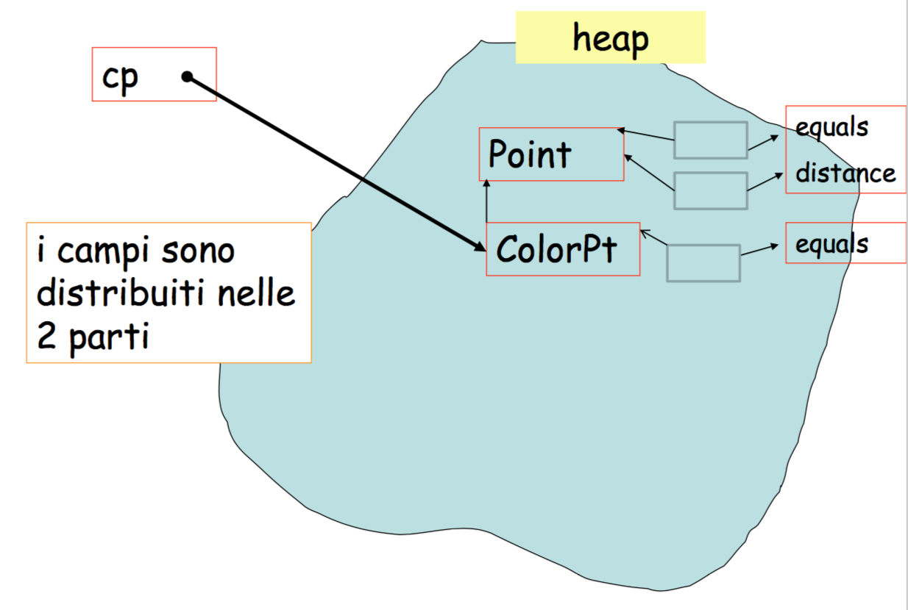

#Lezione 18 - Programmazione OO

##Dynamic Lookup

Detto anche binding dinamico o polimorfismo di sotto-tipo, stabilisce come vengono selezionati i metodi di un oggetto.

In C++ e Java si parla di invocazione di un metodo di un oggetto, mentre in Smalltalk si parla di mandare un messaggio ad un oggetto `x->m(args)`.

Il dynamic lookup richiede che ad ogni esecuzione dell'istruzione `x->m(args)`, il metodo `m` che viene eseguito sia deciso dal valore dinamico del tipo di `x`.

La stessa variabile infatti ha sempre un tipo statico e almeno un tipo dinamico:

- **Tipo statico**: cioè il tipo definito dal compilatore (non cambia).
- **Tipo dinamico**: cioè il tipo determinato dal valore assegnato alla variabile durante l'esecuzione del programma.

Quindi, quando viene inviato un messaggio alla variabile `x` è il tipo dinamico che determina quale funzione viene invocata. Di conseguenza l'istruzione `x->m(args)` può portare all'invocazione di funzione diversa se cambia il tipo dinamico di `x`.

Il dynamic lookup è diverso dall'**overloading**.

L'overloading (sovraccaricamento) avviene con un polimorfiso *ad-hoc* e si basa sul tipo statico dei parametri passati ad un metodo, pertanto la funzione da eseguire viene decisa a compile-time.

In generale, data una collezione *C* di oggetti diversi, ognugno con il metodo `pippo`, è possibile mandare lo stesso messaggio `pippo` a tutti gli elementi della collezione. Si occuperà il compilatore di produrre il codice necessario affinché venga sempre eseguita la funzione corretta.

Da notare che non devono essere presenti particolari relazioni tra i vari oggetti, se non la presenza del metodo `pippo` in ognuno di essi. Non è quindi necessario che ci sia una gerarchia tra i vari tipi degli oggetti.

Effettuare il dynamic lookup richide un costo in termini di efficacia, pertanto è possibile scegliere di implementarlo per qualsiasi metodo oppure solo per alcuni metodi (metodi **virtuali** del c++).

È quindi possibile seguire due strategie:

- Fare quasi tutto a compile time, tranne per alcuni metodi virtuali, come fa il C++, ottenendo così delle prestazioni migliori;
- Fare tutto a run-time, come fa Smalltalk.

Il dynamic lookup può essere considerato come un overloading dinamico nel quale la valutazione del metodo da invocare viene fatta a runtime valutando il tipo dinamico dell'oggetto.
Dal momento che `x->m(a,b)` equivale a `m(x,a,b)` e il dynamic lookup viene effettauato solo sul valore di `x`.

In alcuni linguaggi il dynamic lookp viene fatto su tutti gli argomenti del messaggio (es: Common Lisp Object System), ciò prende il nome di **multiple dispatch**.

Il multiple dispatch può essere utilizzato per implementare il test di uguaglianza in base al tipo dei due oggetti, creando però un incapsulamento più debole.

##Astrazione

Aka: incapsulamento.

È la capacità di nascondere i dettagli implementativi di un oggetto, creando una distinzione tra una parte pubblica (interfaccia) e una parte privata contenente i dettagli implementativi.

Inizialmente c'era solamente il concetto di pubblico o privato, col tempo sono state poi aggiunte nuove tipologie di visibilità come package e protected.

L'astrazione dipende dal linguaggio, ad esempio per Smalltalk tutti i campi dati sono privati e tutti i metodi sono pubblici

##Subtyping

`A <: B`, `A` è **sotto tipo** di `B`.

Ovvero dovunque serve un valore di tipo `B` è possibile utilizzare un oggetto di tipo `A`.

Il subtyping è una relazione di inclusione tra le interfacce di due tipi. Quindi se `A` è sotto tipo di `B`, tutti i metodi che posso invocare su `B` li posso anche invocare su `A`.

Vantaggi del subtyping:

- Permette di trattare in modo uniforme valori di tipo diverso.
- Permette di avere una base comune per ogni oggetto.
- Rende possibile aggiungere funzionalità senza cambiare il resto del programma.
- Velocizza il prototipaggio.

##Ereditarietà

L'ereditarietà significa riutilizzo di codice. Ho una classe e voglio crearne una nuova riutilizzando almeno una parte del codice della classe che ho già.

Il subtyping riguarda le interfacce degli oggetti mentre l'ereditìarietà riguarda l'implementazione degli oggetti.

Lo stesso effetto dell'ereditarietà si può ottenere duplicando il codice di una classe, ma usando l'ereditarietà:

- Si evita il copia-incolla, diminuendo la possibilità che si verifichino errori.
- Viene creato un legame tra la classe base e quelle che ereditano, in questo modo un cambiamento alla classe base si ripercuote automaticamente sulle classi che ereditano, evitando così il rischio di inconsistenze.

###Subtyping e Ereditarietà sono due cose diverse

Si vogliono realizzare 2 tipi di coda:

- FIFO: push alla fine, pop all'inizio.
- LIFO: push e pop alla fine.

Un modo poco ortodosso di farlo è quello di definire un tipo `doppia_coda` che permette di eseguire push e pop su entrambi gli estremi.

Si possono così definire LIFO e FIFO con l'ereditarietà dalla classe doppia coda.

Ottenendo LIFO nascondendo tutti i metodi di `doppia_coda` e inserendo due nuovi metodi che permettono di invocare i due metodi di `doppia_coda` che interessano, ottenendo una classe con solo due metodi pubblici. Allo stesso modo è possibile definire FIFO.

In C++ è possibile fare ciò utilizzando la **private inheritance** e si aggiungno dei metodi pubblici.

Definendo così LIFO e FIFO si ottengo due classi che ereditano da `doppia_coda` ma che non hanno la stessa interfaccia.

Quindi è falso dire che `FIFO <: doppia_coda` e `LIFO <: doppia_coda`.

Infatti, il subtyping è una relazione sulle interfacce mentre l'ereditarietà è una relazione sull'implementazione dei metodi.

Alcuni linguaggi creano confusione perché l'unico modo per ottenere il dynamic lookup in modo efficente, è legare il subtyping con l'ereditarietà.

##Storia della OOP - Simula e Smalltalk

Simula nasce in Norvegia negli ultimi anni 60 progettato da Ole-Johan Dahl e Kristn Nygaard, due matematici che cercavano un modo per effettuare delle simulazioni basate su eventi.

I due tizi volevano fare qualcosa del genere:

```
costruisci coda di eventi Q
repeat
    rimuovi e da Q
    simula e
    metti i nuovi eventi in Q
until Q vuota
```

C'era quindi il bisogno di avere delle struttre dati che possono rappresentare eventi di vario tipo.

In questo caso è tornato utile anche il dynamic lookup per la scelta del metodo da invocare e il subtyping per i vari eventi che avevano un'interfaccia comune.

In Simula sono presenti:

- **Classi**: un funzione che restituisce il puntatore al suo record di attivazione (upward funresult problem).
- **Oggetto**: il record di attivazione che funziona da istanza della classe.

Un oggetto contiene delle funzioni, cioè delle chiusure, e dei campi dati, entrambie presenti nel record di attivazione ritornato dalla classe.

Dal momento che si lavora con lo heap è stato previsto anche un garbage collector.

La versione prima versione **Simula67** prevede:

- Dynamic lookup
- Inheritance e subtyping
- **Inner**: un metodo della classe base può essere marcato con la keyword inner per prevedere la chiamata ad un secondo metodo aggiuntivo della classe derivata, permettendo così di estendere il codice di un metodo della classe base.
- **Inspect**: permette di fare un test dinamico sul tipo di un dato a runtime.
- Manca l'incapsulation così come super/self.

```
class Point(x,y); real x,y;
begin
    boolean procedure equals(r); ref(Point) r;
        if r =/= none then
            equals := abs(x-r.x)+abs(y-r.y) < 0.00001;
    
    real procedure distance(p); ref(Point) p;
        if p == none then
            error
        else
            distance := sqrt((x-p.x)**2+(y-p.y)**2);
end

...

p :- new Point(1.0, 2.5);
```

Si può notare:

- La sintassi è molto influenzata da Algol60.
- La presenza di puntatori per riferire altri oggetti.
- Ogni metodo della classe ha di default un riferimento all'oggetto.
- Il fatto che la classe abbia due metodi implica che il record di attivazione conterrà due chiusure.
- La funzione `Point` non ha corpo, serve solo per creare il record di attivazione da mettere nell heap.
- La variabile `p` ha come tipo `ref(Point)`.
- Ad ogni invocazione della funzione `Point` viene creato un nuovo record di attivazione che corrisponde all'oggetto.


In modo analogo funziona anche l'invocazione del metodo di un oggetto



###Sottoclassi e subtyping

Il seguente codice permette di definire una classe `C2` che deriva da `C1`.

```
class C1
//dichiarazione

C1 class C2
//dichiarazione aggiuntive

ref(C2) c2 = new C2
```

La costruzione degli oggetti viene trattata come il ritorno di una funzione definita all'interno di una funzione. In questo modo viene creato un record di attivazione per l'oggetto della classe base e un altro record per l'oggetto che estende la classe base.

Questo record avrà come access link l'indirizzo del sotto oggetto della classe base.

Ad esempio 

```
Point class ColorPt(c); color c;
begin
    boolean procedure equals(q); ref(ColorPt) q;
        ...
end

ref(ColorPt) cp = new ColorPt(3,5,2,1 giallo);
```



Da notare che `equals` di `ColorPt` copre l'altro `equals` della classe `Point`, mentre quando viene eseguito il metodo `distance` che non è presente nella classe derivata, viene eseguito il metodo della classe base, raggiunto grazie all'access link.