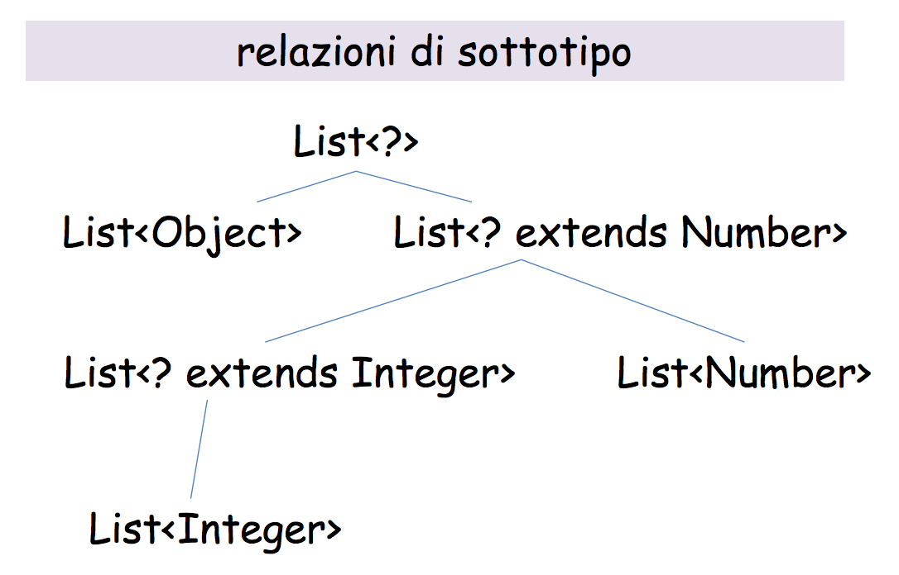

#Lezione 29 - Java generics

**raw type**: tipi normali non parametrici.

In Java `List<String>` non è una nuova classe creata dal template `List<T>`, ma è una notazione per specificare al compliatore che si intende utilizzare la lista come una lista di stringhe, permettendo così al compilatore di controllare il tipi.

```java
List<String> ls = new ArrayList<String>();
List<Object> lo = ls; // Il compilatore segnala un errore (no covarianza)

// Se l'assegnazione fosse andata a buon fine sarebbe stato possibile
// eseguire le seguenti operazioni
lo.add(new Object());
String s = ls.get(0); // Errore: prova ad assegnare un Object ad una String
```

Con i generics si **perde la covarianza** dei riferimenti e `List<Object>` non viene considerato come sopra tipo di `List<String>`.

## Metodi generici

```java
public static <T,E> void fromArrayToCollection (T[] a, Collection<E> c)
    for (T o : a) {
        c.add(o);
    }
} 
```

Il codice sopra riportato non compila, perché il tipo dell'array e il tipo della collezione non sono in relazione tra loro.

Un'alternativa è quella di utilizzare una collezione di `Object`.

```java
public static <T> void fromArrayToCollection (T[] a, Collection<Object> c) {...}
```

questa definizione però non funziona bene:

```java
fromArrayToCollection(intArray, objectCollection); //Ok
fromArrayToCollection(intArray, intCollection); //Errore di compilazione
```

Viene sollevato un errore perché `Collection<Int>` non è sotto tipo di `Collection<Object>`.

Un'altra idea può essere quella di utilizzare il raw type:

```java
public static <T> void fromArrayToCollection (T[] a, Collection c) {...}
```

In questo modo viene mescolato il codice pre-generics con il codice generics. Il compilatore solleva un warning per la chiamata della funzione `add()` perché non riesce a fare il controllo di tipo a compile time e deve inserire un controllo di tipo a runtime.
Questo perché la collection nella quale andiamo ad aggiungere l'elemento potrebbe contenere oggetti di un tipo diverso e l'`add()` riuscirebbe ad aggiungere comunque l'oggetto di tipo `T`, introducendo la possibilità di un errore runtime durante il resto dell'esecuzione del programma, ovvero quando verrà estratto dalla lista l'elemento aggiunto.

Questo è un problema generico che si verifica quando si mescola il codice con i generics con il codice senza i generics.
Segue inoltre che `Collection<Object>` non ha lo stesso tipo di `Collection`.

Un'altra possibile soluzione è:

```java
public static <T> void fromArrayToCollection (T[] a, Collection<?> c) {...}
```

ovvero utilizzando la wild card `<?>`. In particolare `Collection<?>` è un sopratipo per tutte le altre collection.

In questo caso il compilatore solleva un errore di compilazione, perché non ha sufficenti informazioni per effettuare il controllo del tipo, ovvero le informazioni fornite sono troppo generiche.

Viene sollevato un errore anziché un warning perché utilizzando la wild card si dice al compilatore *"Voglio che controlli il tipo"* e lui non ne è in grado. Utilizzando il raw type si dice al compilatore *"Me ne frego del tipo"*, quindi il compilatore solleva un warning per dire *"Occhio che potrebbe esserci un errore"*.

Morale della favola, la firma corretta per il metodo è:

```java
public static <T> void fromArrayToCollection (T[] a, Collection<T> c) {...}
```

e questo dice al compilatore *"Guarda che l'array e la collezione devono contenere oggetti dello stesso tipo"*.

Con questo sistema viene introdotta la contro varianza a causa della covarianza degli array. Ovvero se `T` viene istanziato con `X` e come secondo parametro viene fornito un `Collection<Y>`, se `X <: Y` non vengono sollevati errori, anche se dalla firma del metodo sembra che i tipi debbano coincidere per forza.

```java
Object[] oa = new Object[100];
Collection<Object> co = new ArrayList<Object>();
fromArrayToCollection(oa, co); // T inferred to be Object

String[] sa = new String[100];
Collection<String> cs = new ArrayList<String>();
fromArrayToCollection(sa, cs); // T inferred to be String

fromArrayToCollection(sa, co); // T inferred to be Object

Integer[] ia = new Integer[100];
Float[] fa = new Float[100];
Number[] na = new Number[100];
Collection<Number> cn = new ArrayList<Number>();

fromArrayToCollection(ia, cn); // T inferred to be Number
fromArrayToCollection(fa, cn); // T inferred to be Number
fromArrayToCollection(na, cn); // T inferred to be Number
fromArrayToCollection(na, co); // T inferred to be Object
fromArrayToCollection(na, cs); // compile-time error
```

C'è un'altra definzione che risulta essere ancora più corretta ed esplicativa:

```java
public static <T> void fromArrayToCollection (T[] a, Collection<? extends T> c)
```



Il caso d'uso principale della wild card è quando si vogliono leggere dei dati generici di una collezione d'oggetti generica. Tutte le operazioni di scrittura su `Collection<?>` falliscono perché non è possibile fare il controllo di tipo.

Un'esempio è dato da

```java
void printCollection(Collection<?> c){ 
    for (Object e : c) {
        System.out.println(e);
    }
}
```

Esercizio:

```java
public abstract class Shape { 
    public abstract void draw(Canvas c); 
}

public class Circle extends Shape { 
    private int x, y, radius; 
    public void draw(Canvas c) { ... } 
}

public class Rectangle extends Shape { 
    private int x, y, width, height; 
    public void draw(Canvas c) { ... } 
}

public class Canvas { 
    public void draw(Shape s) { s.draw(this); }
    public void drawAll(List<Shape> shapes) { 
        for (Shape s: shapes) { 
            s.draw(this); 
        }
    }
} 
```

Il metodo `drawAll` funziona solo se riceve una `List<Shape>`, se riceve una `List<Circle>` viene sollevato un errore. Per rendere più elastica il metodo si può utilizzare la firma `public void drawAll(List<? extends Shape> shapes)`.

Non sempre conviene utilizzare la versione flessibile:

```java
public void addRectangle(List<? extends Shape> shapes) { 
    // Compile-time error! shapes.add(0, new Rectangle());
}
```

## Generics e codice vecchio

```java
// Codice legacy
package com.Example.widgets;

public interface Part {...}

public class Inventory { 
    /* Adds a new Assembly to the inventory database. 
    The assembly name consists of a set parts specified by parts. 
    All elements of the collection parts must support the Part
    interface. */
    
    public static void addAssembly(String name, Collection parts) {...}
    public static Assembly getAssembly(String name) {...} 
}

public interface Assembly {
    // Returns a collection of Parts Collection
    Collection getParts(); 
}

// Parte Generics
package com.mycompany.inventory;
import com.Example.widgets.*;

public class Blade implements Part { ... }
public class Guillotine implements Part { ... } 

public class Main {
    public static void main(String[] args) {
        Collection<Part> c = new ArrayList<Part>();
        c.add(new Guillotine()) ;
        c.add(new Blade());
        Inventory.addAssembly(“pippo", c); // addAssembly si aspetta il raw type, ma il codice compila
        Collection<Part> k = Inventory.getAssembly(“pippo").getParts();
        // L'assegnamento produce un "Unchecked warning" perché
        // si sta assegnando una collezione raw ad una collezione
        // generica e il compilatore non riesce a stabilire
        // la correttezza dei tipi 
    }
}
```

Questo funziona perché il compilatore Java considera `Collection` (versione raw type) come `Collection<?>`, questa scelta è stata forzata per permettere di combinare del codice scritto prima dei generics con il codice che li utilizza.

Per assicurare la correttezza rispetto ai tipi il compilatore introduce dei controlli a runtime per verificare che la `Collection` ritornata sia effettivamente una `Collection<Part>`.

```java
Box<String> stringBox = new Box<>();
Box rawBox = stringBox;
rawBox.set(8);  // Compile time warning: unchecked invocation to set(T)
                // A runtime viene sollevata un'eccezione
```

