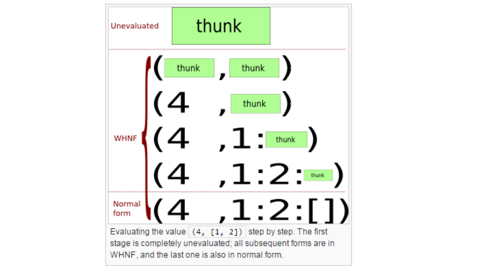
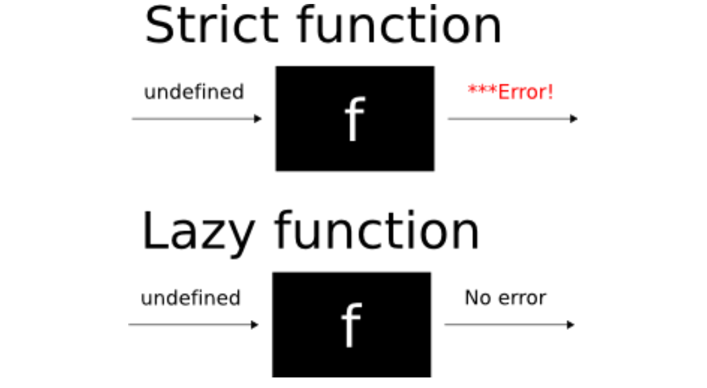

#Lezione 30 - Generics 2 e Laziness

## Limitazioni dei Generics

I parametri di tipo di una classe non possono venire utilizzati nei campi e nei metodi statici della classe.

```java
SingleLinkQueue.merge()
SingleLinkQueue.merge<String>() //Non compila
```

All'interno di un metodo non si possono scrivere istruzioni tipo `new T()` o `new T[10]`.

Non è possibile definire array di generics, `new List<String>[10]` non funziona, l'unico caso in cui si può fare è utilizzando la wild card.

Inoltre non si possono usare:

- `instanceof`
- cast
- eccezioni
- `List<String>.class`, perché non esiste la classe `List<String>`.

## Ereasure

Il Java Generics, quando viene tradotto in Bytecode, perde i parametri di tipo. In particolare:

- `List<A>` --> `List`
- `A` --> `Object`
- `<? extends Number>` --> `Number`

In questo modo si garantisce anche la retro compatibilità con il codice Java normale e la JVM.

È possibile rimuovere i parametri di tipo perché quando viene prodotto il Bytecode è già stato type checked.

Ci sono però dei problemi:

```java
interface Comparator<A>{
    public int compare(A x, A y);
}

class ByteComp implements Comparator<Byte>{ //Il parametro Byte viene scartato
    public int compare(Byte x, Byte y){ // ma nella firma del metodo rimane
        return x.byteValue()-y.byteValue();
    }
}
```

per gestire questi casi particolari il compliatore genera in modo automatico il codice per gestire questa situazione:

```java
interface Comparator{
    public int compare(Object x, Object y);
}
class ByteComp implements Comparator {
    public int compare(Byte x, Byte y){ //non è overriding
        return x.byteValue()-y.byteValue();
    }
    
    public compare(Object x, Object y){ //metodo bridge
        return this.compare((Byte) x, (Byte) y);
    }
}
```

## Lazyness in Haskell

La valutazione lazy implica che non viene calcolato nulla finché non è strettamente necessario.

Data un'espressione questa può essere valutata in modo **inner most** o **outer most**.

Supponendo di avere la funzione `square x = x*x`. 

Per valutare `square (3+4)` in modo inner most, vengono valutate prima le espressioni più interne, a partire dalla espressioni che sono già risolte (valori in forma normale). Con l'apporccio innermost, viene prima calcolato `3+4` e poi viene valutato `square 7`, in questo caso `7` è già risolto, e viene valutato `7*7` ottenendo `49` che è la forma normale dell'espressione.

Per raggiungere la forma normale sono state necessarie 3 operazioni.

Con l'approccio outer most, viene calcolata come prima espressione quella che non è contenuta in altre espressioni più grandi.
Ovvero, partendo da `square (3+4)`, viene prima valutato `square`, ottenendo `(3+4)*(3+4)`. L'espressione più esterna adesso è `3+4`, ottenendo `7*(3+4)`, viene poi valutata ancora `3+4`, ottenendo `7*7`. Infine si calcola il risultato `7` in 4 passi.

Indipendentemente dall'approccio, ad ogni passo si riduce un espressione che prende il nome di **redex**.

Quindi, con l'approccio inner most viene ridotto il redex che non contiene altri redex e con l'approccio outermost viene ridotto il redex che non è contenuto da altri redex.

L'approccio lazy valuta le espressioni in modo outer most, pertanto anche se ha delle proprietà interessanti, è inefficiente.

Ci sono però dei casi in cui outermost richiede meno operazioni.

Ad esempio, consideriamo la funzione `fst` che ritorna il primo elemento di una tupla.

Per calcolare l'espressione `fst(square 4, square 2)` con l'approccio inner most è necessario calcolare prima `square 4` e poi `square 2` ed infine ritornare il valore di `square 4`, scartando il valore di `square 2` che è stato calcolato inutilmente.

Utilizzando l'approccio outer most, il valore di `square 2` non viene calcolato richedendo così meno operazioni.
Questo perché `fst` è una funzione lazy.

Un'espressione potrebbe non essere riducibile alla forma normale, però se questa è raggiungibile, è sicuramente raggiungibile con l'approccio outer most, cosa che non è sempre vera per inner most.

`fst(square 4, undefined)` raggiunge la forma normale solo se calcolata con l'approccio outermost.

Indipendentemente dall'ordine con cui si valutano le espressioni, la forma normale che si raggiunge è sempre quella.

In alcuni casi l'approccio outer most può essere reso più efficiente per evitare di eseguire calcoli ripetuti, effettuando delle ottimizzazioni con dei grafi.

Outer most però ha altri svantaggi legati all'efficienza:

```haskell
sum [0..1000] = foldl (+) 0 [1..10000]
              = foldl (+) 0+1 [2..10000]
              = foldl (+) 0+1+2 [3..10000]
              = ...
```

ovvero prima estrae i valori dalla lista e poi quando a finito li somma.
In questo caso sarebbe conveniente avere delle riduzioni inner most ed è quello che viene fatto da `foldl'`.

I valori in Haskell sono estremamente stratificati, ovvero sono dei data type discriminati da dei costruttori, ognungo dei quali può essere rappresentato come un albero e non sempre è interessante calcolare tutto l'albero, perché potrebbe essere interessante solo una porzione dell'albero.

```haskell
let
    z = (length [1..5], reverse "olleh") // z=thunk
    (n, s) = z // z=(thunk, thunk) n=thunk, s=thunk
    'h':ss = s
in 
    ... 
```

`thunk` indica un espressione che deve essere calcolata e che contiene anche le informazioni legate all'ambiente che deve essere usato per valutarla, in un modo simile alle chiusure delle funzioni.

Per effettuare il pattern matching e proseguire con l'esecuzione del programma, viene calcolato il minimo indispensabile, ovvero fino a che non si arriva al fatto che il valore di `z` è una coppia.

Per calcolare `'h':ss = s` viene valutato il valore di `s` per verificare che sia una lista del tipo `thunk:thunk`, la cosa importante è che `s` sia una lista non vuota, altrimenti viene sollevato un errore riguardo il pattern matching.
Poi deve essere matchato il carattere `h`, quindi viene valutato il primo `thunk`, ottenendo `s = 'h':thunk` e `ss = thunk`, da notare che il thunk di `ss` corrisponde all'espressione `reverse "olle"`.

Tutte le espressioni intermedie che contendono dei thunk prendono il nome di **weak head normale form**.



Una funzione può essere **strict** o **lazy**:

- una funzione strict è una funzione che utilizza i suoi parametri, quindi è necessario che questi vengono valutati
- una funzione lazy non usa tutti i suoi parametri, quindi può essere che alcuni non vengano valutati.

Nel caso di funzioni lazy conviene quindi utilizzare la valutazione outer most per limitare il numero di calcoli.



Non è facile valutare se una funzione è lazy o meno, sempre per il discorso della non decidibilità, dei linguaggi di Turing ecc.

Perché una funzione sia strict, questa deve forzare il valore di un parametro. Ovvero quando `f x` forza la valutazione del parametro `x`.

Ad esempio verrebbe da pensare che la funzione `id` non sia strict perché ritorna semplicemente il valore ricevuto come parametro. Tuttavia, questa funzione stampa sull'ambiente di esecuzione il valore del parametro e di conseguenza viene forzata la valutazione.

```haskell
-- We evaluate the right-hand of the let-binding to
WHNF by pattern-matching
-- against it.
let (x, y) = undefined in x
-- Error, because we force undefined.
let (x, y) = id undefined in x
-- Error, because we force undefined.

const a b = a -- lazy sul secondo parametro
let (x, y) = const (3, 4) undefined
-- No error, because const (3, 4) undefined = (3,4), thus
-- undefined is ignored 
```