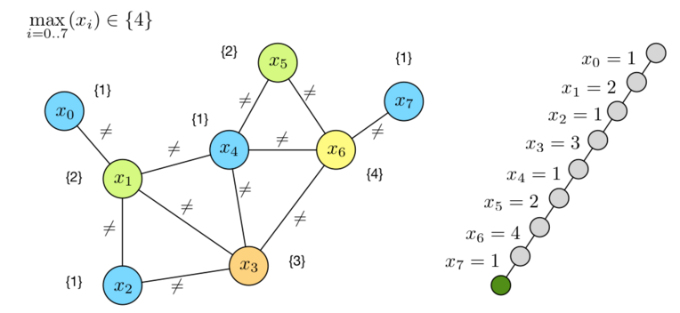
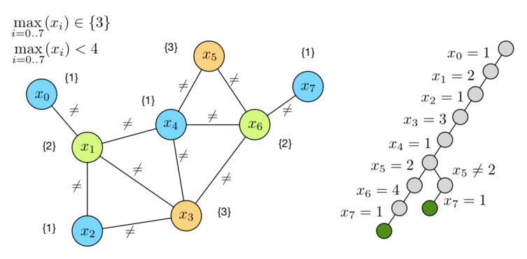

#Lezione 4 - Enumerazione e Ottimizzazione

*Tra la lezione 3 e 4 ci sono stati due laboratiori.*

##Enumerazione delle soluzioni

In alcuni casi, in CP può essere necessario trovare più soluzioni oppure sapere quante sono le possibili soluzioni.

Per risolvere questo problema di enumerazione l'algoritmo di ricerca DFS diventa:

```python
def DFS(CSP):
  if sol_found(CSP):
    process solution
    return
  if infeasible(CSP): return
  for dec in decisions(CSP):
      DFS(apply(dec, CSP))
```

`or-tools` funziona in modo simile, ogni volta trova una soluzione si mette in pausa in modo da porterla utilizzare con il metodo `NextSolution()`.

##Ottimizzazione in CP

> COP = \<X, D, C, f\>

È un CSP con una funzione (o espressione) obiettivo che deve essere minimizzata (si può ottenere una massimizzazione negando la funzione).

###Optimal Map Coloring

Qual'è il numero minimo di colori per colorare le regioni del nord Italia?

La definzione del modello è analoga a quella del relativo CSP, con la differenza che il dominio delle variabili va da *0* a *n-1*, dove *n* è il numero delle regioni.

Serve però una funzione obiettivo:

> f(x) = Max<sub>[i = 0 ... n-1]</sub>(x<sub>i</sub>)

##Risoluzione di un COP

L'idea principale è che risolvere un COP coincide con il risolvere una serie di CSP.

Ci sono vari approcci a questo tipo di problema, ma ci sono due filoni principali:

- Ricerca sul dominio di *f(x)*
- Branch & Bound

### Rircerca

####Descructive Lower Bound

Si itera sui valori *v* del dominio di *f(x)* a partire dal lower bound, ad ogni iterazione si pone il vincolo *f(x) <= v* e si risolve il CSP.

Probabilmente i primi CSP sono infiesible, però la prima soluzione che viene trovata risulta anche essere ottima.

Questo approccio viene chiamato **descrutive** perché ad ogni iterazione si butta via tutto quello calcolato per l'iterazione precedentemente.

```python
sol = None # Current best solution
solved = False # Outcome of the last solution attempt
lb = safe lower bound
while not solved:
  P = ⟨X,D,C ∪ {f(x) ≤ lb}⟩
  solved = solve(P)
  if solved: sol = found solution
  else: lb += 1
```

####Destructive Upper Bound

Stesso ragionamento solo che si parte dal massimo valore di *f(x)*, è importante che il valore di partenza permetta di raggiungere una soluzione.

Ad ogni iterazione si usa *v = f(x) - 1*, cioè il costo della soluzione trovata al passo precedente *-1* in modo da provare a migliorare.

L'ultima soluzione trovata è quella ottima.

Il vantaggio di questo algoritmo è che può essere interrotto in ogni momento e fornisce comunque una soluzione anche se questa non è ottima.

Questo fatto è molto importante perché la maggior parte dei COP è NP-Difficile.

```python
sol = None # Current best solution
solved = True # Outcome of the last solution attempt
ub = safe upper bound
while solved:
  P = ⟨X,D,C ∪ {f(x) ≤ ub}⟩
  solved = solve(P)
  if solved:
    sol = found solution
    ub = sol(f(x)) - 1
```

##### Upper VS Lower

La versione che usa il lower bound riesce a fare più propagazione risultando più efficiente anche se il problema che si va a risolvere probabilmente non ha soluzione e quindi bisogna esplorare tutto l'albero.

Ovviamente la versione che usa il lower bound non è anytime però fornisce un lower bound che in alcuni casi può essere più interessante.

I passi del lower bound invece sono molto corti.

Per quanto riguarda la versione upper, questa funziona come duale del lower bound, i passi dell'algoritmo sono più grandi, si trova a risolvere problemi per la maggior parte feasbile e quindi ci mette meno tempo.

Di contro non trova un lower bound e c'è meno propagazione dei vincoli.

### Binary Search

È la combinazione dei due algoritmi, che effettua una ricerca binaria sul dominio di *f(x)*.

L'idea è quella di tenere un upper bound feasbile e un lower bound infeasible e di rivolvere il problema per *lb < f(x) < ub*.

Se si riesce a trovare una soluzione per quel problema si aggiorna *ub* con il valore di *f(x)*, altrimenti, se il problema è infeasible, si aggiorna *lb* con il valore di *f(x)*.

L'algoritmo termina quanto viene trovata una soluzione *f(x) = lb+1*.

```python
sol = None #Current best solution
lb = safe lower bound
ub = safe upper bound
while lb < ub:
  P = ⟨X,D,C ∪ {f(x) > lb, f(x) < ub}⟩
  solved = solve(P)
  if solved:
    sol = found solution
    ub = sol(f(x))
  else:
    lb = sol(f(x))
```

In questo modo si ottiene un algoritmo di tipo anytime che calcola anche un lower bound, che funziona a passi più grandi e che permette di effettuare una buona propagazione dal momento che ci sono vincoli sempre più stretti su *f(x)*.

Ma un altro grande vantaggio di questo approccio è l'**optimality gap**: se l'algoritmo viene fermato prima della terminazione si ottiene sia una soluzione per il problema CSP sia un indicatore della qualità della soluzione.

> og = (ub - lb) / lb

###Branch and Bound

Le ricerche hanno un problema: scartano la maggior parte delle informazioni ad ogni iterazione e questo porta a tanto lavoro ripetuto.

Nel B&B, ogni volta che si trova una nuova soluzione si va ad aggiungere un nuovo vincolo di Bound sul valore di *f(x)*.

In questo modo, viene prima trovata una soluzione feasible, come nel caso di un CSP normale, dopodiché viene aggiunto un vincolo che rende infeasible la soluzione trovata.
Una volta aggiunto il nuovo vincolo, la ricerca continua facendo il backtracking in modo da trovare una soluzione che soddisfi il nuovo vincolo. Se non viene trovata una soluzione migliore, l'ultima soluzione trovata è quella ottima.

Ad esempio, nel problema della colorazione della cartina, prima viene risolto il CSP utilizzando 5 colori, dopodiché viene aggiunto il vincolo "*numero colori < 5* e la ricerca riprende dalla soluzione trovata.




**GIF B AND B**

Utilizzando il branch and bound in CP non c'è bisogno di calcolare per ogni nodo il lower bound, in quanto viene calcolato in modo automatico dai vincoli.

Quando l'algoritmo trova una soluzione, per capire che è ottima deve comunque andare ad esplorare tutto l'albero (*optimality proof*).

####Pro e contro

- La prova di ottimalità può essere complessa, perché è necessario esplorare tutto l'albero.
- Non c'è uno spreco di informazioni, l'albero viene esplorato una volta sola.
- È possibile fare passi grandi;
- È un algoritmo anytime:
- I lower bound ottenuti sono molto laschi.


##Reified Constraint

Alcuni problemi possono essere complessi da modellare o possono essere modellati con modelli binari (tipo il problema del trasporto magazzino/cliente tipico della Ricerca Operativa).

Implementare un CSP come modello binario ha dei problemi in quanto ci sono molte variabili e non si può fare tanta propoagazione.


