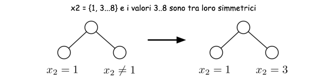

#Lezione 7 - Migliorare un modello

Lo stesso problema può essere modellato in modi diversi, alcuni sono più semplici da modellare rispetto ad altri e allo stesso modo alcuni sono più efficenti di altri.

Inoltre, anche gli stessi vincoli possono influire sulle prestazioni, così come la scelta dei valori "farlocchi" va ad influire sulle prestazioni.

Ad esempio: se nel problema di pianificazione della produzione di una macchina, scelgo il valore *-1* per rappresentare un ciclo di pausa posso ottenere delle prestazioni peggiori rispetto al modello che usa *eoh* o un altro valore per modellare tale ciclo.
Questo dipende da come vengono scegli dal risolutore i valori da assegnare alle variabili.

Un altro problema è dato dalle simmetrie nelle soluzioni, che possono portare ad creare branch di ricerca inutili, pertanto può essere utile aggiungere dei vincoli per andarle a rimuovere.

Ad esempio, se devo produrre in serie 5 unità x1 ... x5 dello stesso prodotto, le due soluzioni [x1, x2, x3, x4, x5] e [x4, x2, x1, x3, x5] sono equivalenti, pertanto convine aggiungere dei vincoli che rimuovono queste soluzioni simmetriche.

La presenza di soluzioni simmetriche influisce sulla complessità della prova di ottimalità, aumentando il trashing.

Un modo per limitare questo problema è aggiungere dei vincoli che rompono queste simmetrie, tuttavia questo approccio potrebbe rallentare il processo di ricerca andando a rendere infeasible alcune delle soluzioni che il solver avrebbe trovato per prime.

Allo stesso modo, quando si tratta di allocare delle quantità di qualche materiale in dei contenitori identici, è possibili vincolare l'assegnamento *x1 = 0*, dal momento che la prima sostanza può essere messa indiscriminatamente in ognuno dei contenitori e ciò porta ad avere delle soluzioni simmetriche.

## Regole di dominanza

Può succedere che alcune delle soluzioni sub-ottime trovate dal risolutore abbiano determinate propiretà che garantiscono l'esistenza di una soluzione migliore.

Ad esempio un problema di makespan può avere una soluzione sub-ottima che produce più prodotti di quelli necessari. Se questa soluzione esiste, allora deve per forza esistere una soluzione migliore che produce l'esatto numero di prodotti necessari.

Più formalmente, date due proprietà di una soluzione *P(x)* e *Q(x)*, con *Q(x)* preferibile rispetto a *P(x)*, si ha una **regola di dominanza** se:

> ∃ solution x: *P(x)* ⇒ ∃ solution x′: *Q(x′)*

Pertanto è possibile aggiungere un nuovo vincolo che renda necessaria la proprietà *Q(x)* senza perdere soluzioni ottime.

Tornando all'esempio precedente:

- *P(x)*: la soluzione produce almeno la quantità necessaria di prodotti.
- *Q(x)*: la soluzione produce esattamente la quantità necessaria di prodotti.

È possibile aggiungere al modello il vincolo *Q(x)* senza perdere soluzioni ottime.

A differenza delle simmetrie, le regole di dominanza si applicano a soluzioni non equivalenti e risulta difficile applicarle in modo sistematico.

Tipicamente l'introduzione delle regole di dominanza diminuisce il numero di branch, però non è detto che il tempo di ricerca diminuisca perché la propagazione del nuovo vincolo potrebbe essere costosa.

## Vincoli rindondanti

In alcuni problemi di ottimizzazione può essere utile aggiungere dei vincoli rindondati del tipo:

> z ≥ lb(x)

in modo da ottenere una propagazione migliore.

A differenza delle regole di dominanza o della rottura di simmetrie, questi vincoli non modificano lo spazio delle soluzioni ma potrebbero rendere più efficace la propagazione.

Ad esempio, in un problema di produzione, se è necessario produrre in tutto *n* prodotti, il makespan minimo sarà *n*, pertanto è possibile aggiungere il vincolo *z ≥ n* per ottenere una propagazione migliore, senza perdere soluzioni. 

## Simmetrie

Possono essere sia di variabile che di valore.

Quelle di **variabile** si verificano quando, data una soluzione feasible è possibile scambiare (**ri-assegnare**) i valori delle variabili ed ottenere comunque un'altra soluzione feasible.
Nelle N-Regine equivale a ruotare la scacchiera sull'asse Y.

In quelle di **valore** invece si va a permutare i vari valori (ridare il nome ai valori), ad esempio in N-Regine c'è una simmetria di valori se si fa una rotazione orizzontale della scacchiera.

Per rompere queste simmetrie è possibile:

- Riformulare il modello in modo da togliere o diminuire le simmetrie
- **Simmetry Breaking statico** vengono aggiunti dei vincoli al modello per rompere le simmetrie
- **Simmetry Breaking dinamico**

###Lex-Leader Method (statico)

È una strategia per rompere le simmetrie di variabile in modo statico.

L'idea è quella di imporre un ordine lessicografico tra le varie variabili in modo che solo una delle soluzioni simmetriche sia valida.

Deve però essere disponibile la lista di tutte le possibili permutazioni.

Di contro però vengono aggiunti dei vincolo grandi e il numero di vincoli da aggiungere cresce in modo **fattoriale** rispetto al numero di simmetrie.

**Caso speciale**: se c'è un vincolo che impone che le varie variabili siano tutte diverse tra loro allora è necessario aggiungere *n-1* vincoli, anziché *n!*.

### Rottura delle simmetrie dinamica

Il metodo statico porta ad aggiungere tanti vincoli e questi possono creare dei problemi alla strategia di ricerca, perché questi vincoli potrebbero andare a tagliare delle soluzioni simmetriche che sono trovate per prime dalla strategia di ricerca.

L'idea principale di questa strategia è quella di considerare i vincoli che rompono le simmetrie solo quando si fa backtracking.
In questo modo quando si scende sul ramo sinistro non vengono tagliate le soluzioni simmetriche, ma, quando si fa backtracking, questi vengono considerati in modo da sfoltire il sotto albero destro.

Ad esempio facendo labeling fermandosi al primo valore simmetrico trovato.

