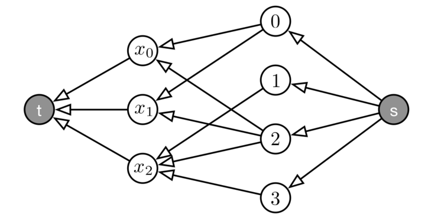
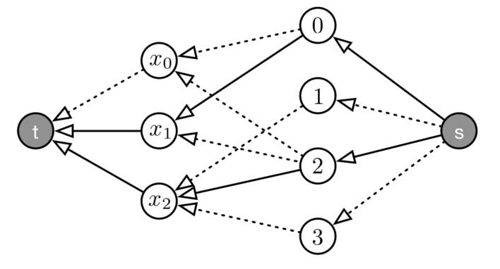
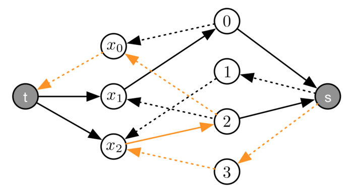
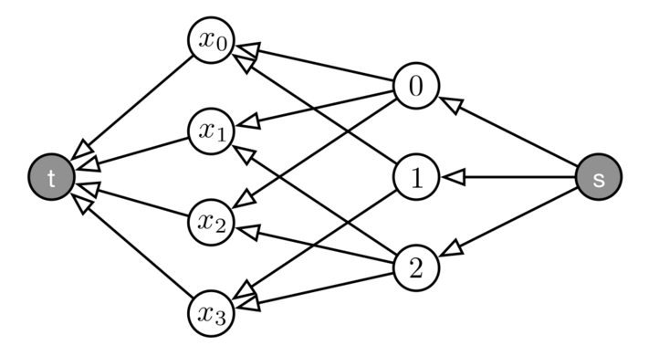
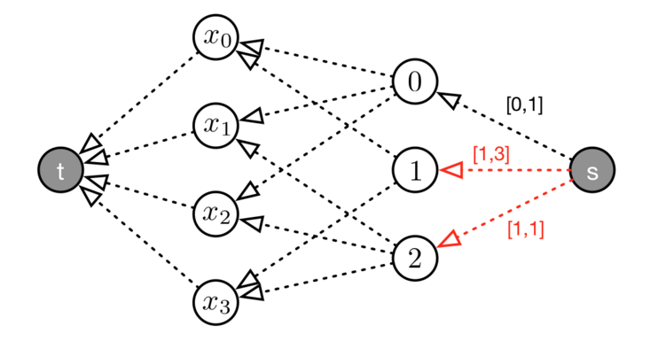

#Lezione 8 - Vincoli globali

Anche se viene stabilita la GAC può essere che sia ancora possibile eseguire del filtering.

##Global vs Local Filtering

Ad esempio nel problema del partial latin square è possibile ragionare a livello di colonna, in cui tutte le celle devono essere diverse.

Formalizzando, indicando con *X* l'insieme delle variabili presenti in una colonna e con *V* l'unione dei domini delle variabili, se si reisce a trovare un sottoinsieme di valori *W⊂V* e un sottoinsieme di variabili *Y⊂X* tale che:

> |Y|=|W| e D(xi) ∈ W,  ∀xi ∈ Y

Allora:

*W* prende il nome di **Hall set** di *X* e i valori presenti in *W* saranno assegnati alle variabili presenti in *Y*, quindi è possibile togliere i valori presenti in *W* dai domini delle variabili che non sono in *Y*.

Formalmente, *∀W ⊂ V*, *Y ⊂ X* con *|Y|=|W|*:

> D(xi) ∈ W,  ∀xi ∈ Y ⇒ D(xj) = D(xj)∖W, ∀xj ∈ X∖Y

Questo processo prende il nome di **Hall set filtering** e forza GAC su un intero set di variabili, come su un'intera colonna del partial latin square, utilizzando dei vincoli rindondanti.

Per codificare come vincolo *D(xj)∖W, ∀xj ∈ X∖Y* si può utilizzare una serie di congiunzioni di vincoli reificati:

> <big>⋀</big>[xi ∈ Y](D(xi)∈W) ⇒ <big>⋀</big>[xj ∈ Y , v ∈ V∖W](xj≠v)

L'implicazione può essere codificata con un minore e uguale mentre la serie di *⋀* può essere codificata con un vincolo di minimo.

Può essere quindi definita un'esepression *contained(xi, W, V)* che deve valere 1 se *D(xi) ∈ W*. Il caso in cui *D(xi) ∉ W* non è interessante in quanto la progagazione vale solo se *contained* vale 1.

Per verificare che *D(xi) ∈ W* posso utilizzare:

> <big>⋀</big>[v ∈ V∖W](xi≠w) = min[v ∈ V∖W](xi ≠ w)

Così facendo è possibile andare a definire il vincolo 

> <big>⋀</big>[xi ∈ Y]contained(xi,W,V)  ⇒ <big>⋀</big>[xi ∈ Y, v ∈ V∖W](xj≠v)

che deve essere definito *∀W ⊂ V*, *Y ⊂ X* con *|Y|=|W|*.

Tuttavia il numero di sottoinsiemi di *V* e *X* è esponenziale e quindi la propagazione richiede troppo tempo.

##Global Alldifferent Constraint

Un approccio alternativo al problema è quello di aggiungere un nuovo vincolo *ALLDIFFERENT(X)* con *X* vettore di variabili. 
La semantica di questo vincolo equivale ai vincoli *xi≠xj,∀i≠j*, con la differenza che in questo caso è possibile andare a definire un algortimo di filtering GAC ad hoc che funziona in tempo polinomiale.

L'algoritmo di propagazione viene visto in due fasi:

1. Verifica della soddisfacibilità del vincolo
2. Esecuzione del filtering

Come esempio viene utilizzato:

> ALLDIFFERENT(X) con x0∈{0,2},x1∈{0,2},x2∈{1,2,3}

### Parte 1

Per ogni vincolo è possibile andare a definire un **value graph**, un grafo che ha nella parte sinistra tanti nodi quandi sono le variabili e nella destra tanti nodi quanti sono i possibili valori del dominio.
Il grafo ha tanti archi che collegano ogni nodo a destra con tutti i nodi a sinistra in cui quel valore compare nel dominio di una variabile.

Questo grafo ha altri due nodi *s* e *t*, il primo è collegato a tutti i possibili valori, mentre tutte le variabili sono collegate al .

Gli archi del grafo che collegano un nodo valore con un nodo variabile rappresentano un possibile assegnamento del valore alla variabile. 
Quando ad una variabile è assegnato un determinato valore, l'arco è rappresentanto con una linea continua, altrimenti viene utilizzata una linea tratteggiata.

Una soluzione esiste quando il flusso entrante al nodo *t* è uguale al numero di variabili.

Per verificare il flusso massimo viene usato l'algoritmo di Ford-Fulkerson.

Si parte da un caso base in cui il flusso in goni arco è 0. Il flusso di un arco viene indicato con *f(a->b) = 0*.

Dopodiché si cerca di far passare del flusso dal nodo *s* al nodo *t* utilizzando degli archi che non sono ancora saturi. Si ripete questo processo finché non si riescono più a trovare percorsi.

In alcuni casi, si arriva ad una situazione che non è una soluzione anche se il problema di partenza è feasible e scegliendo dei percorsi diversi sarebbe stato possibile raggiungere una soluzione.

Quindi deve essere possibile fare l'**undo** delle scelte. 
Una possibilità è quella di utilizzare il backtracking, ma così facendo si ottiene una complessità esponenziale. Fortunamente c'è una strategia alternativa.

Si può costruire il grafo residuale, un grafo con gli stessi nodi del grafo del flusso, solamente che gli archi che nel grafo del flusso rappresentano un assegnamento vengono invertiti.

Più formalmente, c'è un arco *a→b* nel grafo residuale se e solo se c'è un arco *a→b* nel grafo originale e *f(a→b) = 0* oppure c'è un arco *b→a* nel grafo originale e *f(b→a) = 1*.

Ovvero il grafo residuale contiene gli archi nei quali può ancora passare del flusso (indicati con un tratteggio) e gli archi dove è possibile togliere del flusso (indicati con una linea continua).

Questo nuovo grafo può essere utilizzato per trovare dei nuovi cammini dal nodo *s* al nodo *t*. Un possibile nuovo cammino è quello arancione.

Questo nuovo cammino può essere utilizzato per andare a trovare nuovi flussi nel grafo iniziale.

In questo caso il flusso sul nodo *t* è uguale al numero di variabili, quindi il vincolo è feasible.

La complessità dell'algoritmo dipende dalla ricerca dei cammini con Dijkstra, la cui complessità è lineare con il numero di archi e in questo caso coincide con la sommatoria delle cardinalità dei domini delle variabili. 
La ricerca dei cammini deve essere fatta al massimo per ogni variabile, quindi si ottiene come complessità *O(|X| ∑[xi ∈ X]|D(xi)|)*, che è molto peggiore rispetto al filtering per il vincolo di diverso, il vantaggio è che viene fatto un filtering più efficace.

La strategia di verifica quindi, prima costruisce il grafo del flusso, dopodiché cerca di massimizzare il flusso che arriva al nodo *t*, se il valore ottenuto conincide con *|X|* allora il vincolo è feasible.

Tipicamente questo algoritmo viene implementato senza la costruzione del grafo, dal momento che possono essere usate direttamente le formule che rappresentano il vincolo. Il grafo viene utilizzato solo per rendere più semplice la spiegazione.

###Filtering per Alldiffernt

Per poter filtrare un valore devo considerare un arco che va da un valore ad una variabile e provare a costruire un ciclo tra i due nodi utilizzando il grafo residuale. 
**Se non viene trovato questo ciclo e tra questi due nodi non c'è flusso, posso togliere quel valore dal dominio di della variabile.**

Questa condizione può essere semplificata considerando che non ci sia un ciclo tra il nodo *v* e il nodo *xi* nel grafo residuale. 
Questo avviene se e solo se *v* e *xi* sono in due componenti fortemente connessi distinti. 
Questo permette di utilizzare l'algoritmo di Tarjan per ottenere un efficenza maggiore.

La complessità si riduce ad essere *O(|X|+∑[xi ∈ X]|D(xi)|)*.

###Ricapitolando

I vincoli globali sono dei vincoli che rappresentano un set di vincoli e risultano essere importanti perché sono molto espressivi e permettono di fare una propagazione più efficente e efficace.

##GCC (non il compilatore)

Ci sono dei problemi in cui è necessario considerare quante volte un determinato valore viene assunto da una variabile e questo può essere fatto utilizzando una sommatoria di metavincoli.

Tuttavia questo approccio ha una propagazione pessima, pertanto conviene utilizzare il vincolo globale **GCC**.

**GCC**, ovvero **Global Cardinality Constraint**, viene utilizzato quando si vuole limitare l'occorrenza (cardinalità) di alcuni valori specifici per delle variabili.

> GCC(X, V, L, U)
> 
> - X è un vettore di variabili xi
> - V è un vettore di valori vj
> - L è un vettore con le cardinalità minime lj per vj
> - U è un vettore con le cardinalità massime uj per vj

L'idea è quella che tutte le variabili del vettore *X* hanno come dominio *V* e che ognuno dei valori debba comparire un numero limitato di volte, specificato dai vettori *L* e *U* (*V, L, U* devono avere la stessa dimensione).

La propagazione di questo vincolo avviene in due tempi come per *Alldifferent*:

1. Verifica della consistenza utilizzando un grafo di flussi
2. Definizione di regole di filtering basate sui flussi.

### Verifica della soddisfacibilità

Viene creato un grafo analogo a quello per *Alldifferent*.

Con la differenza che gli archi che vanno da *s* ai valori hanno una capacità massima uguale a *uj* e una domanda minima pari a *lj*.

L'algortimo parte cercado di soddisfare i vari vincoli di domanda

Anche in questo caso per trovare il percorso occorre utilizzare il grafo residuale, che viene definito in modo leggermente diverso, dal momento che ora gli archi hanno una capacità maggiore di 1.

Questa volta l'arco *a → b* è presente nel grafo residuo se:

- Il grafo originale contiene l'arco *a → b* con capacità *c* e *c - f(a → b) > 0*. Ovvero **l'arco non è ancora saturo**.
- Il grafo originale contiene l'arco *b → a* (inverso) con domanda *d* e *f(b → a) - d > 0*. Ovvero **si può ridurre il flusso** che scorre nell'arco senza invalidare il vincolo della domanda.

Come side effect di questa definzione si ha che nel grafo residuo non è presente il vincolo della domanda per i vari archi.

Un'altra cosa da notare è che *Alldifferent* è un caso particolare di questo problema.

###Filtering per GCC

Una volta costruito il grafo residuale che rappresenta un assegnamento feasible è possibile andare a filtrare un valore se non compare in un ciclo e sempre allo stesso modo è possibile utilizzare i componenti fortemente connessi per rendere il processo più efficente.

Nell'esempio non ci sono cicli che utilizzano gli archi *0→x0* e *2→x3* quindi è possibile effettuare il pruning del valore *0* da *D(x0)* e *2* da *D(x3)*.

###Considerazione su GCC

Tipicamente nei solver non è presente GCC ma è presente *Distribute*:

> DISTRIBUTE(X,V,N)
> 
> - X vettore di variabili xi
> - V vettore di valori vj
> - N vettore con le cardinalità nj per le variabili vj

Le due principali differenze riguardano che i buond sulle cardinalità vengono specificati con *D(nj)* e il propagatore può filtrare le variabili *nj*, il che vuol dire che è possibile utilizzare *Distribute* per contare (?).