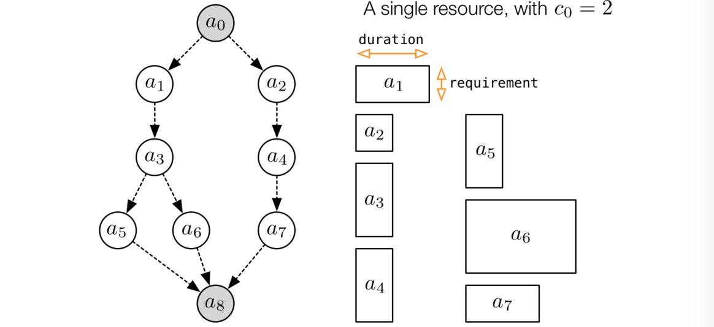
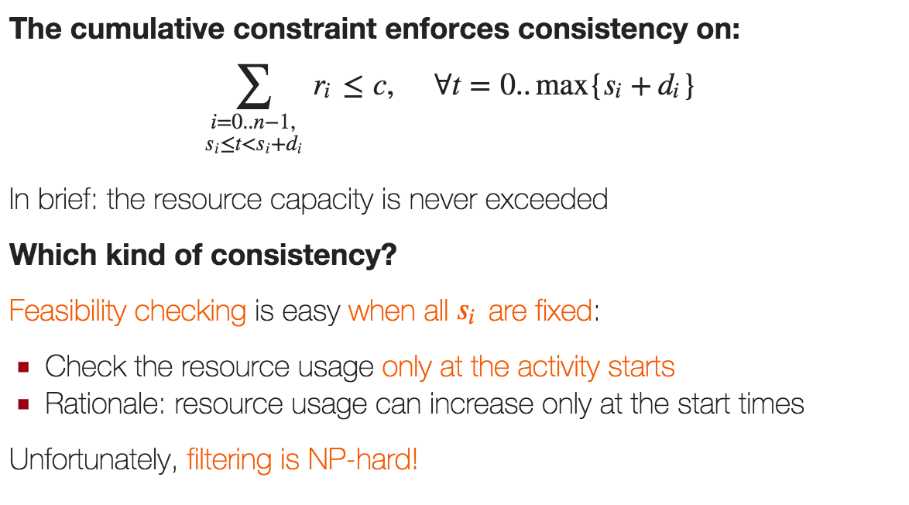

#Lezione 11 - CP e Scheduling

Una delle applicazioni classiche di CP perché si riescono ad ottenere ottimi risultati.

##RCPSP - Resource Constrained Project Scheduling Problem

- Ci sono *n* attività con una certa durata
- Ci sono delle risorse limitate ma sono rinnovabili, ovvero quando l'attività termina libera le risorse che occupava.

Tipicamente vengono aggiunte due attività farlocche per rappresentare l'inzio e la fine della produzione.

(Nell'esempio dell'immagine c'è un solo tipo di risorsa)

L'obiettivo è quello di minimizzare il makespan, assegnando lo start time a tutte le attività, rispettando i vari vincoli.

Come variabili vengono utilizzati *si* che rappresentano lo start time delle varie attività, con dominio *{0 ... eoh}*.

L'obiettivo è quello di minimizzare la massima terminazione:

> min z = max[i = 0..n−1] (si + di)

mentre le precedenze vengono modellate con

> si + d i ≤ sj

Per le capacità, se queste sono unitarie, modellare il vincolo delle risorse è semplice, basta che due attività che richiedono la stessa risorsa non siano sovrapposte.

Se invece le capacità non sono unitarie l'approccio deve cambiare.
Un'idea è quella di andare a mettere tanti vincoli per ogni unità di tempo che controlla che la sommatoria delle capacità non superi la capacità massima.

La propagazione è comunque pessima perché richede dei metavincoli, si può migliorare considerando solo gli intervalli di tempo in cui inizia un'attività.

### Cumulative Constraint

Permette di modellare con un vincolo globale la capacità di una singola risorsa.

> CUMULATIVE(s,d,r,c)
>
> - s is a vector of start time variables si
> - d is a vector of durations di
> - r is a vector of requirements ri
> - c is the capacity

Il problema è che fare filtering risulta NP-Hard pertanto gli algoritmi di filtering utilizzati sono sub-ottimi dal momento che fanno un filtering incompleto.
Dal momento che questo vincolo è molto utile, sono stati proposti molti algortimi di filtering (tutti incompleti).

#### Timetable filtering

L'idea è quelli di mantenere il controllo dell'utilizzo minimo della risorsa, considerati i vari domini delle variabili.

Se LST di un'attività è minore del EET, c'è di sicuro un intervallo temporale in cui quell'attività sarà sicuramente eseguita.
Aggregando tutte le **compulsory part** di tutte le attvità si riesce a  calcolare quante risorse saranno sicuramente richieste.

 vedi slide per il resto

Il profilo delle attività può essere fatto in *O(n log(n))* e può essere fatto durante lo SWEEP. Lo SWEEP ha complessità *O(n)* e deve essere ripetutata *n* volte, quindi la complessità totale è *O(n2)*.

####Edge Finder

*quello che conta è l'idea*

Considers pairs (Ω,i)
Ω= a set of activities
i= the activities to be filtered
Detects if activity i cannot precede any activity in Ω
Updates D(si) based on that information
Complexity O(kn2) (k= num. distinct requirements)
A very effective approach in some cases (typically: tight time windows)

> Time window = [min si, max si] \(in this context)

####Energeti reasoning

Energy = required resource × time
Reason on the required energy in certain time intervals
Detect overusage ⇒ fail
Detect potential overusage ⇒ prune
An interesting, but seldom useful approach:

PRO: Subsumes both timetabling at edge
CON: Complexity O(n3) (too high in many cases)

#### Timetable Edge Finding

Approccio molto recente (2012/2013), ha una complessità *O(n2)* ma che deve essere rieseguito fino al fix point.
Risulta più potente di Edge Finder.

### Strategie di ricerca per il problema di scheduling

- Su che varaibile fare branching?
- Su che valore fare branching?
- Come fare branching?

#### Valore da assegnare

Tipicamente l'obiettivo è minimizzare il makespan, far partire il prima possibile le attività aiuta a trovare soluzioni migliori.

In più i problemi di scheduling hanno delle **meteriche di costo regolari**, ovvero metriche per le quali quando aumento il valore di una variabile senza cambiare il valore delle altre peggiorano sempre.

#### Variabile da assegnare

Per scegliere la variabile da assegnare si può pensare di prendere quella che hanno meno precedenze, tuttavia questa ricerca può essere pesante.

Conviene quindi prendere la variabile che ha lo start time più basso possibile.
Con questa scelta è facile che ci siano molte situazioni di parità, pertanto serve un criterio di tie-breaking efficace, come la scelta della variabile con LET minore, ovvero con la deadling più piccola.

Possono esserci dei pareggi anche in questo caso e tipicamente, una volta raggiunto questo punto, si segue l'ordine dato dall'indice delle variabili.

Questo approccio prende il nome di **priority based scheduling** ed è una famosa euristica per risolvere lo scheduling con le ricerche greedy. Non sempre però porta ad avere una soluzione ottima al primo colpo ed è necessario andare a fare backtracking.

#### Backtracking

Impostare il vincolo che lo start time sia diverso è troppo debole, dal momento che nei problemi reali i domini sono molto grandi.

L'idea è quindi quella di sostituire il vincolo di diverso con il tag **postponed**. Una variabile post-posta non può essere scelta per fare branching finché il suo earliest start time non viene modificato.

Il problema è che questa strategia di branching è **incompleta** perché non esplora tutto l'albero di ricerca.
C'è però una regola di dominanza che deriva dal fatto che la funzione di costo è regolare che garantisce che la parte di albero non esplorata contenga solamente soluzioni sub-ottime.

La regola di dominanza viene persa nel caso la funzione costo riguardi anche dei costi legati all'immagazinamento, in questo caso conviene utilizzare il domain splitting.

## Esempio applicativo

vedi slide http://www.lia.disi.unibo.it/Staff/MicheleLombardi/reveal.js/ch10.html#/68